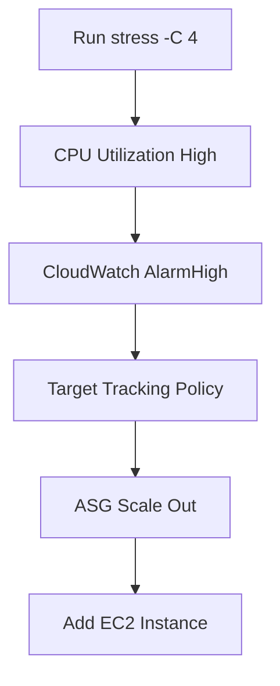
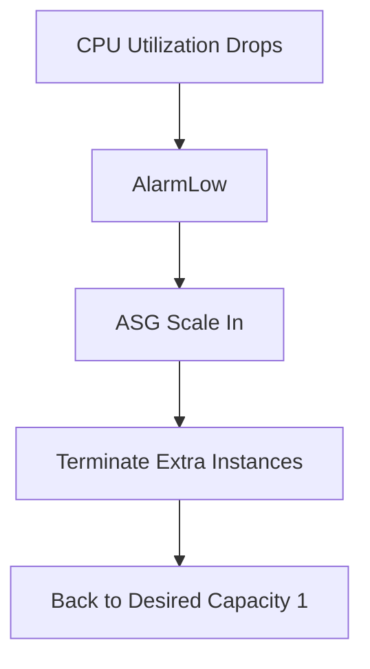

# 75. Auto Scaling Groups - Scaling Policies Hands On

## 🎯 Giới thiệu

Bài hands-on minh họa automatic scaling cho **Auto Scaling Group (ASG)**, tập trung vào **Target Tracking Scaling Policy** dựa trên CPU utilization.

Bài cũng giới thiệu nhanh:

- Scheduled actions.
- Predictive scaling policies.
- Dynamic scaling policies.

## 1. 🗓️ Scheduled Actions

**Scheduled actions** dùng khi muốn schedule scaling action trong tương lai.

Có thể cấu hình:

- Desired capacity.
- Minimum capacity.
- Maximum capacity.
- Lặp lại theo tuần, giờ hoặc schedule cụ thể.
- Start time.
- End time.

Use case:

- Biết trước sẽ có big promotion vào next Saturday.

## 2. 🔮 Predictive Scaling Policies

**Predictive scaling** là machine learning driven.

Cách cấu hình:

- Chọn metric để forecast.
- Ví dụ:
  - CPU utilization.
  - Network in.
  - Network out.
  - Application Load Balancer request count.
  - Custom metric.
- Đặt target utilization, ví dụ 50% CPU utilization.

ASG sẽ dựa trên past usage để tạo forecast và scale theo forecast.

Transcript không demo vì cần enable trong thời gian dài và có usage thực tế.

## 3. 📈 Dynamic Scaling Policies

Dynamic scaling có 3 lựa chọn:

- **Target tracking**.
- **Step scaling**.
- **Simple scaling**.

### Simple Scaling

Cần chỉ định:

- Name.
- CloudWatch alarm.
- Hành động khi alarm triggered.

Có thể:

- Add capacity units.
- Remove capacity units.
- Set capacity.

### Step Scaling

Cho phép dùng nhiều bước dựa trên alarm value.

Ví dụ:

- Alarm rất cao → add 10 capacity units.
- Alarm cao nhưng không quá cao → add 1 capacity unit.

### Target Tracking

Bài demo dùng target tracking vì nó tạo CloudWatch alarms cho chúng ta.

## 4. 🎯 Tạo Target Tracking Policy

Cấu hình trong bài:

- Policy name: target tracking policy.
- Metric: Average CPU utilization.
- Target value: 40.

Mục tiêu:

- ASG duy trì CPU utilization quanh 40%.
- Nếu CPU vượt quá target, ASG add capacity units.

Trước khi test:

- Minimum và desired đang là 1.
- Maximum được tăng lên 3 để ASG có thể scale out.

## 5. 🔥 Stress CPU để Trigger Scale Out

Ban đầu CPU utilization gần 0 vì instance không làm gì.

Bài demo kết nối vào EC2 instance bằng **EC2 Instance Connect** rồi cài công cụ stress.

Sau đó chạy:

```bash
stress -C 4
```

Lệnh này làm CPU tăng lên 100% bằng cách dùng 4 CPU units.



## 6. ✅ Kết quả Scale Out

Trong Activity history:

- Alarm triggered.
- Target tracking policy làm capacity tăng từ 1 lên 2.

Trong Instance management:

- Có 2 EC2 instances.

Nếu CPU vẫn cao:

- Desired capacity có thể tiếp tục tăng từ 2 lên 3.

## 7. ☁️ CloudWatch Alarms do Target Tracking tạo

Target tracking policy tự tạo 2 CloudWatch alarms:

- **AlarmHigh**: dùng để scale out.
- **AlarmLow**: dùng để scale in.

Trong transcript:

- AlarmHigh: CPU utilization > 40% trong 3 data points within 3 minutes.
- AlarmLow: CPU utilization < 28% trong 15 data points.

## 8. 📉 Scale In khi CPU giảm

Sau khi dừng stress hoặc reboot instances:

- CPU utilization quay về 0.
- AlarmLow được triggered.
- ASG bắt đầu scale in.

Trong Activity history:

- Capacity giảm từ 3 xuống 2.
- Sau đó từ 2 xuống 1.
- Instances bị terminated.



## 9. 🧹 Cleanup

Khi hoàn tất:

- Delete target tracking policy.

## 📊 Bảng tóm tắt

| Tiêu chí | Mô tả |
|----------|------|
| Demo policy | Target Tracking Scaling Policy |
| Metric | Average CPU utilization |
| Target value | 40% |
| Max capacity demo | 3 |
| Stress command | `stress -C 4` |
| Scale out trigger | CPU cao hơn target |
| Scale out result | Capacity 1 → 2 → 3 |
| Scale in trigger | CPU giảm xuống thấp |
| Scale in result | Capacity 3 → 2 → 1 |
| CloudWatch alarms | AlarmHigh và AlarmLow |

## 💡 Mẹo ghi nhớ cho kỳ thi AWS

- **Target Tracking** tự tạo CloudWatch alarms.
- CPU cao → AlarmHigh → scale out.
- CPU thấp → AlarmLow → scale in.
- Maximum capacity phải lớn hơn minimum/desired thì ASG mới scale out được.
- Sau bài demo nên delete scaling policy.

## ✅ Kết luận

Bài hands-on chứng minh cách **Target Tracking Scaling Policy** tự động scale ASG dựa trên CPU utilization. Khi CPU tăng cao, ASG thêm instances; khi CPU giảm, ASG terminate bớt instances để quay về capacity phù hợp.
