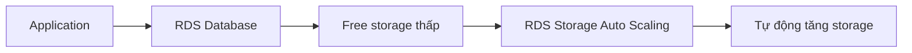

# 77. Amazon RDS Overview

## 🎯 Giới thiệu

Amazon RDS là viết tắt của **Relational Database Service**.

Đây là dịch vụ **managed database service** dành cho các database sử dụng **SQL** làm ngôn ngữ truy vấn. Thay vì tự cài database trên **EC2**, AWS quản lý nhiều phần vận hành quan trọng giúp bạn tập trung vào ứng dụng.

## 1. 📌 Amazon RDS là gì?

Amazon RDS cho phép tạo database trên cloud và được AWS quản lý.

Các database engine được Amazon RDS hỗ trợ trong bài:

- **PostgreSQL**
- **MySQL**
- **MariaDB**
- **Oracle**
- **Microsoft SQL Server**
- **IBM DB2**
- **Aurora**

💡 **Mẹo thi AWS:** Cần nhớ các engine được hỗ trợ bởi **Amazon RDS**, đặc biệt **Aurora** là database proprietary của AWS.

## 2. ✅ Vì sao dùng RDS thay vì database trên EC2?

Nếu tự triển khai database trên **EC2**, bạn phải tự xử lý nhiều công việc vận hành. Với **RDS**, AWS cung cấp sẵn nhiều tính năng managed:

- Tự động provisioning database.
- Tự động patching hệ điều hành bên dưới.
- **Continuous backups**.
- Khả năng restore tới một thời điểm cụ thể bằng **Point in Time Restore**.
- Monitoring dashboard để xem performance database.
- **Read Replicas** để cải thiện read performance.
- **Multi AZ** hỗ trợ **disaster recovery**.
- Maintenance windows cho upgrades.
- Scaling:
  - **Vertical scaling**: tăng instance type.
  - **Horizontal scaling**: thêm **Read Replicas**.
- Storage được backed bởi **EBS**.

⚠️ Vì RDS là managed service nên bạn **không thể SSH** vào RDS instances.

## 3. 💾 RDS Storage Auto Scaling

**RDS Storage Auto Scaling** giúp database tự động tăng dung lượng lưu trữ khi sắp hết free space.

Luồng hoạt động:

Tính năng này giúp tránh thao tác thủ công khi cần mở rộng storage database.

## 4. ⚙️ Điều kiện Auto Scaling Storage

Để storage tự động tăng, cần bật tính năng này và thiết lập **maximum storage threshold**.

Storage có thể tự động tăng khi:

- Free storage nhỏ hơn **10%** dung lượng đã cấp phát.
- Tình trạng low storage kéo dài hơn **5 phút**.
- Đã qua **6 giờ** kể từ lần modification gần nhất.

Tính năng này hữu ích cho application có workload khó dự đoán.

✅ **RDS Storage Auto Scaling** hỗ trợ tất cả database engines của RDS.

## 📊 Bảng tóm tắt

| Tiêu chí | Mô tả |
|----------|------|
| Dịch vụ | Amazon RDS |
| Loại database | Relational database dùng SQL |
| Managed bởi AWS | Provisioning, patching, backups, monitoring, maintenance |
| Backup | Continuous backups, Point in Time Restore |
| Read scaling | Read Replicas |
| Disaster Recovery | Multi AZ |
| Storage | Backed by EBS |
| SSH access | Không có SSH access vào RDS instances |
| Storage Auto Scaling | Tự tăng storage khi sắp hết dung lượng |

## 💡 Mẹo ghi nhớ cho kỳ thi AWS

- **RDS = managed relational database**.
- Muốn cải thiện read performance: nghĩ tới **Read Replicas**.
- Muốn disaster recovery: nghĩ tới **Multi AZ**.
- Không thể SSH vào RDS vì đây là managed service.
- **RDS Storage Auto Scaling** phù hợp workload có storage tăng khó dự đoán.

## ✅ Kết luận

Amazon RDS giúp chạy relational database trên AWS mà không cần tự quản lý hạ tầng database. Dịch vụ cung cấp backup, monitoring, scaling, **Read Replicas**, **Multi AZ**, và **Storage Auto Scaling**. Điểm cần nhớ cho kỳ thi là RDS là managed service, storage dựa trên **EBS**, và không cho phép SSH vào underlying instances.
