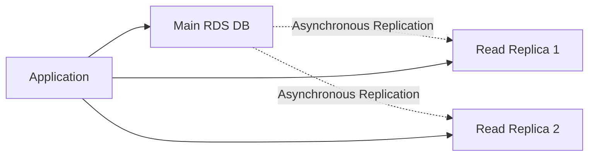
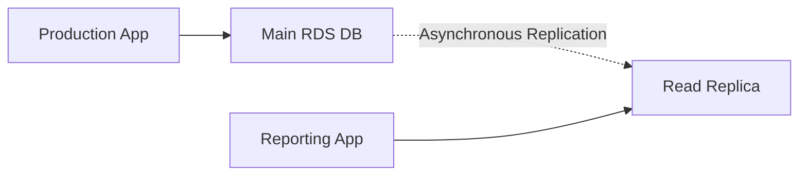
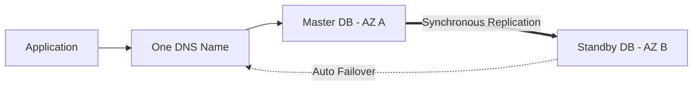
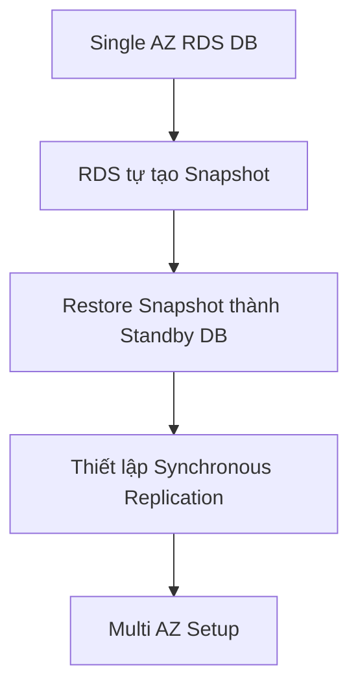

# 78. RDS Read Replicas vs Multi AZ

## 🎯 Giới thiệu

Bài học tập trung phân biệt **RDS Read Replicas** và **Multi AZ**. Đây là nội dung rất quan trọng cho kỳ thi AWS vì hai tính năng này có mục đích khác nhau:

- **Read Replicas**: scale read workload.
- **Multi AZ**: disaster recovery và high availability.

## 1. 📖 RDS Read Replicas

**Read Replicas** được dùng để mở rộng khả năng đọc của database.

Một RDS database instance chính có thể tạo tối đa **15 Read Replicas**.

Read Replicas có thể đặt ở:

- Same Availability Zone.
- Cross Availability Zone.
- Cross Region.

Replication giữa main database instance và Read Replicas là **asynchronous replication**.

## 2. ⚠️ Eventually Consistent

Vì replication là **asynchronous**, dữ liệu trên Read Replicas là **eventually consistent**.

Điều này có nghĩa:

- Application có thể đọc từ Read Replica trước khi dữ liệu mới được replicate.
- Khi đó dữ liệu đọc được có thể là dữ liệu cũ.

## 3. 🚀 Use Case của Read Replicas

Một use case điển hình:

- Production database đang xử lý workload chính.
- Team khác muốn chạy reporting hoặc analytics.
- Nếu chạy trực tiếp trên production database, database có thể bị overload.
- Giải pháp: tạo **Read Replica** và cho reporting application đọc từ đó.

✅ Production application không bị ảnh hưởng vì reporting workload đọc từ Read Replica.

## 4. 🔎 Read Replicas chỉ dùng cho đọc

Read Replicas chỉ phù hợp cho các câu lệnh dạng **SELECT**.

Không dùng Read Replicas cho các câu lệnh thay đổi database như:

- **INSERT**
- **UPDATE**
- **DELETE**

⚠️ **Mẹo thi AWS:** Read Replica = read only workload.

## 5. 🔁 Promote Read Replica

Một Read Replica có thể được **promoted** thành database riêng.

Sau khi promote:

- Replica không còn nằm trong replication mechanism cũ.
- Nó có lifecycle riêng.
- Có thể nhận writes như một database độc lập.

## 6. 🌐 Networking Cost cho Read Replicas

Với RDS Read Replicas:

| Trường hợp | Network replication fee |
|-----------|--------------------------|
| Read Replica khác AZ nhưng cùng Region | Không tính phí replication traffic |
| Cross Region Read Replica | Có replication fee |

Lý do: RDS là managed service nên replication traffic cross-AZ trong cùng Region được miễn phí cho trường hợp này.

## 7. 🛡️ RDS Multi AZ

**Multi AZ** chủ yếu dùng cho **Disaster Recovery**.

Cách hoạt động:

- Application đọc/ghi vào **Master database instance**.
- Master nằm ở một AZ.
- Có một **standby instance** ở AZ khác.
- Replication giữa Master và standby là **synchronous replication**.
- Application kết nối qua một **DNS name**.
- Khi Master gặp sự cố, tự động failover sang standby.

## 8. ✅ Multi AZ dùng để tăng availability

Multi AZ giúp tăng availability trong các trường hợp:

- Mất toàn bộ AZ.
- Network issue.
- Instance failure.
- Storage failure trên Master database.

⚠️ Standby database **không dùng để scale reads**:

- Không đọc từ standby.
- Không ghi vào standby.
- Standby chỉ dùng cho failover.

## 9. 🔄 Read Replica có thể Multi AZ không?

Có. Một **Read Replica** có thể được thiết lập dạng **Multi AZ** để phục vụ disaster recovery.

💡 Đây là một câu hỏi phổ biến trong kỳ thi.

## 10. ⚙️ Chuyển RDS từ Single AZ sang Multi AZ

Chuyển từ **Single AZ** sang **Multi AZ** là thao tác **zero downtime**.

Bạn chỉ cần:

- Chọn database.
- Click **Modify**.
- Enable **Multi AZ**.

Phía sau, RDS sẽ:

## 📊 Bảng so sánh Read Replicas vs Multi AZ

| Tiêu chí | Read Replicas | Multi AZ |
|----------|---------------|----------|
| Mục đích chính | Scale reads | Disaster Recovery |
| Replication | Asynchronous | Synchronous |
| Consistency | Eventually consistent | Đồng bộ với Master |
| Có thể đọc? | Có, dùng SELECT | Không đọc từ standby |
| Có thể ghi? | Không, trừ khi promoted | Ghi vào Master |
| Failover | Không phải mục tiêu chính | Automatic failover |
| Số lượng | Tối đa 15 Read Replicas | Một standby trong AZ khác |
| Cross Region | Có thể | Bài không đề cập |
| Network fee | Free nếu same Region, fee nếu cross Region | Bài không đề cập |

## 💡 Mẹo ghi nhớ cho kỳ thi AWS

- **Read Replicas = scale reads**.
- **Multi AZ = disaster recovery**.
- **Read Replicas dùng asynchronous replication** nên có **eventual consistency**.
- **Multi AZ dùng synchronous replication** và có **automatic failover**.
- Standby trong Multi AZ không dùng để đọc.
- Chuyển Single AZ sang Multi AZ là **zero downtime operation**.

## ✅ Kết luận

**Read Replicas** giúp tăng read capacity và phù hợp cho workload đọc như reporting, analytics. **Multi AZ** giúp tăng availability và phục vụ disaster recovery với synchronous replication và automatic failover. Đây là hai khái niệm cần phân biệt rõ khi ôn thi AWS.
