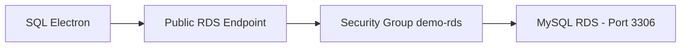

# 79. Amazon RDS Hands On

## 🎯 Giới thiệu

Bài hands-on hướng dẫn tạo một **Amazon RDS database** dùng engine **MySQL**, kết nối bằng SQL client, xem các tính năng quản trị cơ bản và cuối cùng xóa database để tránh phát sinh chi phí.

## 1. 🛠️ Tạo RDS Database

Trong console **Aurora and RDS**:

- Chọn **Databases**.
- Chọn **Create database**.
- Có hai cách tạo:
  - **Easy create**.
  - **Full configuration**.

Bài học chọn **Full configuration** để xem nhiều tùy chọn hơn.

## 2. 🧩 Chọn Engine và Template

Engine options có thể bao gồm:

- **Aurora MySQL-compatible**.
- **Aurora PostgreSQL-compatible**.
- **MySQL**.
- **PostgreSQL**.
- Các engine khác.

Trong hands-on, chọn **MySQL** để đơn giản.

Templates:

- **Production**: có nhiều settings hơn.
- **Dev/Test**.
- **Free tier**.

Bài học chọn **Free tier**.

⚠️ Với **Free tier**, chỉ dùng được **Single-AZ database instance deployment** với một instance.

## 3. 👤 Credentials và Authentication

Các tùy chọn credentials:

- Tự tạo password và để RDS quản lý.
- Quản lý password bằng **AWS Secrets Manager**.

Trong bài:

- Dùng self-managed password.
- Master username là `admin`.
- Chỉ bật **password authentication**.

Console cũng cho thấy có tùy chọn dùng **IAM** để authenticate vào database.

## 4. 💾 Instance và Storage

Cấu hình instance:

- Dùng instance thuộc Free tier như `db.t4g.micro`, `db.t3.micro`, hoặc default tương ứng.

Storage:

- Dùng **20 GB**.
- Có tùy chọn **storage autoscaling**.
- Nếu storage sử dụng hết, có thể autoscale lên ví dụ **1000 GB**.

## 5. 🌐 Connectivity và Security Group

Cấu hình connectivity trong bài:

- Không connect trực tiếp tới EC2 compute resource.
- Dùng default **VPC**.
- Public access: **Yes** để có thể truy cập RDS từ public IP.
- Tạo security group mới tên `demo-rds`.
- Port dùng cho MySQL: **3306**.

⚠️ Nếu không kết nối được, cần kiểm tra:

- Database có được set là public database không.
- Security group có cho phép IP của bạn truy cập port **3306** không.

## 6. 🧪 Kết nối bằng SQL Electron

Sau khi database available:

- Lấy **endpoint** và **port 3306**.
- Mở **SQL Electron**.
- Tạo connection mới:
  - Database type: **MySQL**.
  - Server address: RDS endpoint.
  - Port: **3306**.
  - User: `admin`.
  - Password: password đã tạo.
  - Initial database: `myDB`.

Khi test connection thành công, có thể connect vào database.

## 7. 🧾 Thử tạo bảng và insert dữ liệu

Bài học demo SQL cơ bản:

- Tạo table `my_table`.
- Có các cột `name` và `first_name` kiểu `VARCHAR(20)`.
- Insert dữ liệu mẫu.
- Select rows để xem dữ liệu.

⚠️ Phần SQL chi tiết nằm ngoài phạm vi kỳ thi, mục tiêu chỉ là thấy bức tranh hoàn chỉnh khi dùng RDS với MySQL.

## 8. 📈 Monitoring và Operations

Trong RDS console, có thể xem:

- **CPU Utilization**.
- **Database connection count**.
- Nhiều metrics khác.

Các thao tác đáng chú ý:

- Tạo **Read Replica** để tăng read capacity.
- Chọn Read Replica có **Multi-AZ** cho recovery hay không.
- Tạo **snapshot** database.
- Restore database tới một thời điểm cụ thể.
- Migrate snapshot sang Region khác.
- Tăng instance type khi cần.

## 9. 🧹 Xóa Database sau Hands-on

Để xóa database:

1. Vào **Modify**.
2. Tắt **deletion protection**.
3. Chọn apply immediately.
4. Sau đó delete database.
5. Có thể bỏ chọn final snapshot trong bài demo.
6. Xác nhận rằng dữ liệu sẽ mất khi deletion hoàn tất.

## 📊 Bảng tóm tắt

| Tiêu chí | Mô tả |
|----------|------|
| Service | Amazon RDS |
| Engine trong bài | MySQL |
| Template | Free tier |
| Deployment | Single-AZ database instance |
| Port | 3306 |
| Client | SQL Electron |
| Security | Security group cho phép IP truy cập port 3306 |
| Monitoring | CPU Utilization, Database connection count |
| Operations | Read Replica, Snapshot, Point in Time Restore, migrate snapshot |
| Cleanup | Disable deletion protection rồi delete database |

## 💡 Mẹo ghi nhớ cho kỳ thi AWS

- RDS là managed service giúp quản lý database dễ hơn.
- MySQL dùng port **3306**.
- Muốn connect từ ngoài vào RDS public database cần endpoint, public access và security group phù hợp.
- **Read Replica** giúp tăng read capacity.
- **Snapshot** dùng để restore hoặc migrate.
- Phải disable **deletion protection** trước khi xóa database nếu tính năng này đang bật.

## ✅ Kết luận

Bài hands-on cho thấy quy trình tạo một Amazon RDS MySQL database, cấu hình credentials, storage, networking, security group, kết nối bằng SQL client, xem monitoring, tạo snapshot/read replica và cleanup. Điểm chính cần nhớ là RDS cung cấp database managed, có endpoint để kết nối, và security group quyết định khả năng truy cập mạng.
