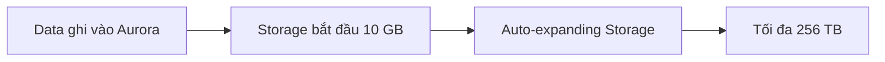
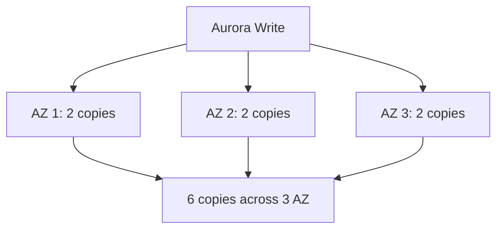
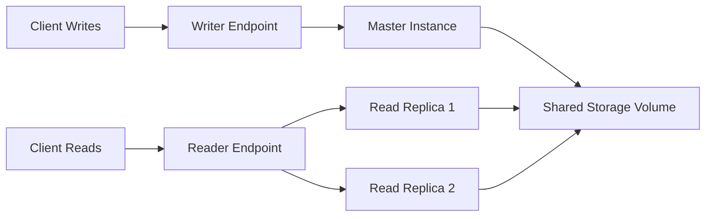

# 80. Amazon Aurora

## 🎯 Giới thiệu

**Amazon Aurora** là công nghệ database proprietary của AWS, không phải open-source, nhưng tương thích với **PostgreSQL** và **MySQL**.

Aurora được thiết kế cloud-optimized và là chủ đề ngày càng xuất hiện nhiều trong kỳ thi AWS.

## 1. 📌 Aurora là gì?

Aurora tương thích với driver của **PostgreSQL** và **MySQL**.

Điều đó có nghĩa:

- Nếu application kết nối như đang kết nối tới PostgreSQL hoặc MySQL, nó vẫn hoạt động với Aurora.
- Aurora có nhiều tối ưu hóa để đạt hiệu năng cao hơn RDS thông thường.

Theo bài học:

- Aurora có thể đạt hiệu năng cao hơn **5x** so với MySQL trên RDS.
- Aurora có thể đạt hiệu năng cao hơn **3x** so với PostgreSQL trên RDS.

## 2. 💾 Aurora Storage Auto-expanding

Storage của Aurora tự động tăng:

- Bắt đầu từ **10 GB**.
- Tự động mở rộng tới **256 TB**.

Điểm quan trọng:

- DBA hoặc SysOps không cần liên tục giám sát disk để tăng thủ công.
- Storage tăng tự động khi dữ liệu tăng.

## 3. 🚀 Read Replicas và Failover

Aurora hỗ trợ:

- Tối đa **15 Read Replicas**.
- Replication nhanh hơn MySQL.
- Replica lag thường dưới **10 milliseconds**.
- Failover nhanh hơn Multi-AZ trên MySQL hoặc RDS.
- Failover trung bình dưới **30 seconds**.

Aurora có high availability mặc định vì được thiết kế cloud-native.

## 4. 🛡️ High Availability trong Aurora

Aurora lưu **6 copies** dữ liệu trên **3 AZ**.

Khi ghi dữ liệu:

- Cần **4 copies out of 6** để write thành công.

Khi đọc dữ liệu:

- Cần **3 copies out of 6** để read.

Aurora còn có cơ chế:

- **Self-healing** bằng peer-to-peer replication.
- Dữ liệu được đặt trên nhiều volume khác nhau.
- Storage volume là logical shared volume, có replication, self-healing và auto-expanding.

## 5. 🧠 Aurora Cluster Architecture

Aurora có một **master** nhận writes.

- Chỉ master ghi vào shared storage.
- Nếu master fail, một Read Replica có thể trở thành master.
- Có thể có nhiều Read Replicas để phục vụ read workload.

## 6. 🔗 Writer Endpoint và Reader Endpoint

Aurora cung cấp hai endpoint quan trọng:

### ✍️ Writer Endpoint

- Là DNS name luôn trỏ tới **master**.
- Nếu master failover, client vẫn dùng writer endpoint và được chuyển tới instance đúng.

### 📖 Reader Endpoint

- Kết nối tới các **Read Replicas**.
- Hỗ trợ connection load balancing.
- Load balancing diễn ra ở **connection level**, không phải statement level.

💡 **Mẹo thi AWS:** Nhớ rõ **writer endpoint** và **reader endpoint**.

## 7. 📈 Auto Scaling Read Replicas

Aurora Read Replicas có thể dùng **auto-scaling**.

- Có thể scale từ 1 tới 15 Read Replicas.
- Reader endpoint giúp application không cần tự theo dõi URL của từng replica.

## 8. 🌍 Cross-region Replication

Aurora Read Replicas hỗ trợ **cross-region replication**.

Bài học nhấn mạnh đây là tính năng cần ghi nhớ ở mức high-level.

## 9. ⚙️ Các tính năng managed của Aurora

Aurora cung cấp nhiều tính năng managed:

- Automatic failover.
- Backup and recovery.
- Isolation and security.
- Industry compliance.
- Push-button scaling bằng auto-scaling.
- Automated patching với zero downtime.
- Advanced monitoring.
- Routine maintenance.
- **Backtrack** để quay database về một thời điểm cụ thể mà không dựa vào backups.

## 📊 Bảng tóm tắt

| Tiêu chí | Mô tả |
|----------|------|
| Service | Amazon Aurora |
| Loại công nghệ | Proprietary technology của AWS |
| Compatibility | PostgreSQL, MySQL |
| Performance | 5x MySQL on RDS, 3x PostgreSQL on RDS |
| Storage | Auto-expanding từ 10 GB tới 256 TB |
| Copies | 6 copies across 3 AZ |
| Write requirement | 4/6 copies |
| Read requirement | 3/6 copies |
| Read Replicas | Tối đa 15 |
| Failover | Trung bình dưới 30 seconds |
| Endpoint | Writer endpoint, Reader endpoint |
| Load balancing | Reader endpoint load balancing ở connection level |
| Special feature | Backtrack |

## 💡 Mẹo ghi nhớ cho kỳ thi AWS

- Aurora = AWS proprietary, compatible với **MySQL** và **PostgreSQL**.
- Storage tự động mở rộng từ **10 GB đến 256 TB**.
- Aurora lưu **6 copies across 3 AZ**.
- Cần nhớ: **4/6 writes**, **3/6 reads**.
- Chỉ có một master nhận writes.
- **Writer endpoint** trỏ tới master.
- **Reader endpoint** phân phối connection tới Read Replicas.
- Reader endpoint load balances ở **connection level**.

## ✅ Kết luận

Amazon Aurora là database cloud-optimized của AWS với hiệu năng cao, storage auto-expanding, high availability mặc định, failover nhanh, tối đa 15 Read Replicas và hai endpoint quan trọng là **writer endpoint** và **reader endpoint**. Đây là một trong các dịch vụ database quan trọng cần nắm khi ôn thi AWS.
