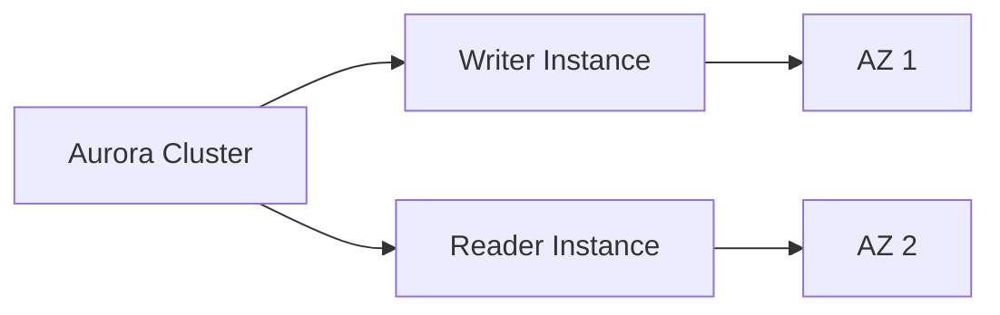
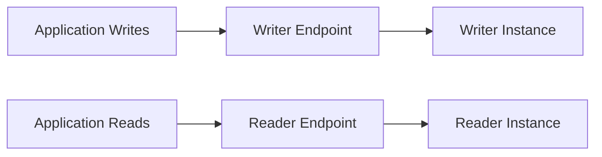

# 81. Amazon Aurora - Hands On

## 🎯 Giới thiệu

Bài hands-on hướng dẫn tạo một **Amazon Aurora database** và khám phá các tùy chọn quan trọng trong console.

⚠️ Giảng viên lưu ý rằng nếu làm theo hands-on để tạo database thật, bạn có thể phát sinh chi phí. Mục tiêu chính là quan sát các options.

## 1. 🛠️ Tạo Aurora Database

Trong console, chọn tạo database bằng **Standard create**.

Aurora có hai lựa chọn chính:

- **MySQL-compatible**.
- **PostgreSQL-compatible**.

Trong bài, chọn **MySQL-compatible**.

Sau đó chọn version. Console có thể lọc các version hỗ trợ:

- **Global database**.
- **Parallel query**.
- **Serverless v2**.

Trong bài, dùng version mặc định do console đề xuất.

## 2. 🏗️ Template và Cluster Identifier

Chọn template **Production** để có thể cấu hình đầy đủ.

Cấu hình trong bài:

- DB cluster identifier: `database two`.
- Master username: `admin`.
- Nhập password cho master user.

## 3. 💾 Cluster Storage Configuration

Aurora có hai tùy chọn storage:

| Storage option | Khi nào dùng |
|---------------|--------------|
| Aurora standard | Workload cost-effective, không dùng Aurora quá nhiều |
| Aurora IO optimized | Workload có nhiều input/output operations, read/write operations cao |

Trong bài, giảng viên giải thích ý nghĩa hai tùy chọn này để người học hiểu khi cấu hình.

## 4. ⚙️ Instance Configuration

Có thể chọn database instance class, ví dụ:

- Memory optimized.
- Burstable classes.
- Previous generation classes.

Trong bài dùng `db.t3.medium`.

Nếu Aurora version tương thích với **Serverless v2**, console sẽ hiển thị tùy chọn **Serverless v2**.

Với Serverless v2:

- Không chọn instance type.
- Chọn **Aurora Capacity Unit (ACU)**.
- Thiết lập minimum ACU và maximum ACU.
- Database tự scale giữa hai capacity units này.

## 5. 🛡️ Availability và Durability

Bài học tạo một **Aurora replica** và một reader node ở AZ khác.

Mục đích:

- Tăng availability.
- Cải thiện reads across AZ.
- Hỗ trợ fast failovers.

⚠️ Tùy chọn này có thể tốn thêm chi phí.

## 6. 🌐 Connectivity và Network

Cấu hình trong bài:

- Không connect tới EC2 resource.
- Network type: **IPv4**.
- Nếu VPC có IPv6, có thể dùng **dual stack mode**.
- Dùng default VPC và default subnet group.
- Allow public access: **Yes**.
- Tạo VPC security group mới tên `demo database Aurora`.
- Database port: **3306** nếu chọn MySQL.

## 7. 🔐 Authentication và Monitoring

Các tùy chọn được nhắc tới:

- **IAM based database authentication**.
- **Kerberos based authentication**.
- Enhanced monitoring.
- Initial database name: `my DB`.
- Backup retention: **1 day**.
- Encryption.
- Backtracking để rewind database.
- Log exports.
- Deletion protection để tránh xóa nhầm database.

## 8. 🔗 Aurora Endpoints

Sau khi Aurora database được tạo, console hiển thị một regional cluster với:

- Writer instance.
- Reader instance.

Cluster có hai endpoint quan trọng:

- **Writer endpoint**.
- **Reader endpoint**.

Ý nghĩa:

- Writer endpoint luôn dẫn tới writer instance đúng.
- Reader endpoint luôn dẫn tới reader instance đúng.
- Mỗi instance cụ thể cũng có dedicated endpoint riêng.

💡 Application nên dùng cluster endpoints để kết nối tới Aurora.

## 9. 📈 Add Readers và Replica Auto Scaling

Aurora cho phép:

- Add thêm readers để tăng scaling capacity.
- Tạo **cross-region read replica**.
- Restore in point in time.
- Add **replica auto-scaling**.

Replica auto-scaling có thể dựa trên:

- Average utilization của Aurora replica.
- Average number of connections tới Aurora replica.

Có thể cấu hình:

- Target value, ví dụ **60%**.
- Scaling period.
- Min capacity.
- Max capacity, trong bài ví dụ từ **1 replica** tới **15 Aurora replicas**.

## 10. 🌍 Add AWS Region và Global Aurora

Bài học demo tùy chọn **Add AWS Region**.

Tính năng này chỉ khả dụng nếu:

- Aurora version được chọn hỗ trợ **global database feature**.
- Cluster có instance size compatible.

Mục tiêu là tạo **global Aurora** bằng cách thêm database region khác.

## 11. 🧹 Cleanup Aurora Database

Để xóa Aurora cluster trong bài:

1. Xóa reader instance trước.
2. Xóa writer instance.
3. Sau khi cả hai instance bị xóa, mới xóa được cluster.

## 📊 Bảng tóm tắt

| Tiêu chí | Mô tả |
|----------|------|
| Service | Amazon Aurora |
| Mode tạo | Standard create |
| Compatibility trong bài | MySQL-compatible |
| Template | Production |
| Storage options | Aurora standard, Aurora IO optimized |
| Instance demo | db.t3.medium |
| Serverless option | Serverless v2 dùng ACU min/max |
| Replica | Reader node ở AZ khác |
| Port | 3306 với MySQL |
| Authentication | Password, IAM based, Kerberos based |
| Endpoints | Writer endpoint, Reader endpoint, dedicated endpoint |
| Scaling | Add readers, replica auto-scaling |
| Global | Add AWS Region nếu version hỗ trợ global database |
| Cleanup | Delete reader, delete writer, rồi delete cluster |

## 💡 Mẹo ghi nhớ cho kỳ thi AWS

- Aurora có **writer endpoint** và **reader endpoint**.
- Reader endpoint phục vụ kết nối đọc, writer endpoint phục vụ ghi.
- **Serverless v2** dùng **ACU** thay vì chọn instance type.
- Aurora replicas giúp availability, read scaling và fast failover.
- Replica auto-scaling có thể scale tới **15 Aurora replicas**.
- **Global database** cần version và instance compatible.

## ✅ Kết luận

Bài hands-on cho thấy cách tạo Amazon Aurora MySQL-compatible cluster, cấu hình storage, instance, availability, network, authentication, endpoints và scaling. Điểm quan trọng nhất là hiểu cấu trúc Aurora cluster với writer/reader instances, **writer endpoint**, **reader endpoint**, replica auto-scaling và tùy chọn global database.
