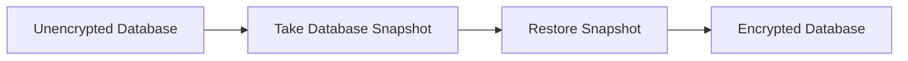
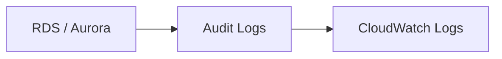

# 82. RDS & Aurora Security

## 🎯 Giới thiệu

Bài học tóm tắt các tùy chọn bảo mật chính cho **RDS** và **Aurora**, bao gồm encryption, authentication, network access, SSH access và audit logs.

## 1. 🔒 At-rest Encryption

Dữ liệu của **RDS** và **Aurora** có thể được mã hóa **at-rest**.

Điều này nghĩa là dữ liệu được mã hóa trên volumes.

Cách hoạt động:

- Master database và replicas được encrypt bằng **KMS**.
- Encryption được định nghĩa tại **launch time** khi tạo database lần đầu.

⚠️ Lưu ý quan trọng:

- Nếu master database không được encrypt, Read Replicas cũng không thể được encrypt.

## 2. 🔁 Encrypt database đã tồn tại

Nếu có database đang tồn tại nhưng chưa encrypt, để chuyển sang encrypted database cần dùng snapshot.

Không thể chỉ bật encryption trực tiếp trên existing unencrypted database theo nội dung bài học.

## 3. 🔐 In-flight Encryption

**In-flight encryption** bảo vệ dữ liệu giữa client và database.

Với RDS và Aurora:

- Mỗi database sẵn sàng hỗ trợ in-flight encryption mặc định.
- Client cần sử dụng **TLS root certificates** từ AWS.

## 4. 👤 Database Authentication

RDS và Aurora hỗ trợ các cách authentication:

- Username và password truyền thống.
- **IAM roles** để kết nối database.

Ví dụ trong bài:

- EC2 instance có **IAM role** có thể authenticate trực tiếp vào database mà không cần username/password.

💡 Điều này giúp quản lý security trong AWS thông qua **IAM**.

## 5. 🛡️ Network Access Control

Network access tới database được kiểm soát bằng **security groups**.

Có thể allow hoặc block theo:

- Specific ports.
- Specific IP.
- Specific security groups.

## 6. 🚫 SSH Access

RDS và Aurora không có **SSH access** vì là managed services.

Ngoại lệ được nhắc tới trong bài:

- **RDS Custom**.

## 7. 🧾 Audit Logs

Có thể bật **Audit Logs** để biết:

- Query nào được thực hiện trên RDS/Aurora.
- Điều gì đang diễn ra trên database theo thời gian.

⚠️ Audit Logs có thể bị mất sau một khoảng thời gian. Nếu muốn giữ lâu dài, cần gửi logs sang **CloudWatch Logs**.

## 📊 Bảng tóm tắt

| Tiêu chí | Mô tả |
|----------|------|
| At-rest encryption | Encrypt dữ liệu trên volumes bằng KMS |
| Thời điểm bật encryption | Launch time |
| Replica encryption | Master không encrypted thì Read Replicas không encrypted |
| Encrypt existing DB | Snapshot rồi restore thành encrypted database |
| In-flight encryption | Dùng TLS root certificates từ AWS |
| Authentication | Username/password hoặc IAM roles |
| Network access | Security groups |
| SSH access | Không có, trừ RDS Custom |
| Audit Logs | Có thể gửi tới CloudWatch Logs để lưu lâu dài |

## 💡 Mẹo ghi nhớ cho kỳ thi AWS

- Muốn encrypt existing unencrypted RDS/Aurora: **snapshot rồi restore encrypted**.
- Encryption at-rest dùng **KMS** và quyết định tại launch time.
- RDS/Aurora không SSH được vì là managed services.
- In-flight encryption dùng **TLS root certificates** từ AWS.
- Audit Logs cần gửi vào **CloudWatch Logs** nếu muốn lưu lâu dài.

## ✅ Kết luận

Bảo mật cho RDS và Aurora xoay quanh encryption at-rest bằng **KMS**, in-flight encryption bằng **TLS**, authentication bằng username/password hoặc **IAM roles**, kiểm soát network bằng **security groups**, và lưu audit logs lâu dài qua **CloudWatch Logs**.
