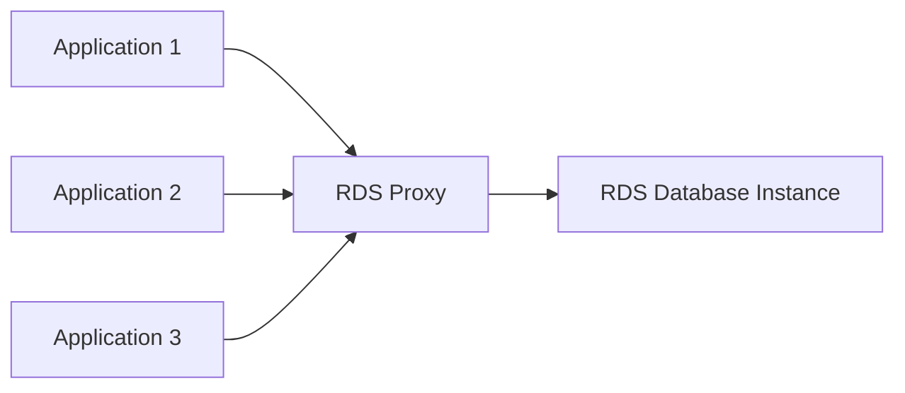
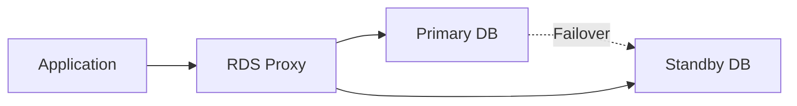
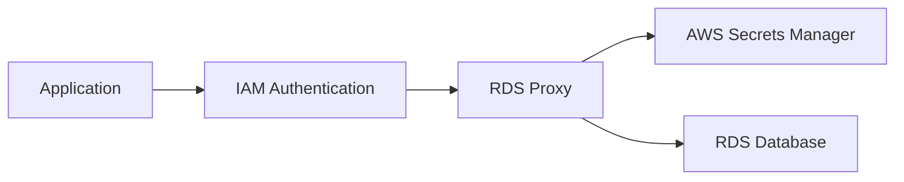
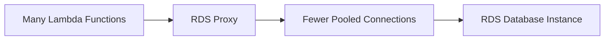

# 83. RDS Proxy

## 🎯 Giới thiệu

**Amazon RDS Proxy** là một fully managed database proxy cho RDS. Thay vì application kết nối trực tiếp tới RDS database, application kết nối tới proxy, còn proxy quản lý và chia sẻ database connections tới RDS.

## 1. 📌 Vì sao cần RDS Proxy?

Nếu nhiều application hoặc nhiều instance kết nối trực tiếp tới RDS database, database có thể chịu áp lực lớn từ số lượng connection.

**RDS Proxy** giúp:

- Pool database connections.
- Share connections giữa các application.
- Giảm số lượng open connections tới RDS database instance.
- Giảm stress lên tài nguyên database như **CPU** và **RAM**.
- Giảm connection timeouts.

## 2. 🚀 Fully Serverless, Auto Scaling và Highly Available

RDS Proxy là:

- Fully serverless.
- Auto scaling.
- Không cần quản lý capacity.
- Highly available across multiple AZ.

## 3. 🔁 Giảm Failover Time

Khi RDS database failover, ví dụ từ primary instance sang standby instance, **RDS Proxy** có thể giảm failover time tới **66%**.

Áp dụng cho:

- **RDS**.
- **Aurora**.

Application vẫn kết nối tới RDS Proxy, còn proxy xử lý failover tới database instance phù hợp.

## 4. 🧩 Supported Engines

RDS Proxy hỗ trợ:

- **MySQL**.
- **PostgreSQL**.
- **MariaDB**.
- **Microsoft SQL Server**.
- **Aurora MySQL**.
- **Aurora PostgreSQL**.

## 5. 🔧 Không cần code change lớn

RDS Proxy không yêu cầu thay đổi code application.

Bạn chỉ cần thay đổi endpoint kết nối:

- Trước đây: connect tới RDS database hoặc Aurora database.
- Sau đó: connect tới **RDS Proxy**.

## 6. 🔐 IAM Authentication và AWS Secrets Manager

Một lợi ích quan trọng khác của RDS Proxy là enforce **IAM authentication** cho database.

Credentials có thể được lưu an toàn trong **AWS Secrets Manager**.

💡 **Mẹo thi AWS:** Nếu câu hỏi yêu cầu enforce IAM authentication cho database, hãy nghĩ tới **RDS Proxy**.

## 7. 🔒 Không Publicly Accessible

**RDS Proxy** không bao giờ publicly accessible.

- Chỉ truy cập được từ trong **VPC**.
- Không thể connect qua internet tới RDS Proxy.

Điều này giúp tăng security.

## 8. ⚡ RDS Proxy với Lambda Functions

Bài học nhấn mạnh use case với **Lambda functions**.

Lambda functions có thể:

- Xuất hiện và biến mất rất nhanh.
- Scale ra 100 hoặc 1,000 functions.
- Mở rất nhiều connections tới RDS database nếu kết nối trực tiếp.

Điều này có thể gây:

- Open connections quá nhiều.
- Timeouts.
- Áp lực lớn lên RDS.

Giải pháp:

RDS Proxy nhận nhiều connections từ Lambda và pool lại thành ít connections hơn tới RDS database instance.

## 📊 Bảng tóm tắt

| Tiêu chí | Mô tả |
|----------|------|
| Service | Amazon RDS Proxy |
| Vai trò | Fully managed database proxy cho RDS |
| Lợi ích chính | Pool và share database connections |
| Tài nguyên giảm tải | CPU, RAM, open connections, timeouts |
| Scaling | Fully serverless, auto scaling |
| Availability | Highly available across multiple AZ |
| Failover | Giảm failover time tới 66% |
| Supported engines | MySQL, PostgreSQL, MariaDB, Microsoft SQL Server, Aurora MySQL/PostgreSQL |
| Code change | Chỉ đổi endpoint kết nối |
| Authentication | Enforce IAM authentication |
| Credentials | AWS Secrets Manager |
| Public access | Never publicly accessible |
| Use case nổi bật | Lambda functions kết nối tới RDS |

## 💡 Mẹo ghi nhớ cho kỳ thi AWS

- **RDS Proxy = connection pooling cho RDS/Aurora**.
- Giảm failover time tới **66%**.
- Dùng để enforce **IAM authentication** cho database.
- Credentials lưu trong **AWS Secrets Manager**.
- RDS Proxy không publicly accessible, chỉ dùng trong **VPC**.
- Lambda + RDS nhiều connection → nghĩ tới **RDS Proxy**.

## ✅ Kết luận

Amazon RDS Proxy giúp giảm áp lực connections lên RDS/Aurora, cải thiện database efficiency, giảm failover time, enforce IAM authentication và lưu credentials an toàn trong AWS Secrets Manager. Đây là dịch vụ rất quan trọng khi application, đặc biệt **Lambda functions**, tạo nhiều database connections.
