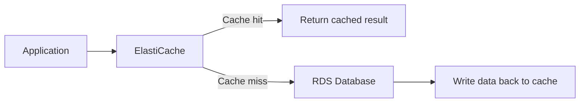
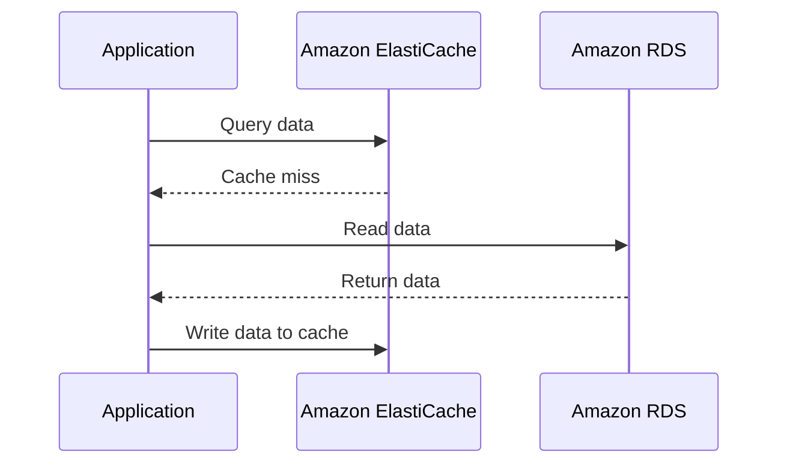
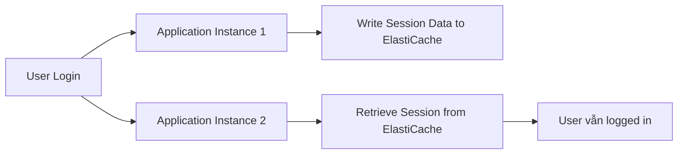
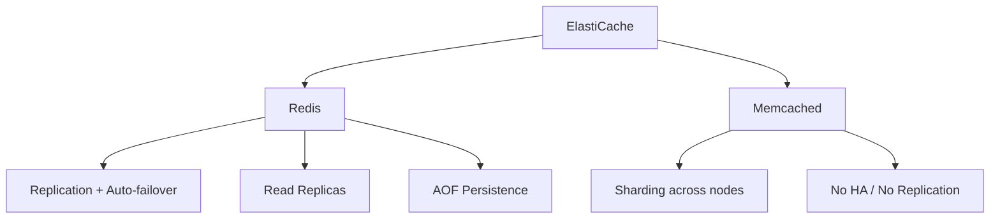

# 84. ElastiCache Overview

## 🎯 Giới thiệu

**Amazon ElastiCache** là dịch vụ managed cho **Redis** hoặc **Memcached**, tương tự như RDS là managed service cho relational databases.

ElastiCache cung cấp cache in-memory có hiệu năng cao và độ trễ thấp.

## 1. 📌 Cache là gì?

Cache là **in-memory database** có:

- High performance.
- Low latency.

Mục tiêu của cache:

- Giảm tải cho database ở workload đọc nhiều.
- Cache các common queries.
- Tránh việc database bị query lặp lại cho cùng một dữ liệu.

## 2. ✅ Lợi ích của Amazon ElastiCache

ElastiCache giúp:

- Giảm load cho database.
- Tăng tốc read-intensive workloads.
- Làm application stateless bằng cách lưu state trong ElastiCache.

AWS quản lý các phần tương tự RDS:

- Operating system maintenance.
- Patching.
- Optimization.
- Setup.
- Configuration.
- Monitoring.
- Failure recovery.
- Backups.

## 3. ⚠️ Cần thay đổi application code

ElastiCache không phải là tính năng chỉ cần bật lên là chạy.

Bạn cần thay đổi application code để:

- Query cache trước database.
- Hoặc query cache sau database tùy strategy.
- Xử lý cache hit và cache miss.

⚠️ Đây là điểm quan trọng: dùng cache thường yêu cầu application logic phù hợp.

## 4. 🧠 Cache Hit và Cache Miss

### ✅ Cache Hit

Application query ElastiCache và dữ liệu đã có sẵn trong cache.

- Kết quả trả về trực tiếp từ ElastiCache.
- Tiết kiệm một lần query tới database.

### ⚠️ Cache Miss

Application query ElastiCache nhưng dữ liệu chưa có.

- Application đọc dữ liệu từ RDS database.
- Sau đó ghi dữ liệu vào cache.
- Lần query sau có thể trở thành cache hit.

## 5. 🔁 Cache Invalidation Strategy

Vì dữ liệu được lưu trong cache, cần có **cache invalidation strategy** để đảm bảo dữ liệu hiện tại được sử dụng.

Đây là một trong các khó khăn chính khi dùng caching technologies.

## 6. 👤 Lưu User Session để Application Stateless

Một kiến trúc khác là lưu user session trong ElastiCache.

Luồng xử lý:

Ý tưởng:

- User login vào một application instance.
- Application ghi session data vào ElastiCache.
- Nếu user được redirect sang instance khác, instance mới lấy session từ ElastiCache.
- User không cần login lại.

## 7. 🔴 Redis vs Memcached

### Redis

Redis có các đặc điểm:

- Multi-Availability Zone với auto-failover.
- Có thể tạo Read Replicas để scale reads và high availability.
- Có data durability bằng **AOF persistence**.
- Có backup and restore features trên open source Redis.
- Hỗ trợ **sets** và **sorted sets**.
- Sets và sorted sets hữu ích để tạo leaderboards.

### Memcached

Memcached có các đặc điểm:

- Multiple nodes partitioning data.
- Data partitioning được gọi là sharding.
- Không có high availability.
- Không có replication.
- Nếu có issue, có thể mất toàn bộ cache.
- Backup and restore chỉ có cho serverless version của Memcached, không phải self-managed version trên ElastiCache.
- Có multi-thread architecture, có thể tốt cho performance.

## 📊 Bảng so sánh Redis vs Memcached

| Tiêu chí | Redis | Memcached |
|----------|-------|-----------|
| Multi-AZ | Có, với auto-failover | Không theo nội dung bài |
| Read Replicas | Có | Không theo nội dung bài |
| High Availability | Có | Không có |
| Replication | Có | Không có |
| Data durability | AOF persistence | Không nhấn mạnh durability |
| Backup/Restore | Có trên open source Redis | Chỉ serverless Memcached |
| Data structures | Sets, sorted sets | Không nêu |
| Kiến trúc | Replicated nodes | Sharding / partitioning |
| Performance note | High performance cache | Multi-thread architecture |

## 💡 Mẹo ghi nhớ cho kỳ thi AWS

- **ElastiCache = managed Redis hoặc Memcached**.
- Cache giúp giảm tải database cho read-intensive workloads.
- Dùng ElastiCache cần thay đổi application code.
- **Cache hit** = dữ liệu có trong cache.
- **Cache miss** = phải đọc từ database rồi ghi lại vào cache.
- Redis phù hợp khi cần replication, auto-failover, read replicas.
- Memcached gắn với sharding và multi-thread architecture.

## ✅ Kết luận

Amazon ElastiCache cung cấp managed Redis hoặc Memcached để tăng tốc ứng dụng và giảm tải database. Cần hiểu cache hit/cache miss, cache invalidation, lưu session để application stateless, và sự khác nhau cơ bản giữa Redis và Memcached khi ôn thi AWS.
