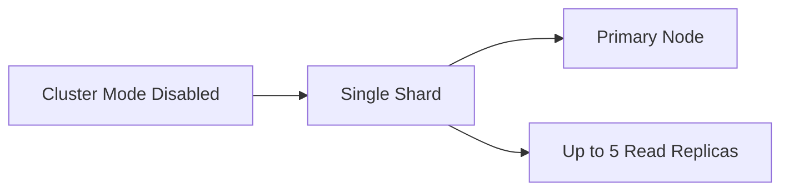
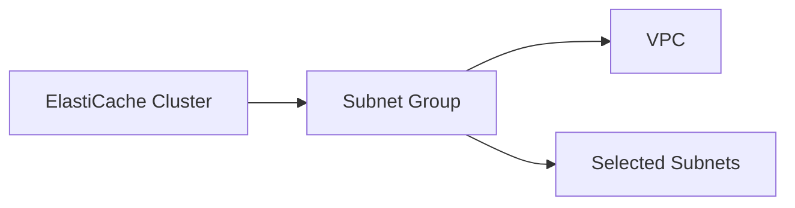

# 85. ElastiCache Hands On

## 🎯 Giới thiệu

Bài hands-on thực hành tạo **Amazon ElastiCache** cluster, quan sát các tùy chọn cấu hình cho **Redis OSS**, **Memcached** và **Valkey**, sau đó xóa cluster để tránh phát sinh chi phí.

## 1. 🧩 Engine Recommendations

Trong console ElastiCache, có các engine recommendation:

- **Valkey**: được mô tả là replacement cho Redis.
- **Memcached**.
- **Redis OSS**.

Trong bài, chọn **Redis**.

## 2. 🏗️ Deployment Options

Có hai deployment option:

- **Serverless option**.
- **Node-based cluster**.

Bài học chọn **node-based cluster** để hiểu rõ cách hoạt động.

Có thể:

- Restore from backup.
- Dùng **Easy create** với recommended best practices configuration.
- Chọn cấu hình production, dev test hoặc demo.
- Tự configure everything.

Trong bài, chọn configure everything để xem toàn bộ options.

## 3. 🔀 Cluster Mode

Cấu hình **cluster mode**:

- **Disabled**: một single shard với một primary node và tối đa 5 read replicas.
- **Enabled**: nhiều shards across multiple servers.

Trong bài, chọn **cluster mode disabled**.

## 4. 🌐 Location và Availability

Cluster trong bài:

- Tên: `DemoCluster`.
- Location: **AWS Cloud**.

Có tùy chọn chạy ElastiCache on premises bằng **AWS Outpost**.

Tùy chọn availability:

- **Multi-AZ**: hữu ích cho high availability và failover nếu primary node failover.
- Trong bài disable Multi-AZ để tránh thêm chi phí.
- **Auto-failover** được để enabled.

## 5. ⚙️ Cluster Settings

Có thể cấu hình:

- Engine version.
- Port.
- Parameter groups.
- Node type.

Trong bài chọn micro instance, ví dụ:

- `t2.micro`.
- `t3.micro`.
- `t4g.micro`.

Giảng viên nhắc `t2` và `t3` có thể nằm trong free tier.

Replicas:

- Có thể cấu hình để hỗ trợ scaling.
- Trong bài để **0 replicas** vì lý do chi phí.
- Nếu dùng Multi-AZ, nên có nhiều replicas.

## 6. 📂 Subnet Group

Bài học tạo subnet group:

- Tên: `my-first-subnet-group`.
- Subnet group xác định ElastiCache có thể chạy cache trong các subnets nào.
- Chọn VPC.
- Subnets có thể auto-selected hoặc tự chỉ định.

## 7. 🔐 Encryption và Access Control

Các tùy chọn security:

### 🔒 Encryption at rest

- Có thể bật hoặc tắt.
- Nếu bật, cần chỉ định key.

### 🔐 Encryption in transit

- Encrypt data giữa client và server.
- Nếu bật encryption in transit, có access control feature.

Access control có thể gồm:

- **Redis AUTH**: chỉ định password / AUTH token để connect Redis cluster.
- **User group access control list**: tạo user group từ ElastiCache console.

Trong bài, disable encryption in transit.

## 8. 🛡️ Security Groups

Security groups dùng để quản lý application nào được truy cập cluster từ góc độ network.

## 9. 🧾 Backup, Maintenance và Logs

Các tùy chọn khác:

- Backup: bật hoặc tắt.
- Maintenance windows cho minor version upgrades.
- Logs:
  - Slow logs.
  - Engine logs.
  - Có thể gửi tới **CloudWatch Logs**.
- Tags.

## 10. 🔗 Endpoints sau khi tạo Cluster

Sau khi ElastiCache database được tạo, nếu application có code phù hợp, có thể dùng:

- **Primary endpoint**.
- **Reader endpoint** nếu có read replica.

Trong bài, giảng viên không demo kết nối Redis bằng code vì sẽ phức tạp và không dễ trình bày nhanh.

## 11. 📊 Console Details và Cleanup

Trong console có thể xem:

- Details.
- Nodes.
- Metrics.
- Logs.
- Network security.

Để cleanup:

- Chọn Redis cluster.
- Chọn action delete.
- Không backup trong bài demo.
- Nhập tên cluster để xác nhận delete.

## 📊 Bảng tóm tắt

| Tiêu chí | Mô tả |
|----------|------|
| Service | Amazon ElastiCache |
| Engine options | Valkey, Memcached, Redis OSS |
| Engine trong bài | Redis |
| Deployment | Node-based cluster |
| Cluster mode | Disabled |
| Shards | Single shard khi cluster mode disabled |
| Replicas | Tối đa 5 read replicas khi cluster mode disabled |
| Multi-AZ | Tùy chọn cho HA và failover |
| Auto-failover | Enabled trong bài |
| Location | AWS Cloud, có tùy chọn AWS Outpost |
| Security | Encryption at rest, encryption in transit, Redis AUTH, user group ACL, security groups |
| Logs | Slow logs, engine logs tới CloudWatch Logs |
| Endpoint | Primary endpoint, reader endpoint nếu có replica |

## 💡 Mẹo ghi nhớ cho kỳ thi AWS

- **Cluster mode disabled** = single shard, one primary node, up to 5 read replicas.
- **Cluster mode enabled** = multiple shards across multiple servers.
- Multi-AZ giúp high availability và failover.
- Encryption in transit mở ra access control options như **Redis AUTH** và user group ACL.
- ElastiCache có primary endpoint và reader endpoint.

## ✅ Kết luận

Bài hands-on giúp hiểu các lựa chọn khi tạo Amazon ElastiCache Redis cluster: engine, deployment mode, cluster mode, Multi-AZ, auto-failover, subnet group, encryption, access control, security groups, backup, logs và endpoints. Đây là nền tảng để hiểu ElastiCache ở góc độ AWS console và ôn thi.
