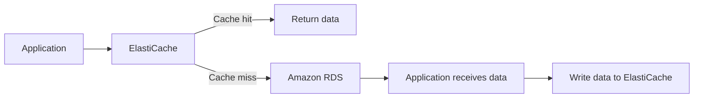
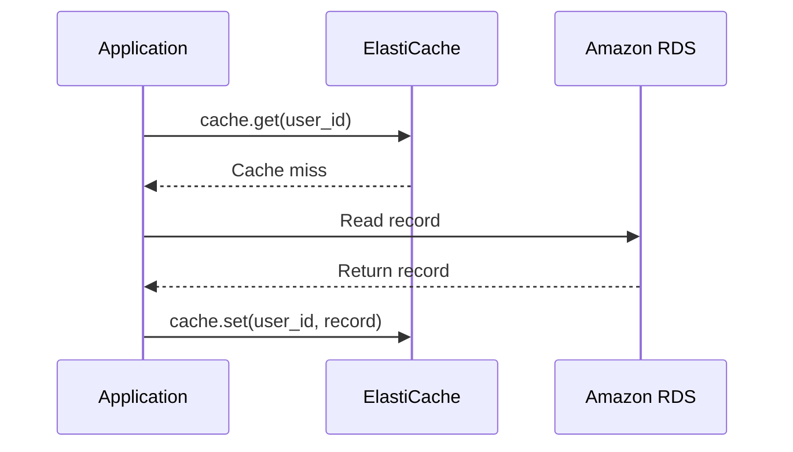
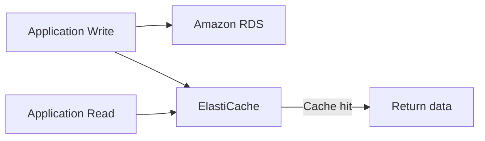

# 86. ElastiCache Strategies

## 🎯 Giới thiệu

Bài học đi sâu hơn vào các **caching strategies** khi dùng **Amazon ElastiCache**, bao gồm câu hỏi khi nào nên cache, các design pattern như **Lazy Loading / Cache-Aside / Lazy Population**, **Write Through**, và cách dùng **Cache Evictions** với **TTL**.

## 1. 🤔 Có nên cache dữ liệu không?

Cache thường an toàn, nhưng không phải phù hợp cho mọi loại dữ liệu.

Cần tự hỏi:

- Dữ liệu có thể bị out of date không?
- Application có chấp nhận **eventual consistency** không?
- Dữ liệu có thay đổi chậm không?
- Có một số keys được truy cập thường xuyên không?
- Dữ liệu có được cấu trúc tốt cho caching không?

✅ Cache hiệu quả khi:

- Dữ liệu thay đổi chậm.
- Một số keys được request thường xuyên.
- Dữ liệu có dạng key-value.
- Cần lưu aggregation results.

⚠️ Anti-pattern:

- Dữ liệu thay đổi rất nhanh.
- Cần truy cập toàn bộ key space.
- Dữ liệu không phù hợp để cache.

## 2. 🧠 Lazy Loading / Cache-Aside / Lazy Population

Ba tên gọi này có cùng ý nghĩa trong bài:

- **Lazy Loading**.
- **Cache-Aside**.
- **Lazy Population**.

Pattern này tối ưu cho read performance.

Luồng xử lý:

## 3. ✅ Ưu điểm của Lazy Loading

Lazy Loading có các ưu điểm:

- Chỉ data được request mới được cache.
- Cache hiệu quả vì không lưu dữ liệu không cần thiết.
- Nếu cache bị wipe hoặc node failure, không fatal.
- Khi cache mất dữ liệu, application vẫn đọc được từ RDS.

Tuy nhiên, cache cần được **warm up** lại:

- Các reads ban đầu đi tới RDS.
- Sau đó dữ liệu được cache dần.

## 4. ⚠️ Nhược điểm của Lazy Loading

Nhược điểm chính là **Cache miss** có thể gây latency.

Khi Cache miss xảy ra, có ba network calls:

1. Application gọi ElastiCache và bị Cache miss.
2. Application đọc dữ liệu từ RDS.
3. Application ghi dữ liệu vào cache.

Ngoài ra có thể có **stale data**:

- Dữ liệu trong RDS được update.
- Dữ liệu trong ElastiCache không nhất thiết được update ngay.
- Cache có thể chứa dữ liệu cũ.

## 5. 🧾 Nhận diện Lazy Loading qua Pseudocode

Bài học dùng ví dụ function `get_user(user_id)`:

- Gọi `cache.get(user_id)`.
- Nếu record là `None`, tức Cache miss.
- Query database bằng `db.query`.
- Ghi kết quả vào cache bằng `cache.set(user_id, record)`.
- Return record.
- Nếu cache có record, return trực tiếp.

💡 **Mẹo thi AWS:** Có thể cần đọc code đơn giản để nhận diện Lazy Loading strategy.

## 6. ✍️ Write Through

**Write Through** là strategy trong đó cache được add hoặc update khi database được update.

Luồng xử lý:

Khi application thay đổi Amazon RDS database, application cũng ghi dữ liệu vào cache.

## 7. ✅ Ưu điểm của Write Through

Ưu điểm:

- Dữ liệu trong cache không bị stale.
- Khi RDS thay đổi, cache cũng thay đổi.
- Chuyển penalty từ read sang write.

Điều này có thể tốt hơn cho trải nghiệm người dùng vì người dùng thường chấp nhận write chậm hơn read.

Ví dụ:

- Đăng bài trên social media có thể mất một chút thời gian.
- Nhưng fetch profile thì kỳ vọng rất nhanh.

## 8. ⚠️ Nhược điểm của Write Through

Nhược điểm:

- Missing data cho tới khi dữ liệu được update hoặc add vào RDS.
- Cache có thể chứa nhiều data không bao giờ được đọc.
- Hiện tượng này gọi là **Cache Churn**.
- Nếu cache nhỏ, việc đưa quá nhiều data vào cache có thể là vấn đề.

Có thể kết hợp **Write Through** với **Lazy Loading**:

- Nếu application không tìm thấy data trong ElastiCache, nó vẫn Lazy Load từ RDS.

## 9. 🧾 Nhận diện Write Through qua Pseudocode

Bài học dùng function `save_user`:

- Lưu dữ liệu vào database bằng `db.query update users`.
- Push record vào cache bằng `cache.set(user_id, record)`.
- Return record.

Điểm nhận diện:

- Đây là write optimization.
- Có thể dùng chung với function `get_user` của Lazy Loading.

## 10. 🗑️ Cache Evictions và TTL

Cache có kích thước giới hạn nên cần **Cache Eviction** để loại bỏ dữ liệu.

Eviction có thể xảy ra khi:

- Xóa item trực tiếp khỏi cache.
- Memory cache đầy.
- Item không được dùng gần đây và bị loại theo **LRU (Least Recently Used)**.
- Item có **TTL (Time-to-live)** hết hạn.

**TTL** quy định item chỉ tồn tại trong cache trong một khoảng thời gian nhất định.

Ví dụ:

- Item chỉ sống 5 phút.
- Sau 5 phút, cache evict item đó.

TTL hữu ích cho:

- Leaderboards.
- Comments.
- Activity streams.
- Nhiều loại data khác.

TTL có thể kéo dài từ:

- Vài giây.
- Tới vài giờ hoặc vài ngày.

Ngay cả TTL vài giây cũng có thể hiệu quả với dữ liệu được request rất nhiều.

## 11. 📈 Khi có quá nhiều Evictions

Nếu cache liên tục đầy memory và có quá nhiều evictions, nên cân nhắc tăng cache size bằng cách:

- Scaling up.
- Scaling out.

Nói cách khác: làm cache lớn hơn.

## 12. 🧠 Final Words of Wisdom

Bài học đưa ra các khuyến nghị:

- **Lazy Loading / Cache-Aside** dễ implement và phù hợp nhiều tình huống, đặc biệt để cải thiện read performance.
- **Write Through** cần nhiều effort hơn, thường là optimization bổ sung trên Lazy Loading.
- Không nên coi Write Through là ưu tiên đầu tiên.
- **TTL** thường là ý tưởng tốt, trừ khi đang dùng Write Through.
- Chỉ cache dữ liệu hợp lý.

Ví dụ có thể cache:

- User profiles.
- Blogs.

Ví dụ có thể không nên cache:

- Pricing data.
- Bank account value.

⚠️ Caching rất khó, đặc biệt là cache invalidation.

## 📊 Bảng so sánh chiến lược cache

| Tiêu chí | Lazy Loading / Cache-Aside | Write Through | TTL / Eviction |
|----------|-----------------------------|---------------|----------------|
| Mục tiêu | Improve read performance | Giữ cache đồng bộ khi write | Quản lý dữ liệu trong cache |
| Khi cache update | Sau Cache miss và đọc từ DB | Khi DB được update | Khi hết hạn hoặc bị evict |
| Ưu điểm | Chỉ cache data được request | Cache không stale | Cân bằng giữa giữ data và giải phóng cache |
| Nhược điểm | Cache miss gây latency, stale data | Write penalty, Cache Churn | TTL cần chọn hợp lý |
| Phù hợp | Foundation strategy | Optimization bổ sung | Hầu hết workload cần cache lifecycle |
| Exam keyword | Lazy Loading, Cache-Aside, Lazy Population | Write Through | TTL, LRU, Cache Eviction |

## 💡 Mẹo ghi nhớ cho kỳ thi AWS

- **Lazy Loading = Cache-Aside = Lazy Population**.
- Lazy Loading: app đọc cache trước, miss thì đọc RDS rồi ghi cache.
- Write Through: app ghi RDS và ghi cache cùng lúc.
- Lazy Loading có **read penalty** khi Cache miss.
- Write Through có **write penalty**.
- **TTL** giúp cache tự loại bỏ item sau thời gian nhất định.
- **LRU** = Least Recently Used.
- Cache chỉ nên dùng cho dữ liệu chấp nhận eventual consistency.

## ✅ Kết luận

ElastiCache Strategies giúp xác định cách application tương tác với cache. **Lazy Loading / Cache-Aside** là nền tảng dễ áp dụng để tăng read performance. **Write Through** giúp giảm stale data nhưng tạo write penalty. **TTL**, **LRU** và **Cache Evictions** giúp kiểm soát vòng đời dữ liệu trong cache. Khi ôn thi AWS, cần nắm rõ luồng xử lý, ưu/nhược điểm và cách nhận diện pseudocode của từng strategy.
