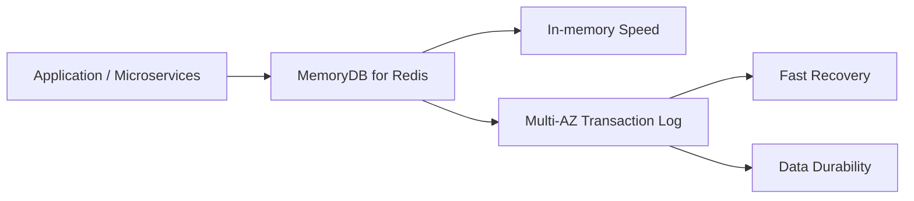

# 87. Amazon MemoryDB for Redis - Overview

## 🎯 Giới thiệu

**Amazon MemoryDB for Redis** là dịch vụ **Redis-compatible**, durable, in-memory database service.

Điểm khác biệt chính so với Redis dùng trong cache là **MemoryDB** được định vị như một database có API tương thích Redis, không chỉ là cache.

## 1. 📌 MemoryDB for Redis là gì?

MemoryDB for Redis cung cấp:

- Redis-compatible API.
- In-memory data.
- Durable data storage.
- Ultra-fast performance.

Theo bài học, MemoryDB có thể đạt hơn **160 million requests per second**.

## 2. 🔴 Redis vs MemoryDB for Redis

Bài học phân biệt:

- **Redis**: mục đích chính là cache với một phần durability.
- **MemoryDB for Redis**: là database với Redis-compatible API.

| Tiêu chí | Redis | MemoryDB for Redis |
|----------|-------|--------------------|
| Mục đích trong bài | Cache với một phần durability | Database có Redis-compatible API |
| Data | In-memory | In-memory |
| Durability | Có một phần durability | Durable data storage |
| Transaction log | Không nhấn mạnh trong bài | Multi-AZ transaction log |

## 3. 🛡️ Durability và Multi-AZ Transaction Log

MemoryDB lưu dữ liệu durable bằng **Multi-AZ transaction log**.

Điều này giúp:

- Fast recovery.
- Data durability.
- Transaction log được lưu across multiple AZ.

## 4. 📈 Scalability

MemoryDB có thể scale liền mạch từ:

- Tens of gigabytes.
- Tới hundreds of terabytes of storage.

## 5. 🚀 Use Cases

Các use cases được nhắc tới:

- Web applications.
- Mobile applications.
- Online gaming.
- Media streaming.
- Nhiều microservices cần truy cập Redis-compatible in-memory database.

## 📊 Bảng tóm tắt

| Tiêu chí | Mô tả |
|----------|------|
| Service | Amazon MemoryDB for Redis |
| Compatibility | Redis-compatible API |
| Loại dịch vụ | Durable in-memory database service |
| Performance | Hơn 160 million requests per second |
| Durability | Durable data storage |
| HA/Durability mechanism | Multi-AZ transaction log |
| Scale | Tens of GB tới hundreds of TB |
| Use cases | Web/mobile apps, online gaming, media streaming, microservices |

## 💡 Mẹo ghi nhớ cho kỳ thi AWS

- **Redis** trong bài được mô tả chủ yếu là cache.
- **MemoryDB for Redis** là database có Redis-compatible API.
- MemoryDB = in-memory speed + durable storage + **Multi-AZ transaction log**.
- Use case phù hợp khi microservices cần Redis-compatible in-memory database với durability.

## ✅ Kết luận

Amazon MemoryDB for Redis cung cấp database in-memory tương thích Redis, có hiệu năng rất cao và durable storage nhờ **Multi-AZ transaction log**. Dịch vụ phù hợp cho web/mobile applications, online gaming, media streaming và các microservices cần tốc độ in-memory cùng data durability.
