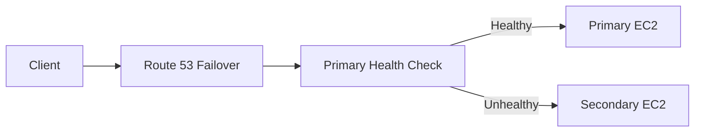
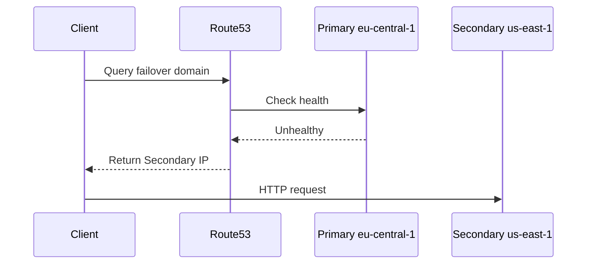

# 100. Routing Policy - Failover

## 🎯 Giới thiệu

**Failover Routing Policy** dùng để route DNS tới primary resource khi healthy, và tự động chuyển sang secondary resource khi primary unhealthy.

Đây là policy quan trọng cho **Disaster Recovery**.

## 1. Cách Failover Routing hoạt động

Kiến trúc gồm:

- Primary EC2 instance
- Secondary / Disaster Recovery EC2 instance
- Health check gắn với primary record

⚠️ Health check cho primary record là bắt buộc.

## 2. Primary và Secondary

Failover record type chỉ có 2 lựa chọn:

- **Primary**
- **Secondary**

Chỉ có:

- một primary
- một secondary

Secondary có thể associate health check nhưng không bắt buộc trong bài.

## 3. DNS response theo health

- Nếu primary healthy → Route 53 trả về primary record.
- Nếu primary unhealthy → Route 53 trả về secondary record.

Client luôn nhận resource được Route 53 xem là healthy.

## 4. Hands-on tạo Failover Record

Tạo record đầu tiên:

- Name: `failover.stephanetheteacher.com`
- Type: **A**
- Value: IP của EC2 ở `eu-central-1`
- Routing policy: **Failover**
- TTL: `60 seconds`
- Failover record type: **Primary**
- Health check: `EU-central-1`
- Record ID: `E`

Tạo record thứ hai:

- Same name: `failover.stephanetheteacher.com`
- Value: IP của EC2 ở `us-east-1`
- Routing policy: **Failover**
- Failover record type: **Secondary**
- Health check: optional
- Record ID: `US`

## 5. Test failover

Ban đầu:

- Both health checks healthy.
- URL trả về response từ `eu-central-1c`.

Sau đó mô phỏng failure:

- Vào security group của primary EC2.
- Xóa inbound rule HTTP port 80.
- Health check `EU-central-1` chuyển sang unhealthy.

Kết quả:

- Refresh URL → response từ `us-east-1`.
- Failover diễn ra tự động.

## 6. Khôi phục primary

Để fix:

- Add lại HTTP inbound rule trong security group.
- Health check sẽ pass lại.
- Route 53 sẽ failover trở lại primary location.

## 📊 Bảng tóm tắt

| Tiêu chí | Mô tả |
|----------|------|
| Policy | Failover Routing |
| Record types | Primary và Secondary |
| Primary health check | Bắt buộc |
| Secondary health check | Có thể optional |
| Use case | Disaster Recovery |
| Test failure | Remove HTTP rule từ security group |
| Khi primary unhealthy | DNS trả về secondary |

## 💡 Mẹo ghi nhớ cho kỳ thi AWS

- Failover Routing chỉ có **Primary** và **Secondary**.
- Primary record phải có Health Check.
- Dùng cho Disaster Recovery / active-passive setup.

## ✅ Kết luận

Failover Routing giúp Route 53 tự động trả về secondary endpoint khi primary endpoint unhealthy. Đây là cơ chế DNS-level failover quan trọng trong multi-region architecture.
