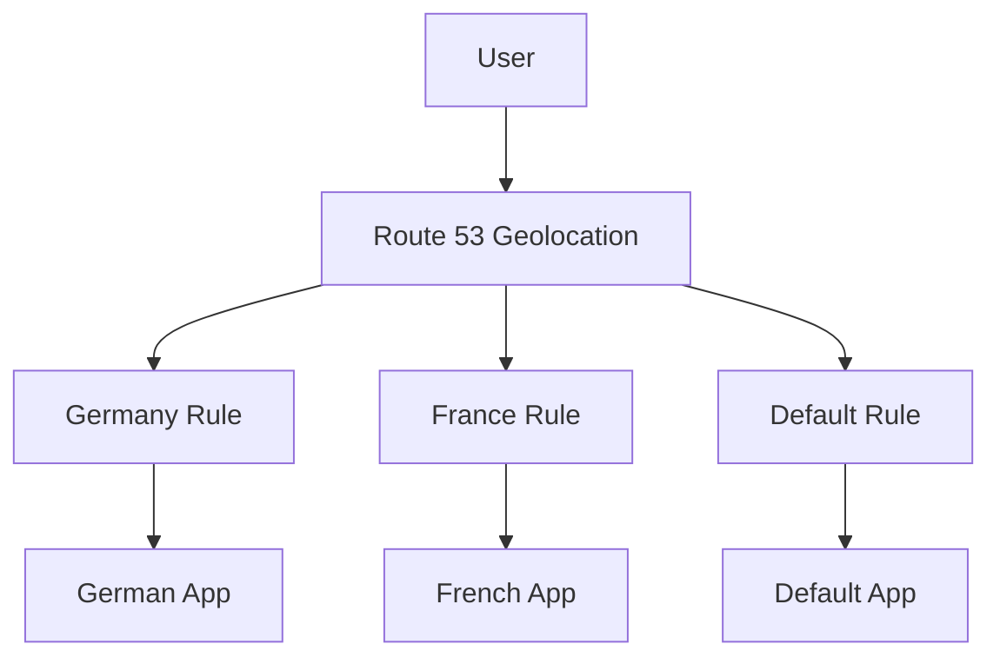

# 101. Routing Policy - Geolocation

## 🎯 Giới thiệu

**Geolocation Routing Policy** route user dựa trên **vị trí địa lý thực tế của user**.

Policy này khác với **Latency-based Routing**, vì Geolocation dựa vào location, không dựa vào latency.

## 1. Geolocation Routing hoạt động như thế nào?

Bạn có thể định nghĩa rule theo:

- Continent
- Country
- U.S. state

Route 53 chọn location match chính xác nhất trước.

Ví dụ:

- User từ Germany → German version
- User từ France → French version
- User không match rule nào → default record

## 2. Default Record

Transcript nhấn mạnh nên tạo **default record**.

Lý do:

- Nếu không có rule nào match location của user, default record sẽ xử lý.
- Tránh trường hợp user không nhận được DNS answer phù hợp.

## 3. Use cases

Geolocation Routing dùng cho:

- Website localization
- Restrict content distribution
- Load balancing

Có thể associate với **Health Checks**.

## 4. Hands-on tạo Geolocation Records

Tạo record name:

- `geo.stephanetheteacher.com`

### Record cho Asia

- Type: **A**
- Value: IP của `ap-southeast-1`
- Routing policy: **Geolocation**
- Location: **Asia**
- Record ID: Asia

### Record cho United States

- Value: IP của `us-east-1`
- Location: **United States**
- Record ID: U.S.

### Default Record

- Value: IP của `eu-central-1`
- Location: **Default**
- Record ID: Default EU

## 5. Test với VPN

Transcript test bằng VPN:

- Không ở U.S. hoặc Asia → default record → `eu-central-1c`.
- VPN India → Asia rule → `ap-southeast-1b`.
- VPN United States → U.S. rule → `us-east-1a`.
- VPN Mexico → không match U.S. → default `eu-central-1c`.

⚠️ Khi gặp timeout ở Asia test, nguyên nhân là HTTP rule đã bị xóa trước đó trong security group. Add lại HTTP rule thì hoạt động.

## 📊 Bảng tóm tắt

| Tiêu chí | Mô tả |
|----------|------|
| Policy | Geolocation Routing |
| Dựa trên | Vị trí user |
| Match level | Continent, Country, U.S. state |
| Priority | Match chính xác nhất |
| Default record | Nên tạo |
| Health Check | Có thể associate |
| Use cases | Localization, restrict content, load balancing |

## 💡 Mẹo ghi nhớ cho kỳ thi AWS

- Geolocation = dựa vào user location.
- Latency = dựa vào lowest latency.
- Luôn nhớ default record để xử lý vị trí không match.

## ✅ Kết luận

Geolocation Routing cho phép Route 53 trả về endpoint theo vị trí địa lý của user. Đây là lựa chọn phù hợp cho localization hoặc phân phối nội dung theo quốc gia/khu vực.
