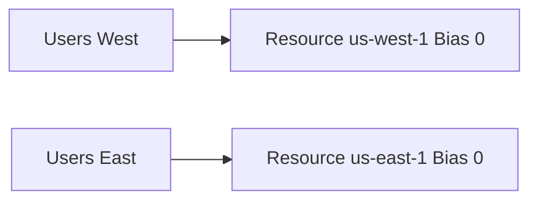
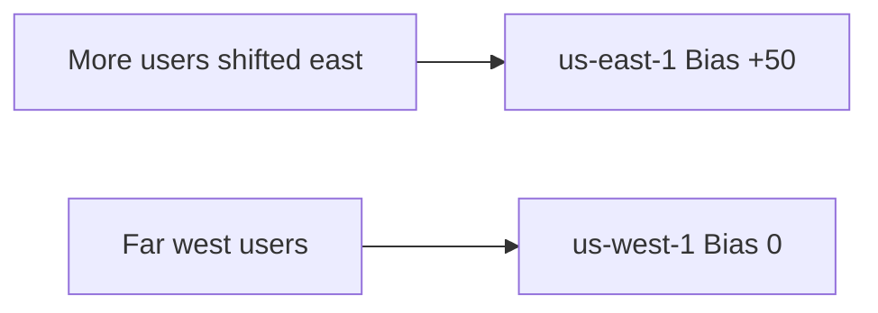

# 102. Routing Policy - Geoproximity

## 🎯 Giới thiệu

**Geoproximity Routing** route traffic dựa trên vị trí địa lý của **users** và **resources**, đồng thời cho phép điều chỉnh lượng traffic bằng **bias**.

📌 Đây là policy hữu ích khi cần **shift traffic** từ region này sang region khác.

## 1. Geoproximity Routing là gì?

Geoproximity Routing cho phép route traffic tới resources dựa trên:

- Geographic location của users.
- Geographic location của resources.
- Bias value để mở rộng hoặc thu hẹp vùng phục vụ của resource.

## 2. Bias là gì?

**Bias** là giá trị dùng để điều chỉnh lượng traffic tới resource.

- Bias dương → mở rộng vùng phục vụ → nhiều traffic hơn tới resource.
- Bias âm → thu hẹp vùng phục vụ → ít traffic hơn tới resource.
- Bias 0 → không điều chỉnh.

## 3. AWS resources vs non-AWS resources

### AWS resources

Nếu resource nằm trong AWS:

- Chỉ cần chỉ định AWS region.
- Route 53 tự tính routing phù hợp.

### Non-AWS resources

Nếu resource không thuộc AWS, ví dụ **on-premises data center**:

- Cần chỉ định **latitude** và **longitude**.

## 4. Route 53 Traffic Flow

Để dùng bias trong Geoproximity Routing, cần dùng advanced **Route 53 Traffic Flow**.

## 5. Ví dụ không bias

Có 2 resources:

- `us-west-1`, bias = 0
- `us-east-1`, bias = 0

Users ở bên trái đường chia sẽ đi tới `us-west-1`, users bên phải sẽ đi tới `us-east-1`.

## 6. Ví dụ bias dương

Có 2 resources:

- `us-west-1`, bias = 0
- `us-east-1`, bias = +50

Bias dương làm vùng phục vụ của `us-east-1` mở rộng hơn, nên nhiều users hơn được route tới `us-east-1`.

## 7. Use case chính

Khi cần shift nhiều traffic hơn tới một region cụ thể:

- Tăng bias của region đó.
- Route 53 sẽ kéo thêm traffic về region đó.

## 📊 Bảng tóm tắt

| Tiêu chí | Mô tả |
|----------|------|
| Policy | Geoproximity Routing |
| Dựa trên | Location của users và resources |
| Bias dương | Tăng traffic tới resource |
| Bias âm | Giảm traffic tới resource |
| AWS resource | Chỉ định region |
| Non-AWS resource | Chỉ định latitude/longitude |
| Yêu cầu bias | Route 53 Traffic Flow |
| Use case | Shift traffic giữa regions |

## 💡 Mẹo ghi nhớ cho kỳ thi AWS

- Geoproximity = location + bias.
- Muốn gửi nhiều traffic hơn tới region → tăng bias.
- Non-AWS resource cần latitude và longitude.

## ✅ Kết luận

Geoproximity Routing cho phép điều chỉnh vùng phục vụ của resources bằng bias. Đây là policy quan trọng khi cần chủ động shift traffic giữa các regions hoặc locations.
