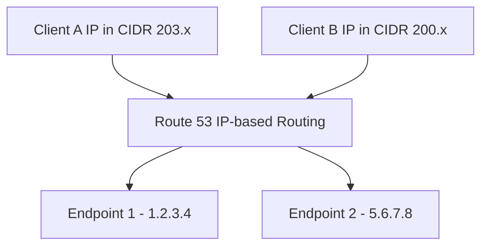

# 103. Routing Policy - IP-based

## 🎯 Giới thiệu

**IP-based Routing** route DNS response dựa trên **client IP addresses**.

Bạn định nghĩa các **CIDR blocks** cho client IP ranges, sau đó map từng CIDR tới endpoint tương ứng.

## 1. IP-based Routing hoạt động như thế nào?

Trong Route 53:

- Tạo danh sách CIDRs cho clients.
- Mỗi CIDR đại diện cho một IP range.
- Gán từng CIDR tới một location/endpoint.

Khi client query DNS:

- Route 53 kiểm tra IP của client thuộc CIDR nào.
- Trả về endpoint tương ứng với CIDR đó.

## 2. CIDR là gì trong bài này?

**CIDR** là IP range của clients.

Ví dụ transcript mô tả:

- Location 1 có CIDR bắt đầu với `203...`
- Location 2 có CIDR bắt đầu với `200...`

Mỗi location được link tới một record value khác nhau.

## 3. Ví dụ routing

Record `example.com` có 2 locations:

| Location | CIDR | Value |
|----------|------|-------|
| Location 1 | CIDR block 1 | `1.2.3.4` |
| Location 2 | CIDR block 2 | `5.6.7.8` |

Kết quả:

- User A thuộc CIDR 1 → được route tới `1.2.3.4`.
- User B thuộc CIDR 2 → được route tới `5.6.7.8`.

## 4. Use cases

Transcript nêu các use cases:

- Optimize performance vì biết IP trước.
- Reduce network costs vì biết traffic đến từ đâu.
- Route traffic từ một internet provider cụ thể tới một endpoint cụ thể.

## 📊 Bảng tóm tắt

| Tiêu chí | Mô tả |
|----------|------|
| Policy | IP-based Routing |
| Dựa trên | Client IP addresses |
| Định nghĩa | CIDR blocks |
| CIDR | IP ranges của clients |
| Use case | Optimize performance, reduce network costs |
| Ví dụ | ISP CIDR route tới endpoint riêng |

## 💡 Mẹo ghi nhớ cho kỳ thi AWS

- IP-based Routing = định tuyến theo client IP/CIDR.
- Hữu ích khi bạn biết trước IP ranges của người dùng hoặc nhà mạng.
- Khác với Geolocation: không dựa trên country/continent, mà dựa trên IP ranges bạn định nghĩa.

## ✅ Kết luận

IP-based Routing cho phép Route 53 trả về endpoint dựa trên CIDR của client IP. Đây là cách routing trực quan khi bạn biết trước IP ranges và muốn tối ưu performance hoặc network cost.
