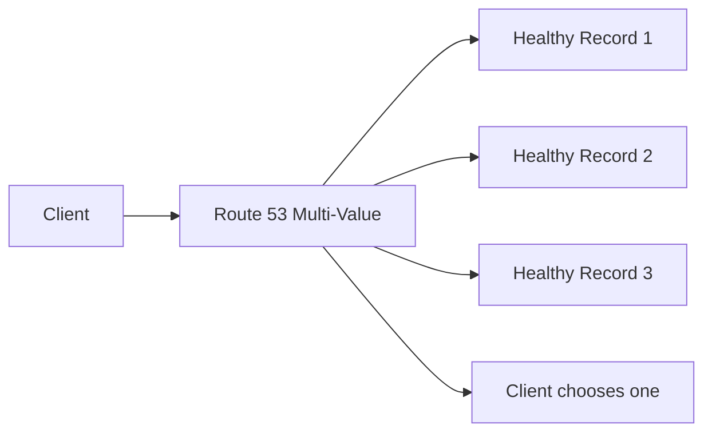
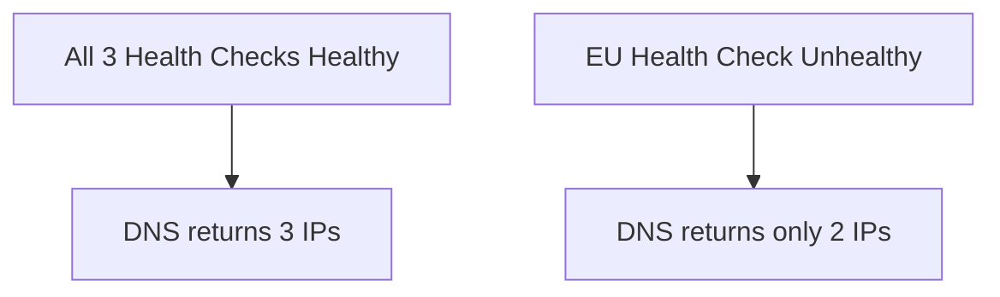

# 104. Routing Policy - Multi Value

## 🎯 Giới thiệu

**Multi-Value Routing Policy** dùng khi muốn Route 53 trả về nhiều resources cho một DNS query.

Điểm mạnh là có thể kết hợp với **Health Checks** để chỉ trả về healthy resources.

## 1. Multi-Value Routing là gì?

Route 53 có thể trả về nhiều values/resources trong một DNS response.

Với Multi-Value:

- Có thể associate records với Health Checks.
- Chỉ healthy records được trả về.
- Tối đa **8 healthy records** được trả về cho mỗi Multi-Value query.

## 2. Multi-Value không thay thế ELB ⚠️

Transcript nhấn mạnh:

- Multi-Value trông giống load balancing.
- Nhưng nó **không thay thế ELB**.
- Đây là **client-side load balancing**.

Client nhận nhiều IPs rồi tự chọn một IP.

## 3. Khác với Simple Routing nhiều values

Simple Routing có thể trả về nhiều values, nhưng:

- Không hỗ trợ Health Checks.
- Có thể trả về unhealthy resource.

Multi-Value mạnh hơn vì:

- Có Health Checks.
- Chỉ trả về healthy records.

## 4. Hands-on tạo Multi-Value Records

Tạo nhiều records cùng name:

- `multi.stephanetheteacher.com`

Các records:

| Region | Routing policy | Health check | Record ID | TTL |
|----------|----------------|--------------|-----------|-----|
| us-east-1 | Multivalue answer | us-east-1 | US | 60s |
| ap-southeast-1 | Multivalue answer | ap-southeast-1 | Asia | 60s |
| eu-central-1 | Multivalue answer | eu-central-1 | EU | 60s |

## 5. Test với dig

Khi cả 3 health checks healthy:

- `dig` trả về 3 IPs.

Khi làm `eu-central-1` unhealthy bằng **Invert health status**:

- `dig` chỉ trả về 2 IPs.

Điều này chứng minh Multi-Value chỉ trả về healthy records.

## 📊 Bảng tóm tắt

| Tiêu chí | Mô tả |
|----------|------|
| Policy | Multi-Value Routing |
| Mục đích | Return multiple resources |
| Health Check | Có thể associate |
| Max records returned | Up to 8 healthy records |
| Load balancing | Client-side |
| Thay thế ELB | ❌ Không |
| Khác Simple | Multi-Value lọc unhealthy records |

## 💡 Mẹo ghi nhớ cho kỳ thi AWS

- Multi-Value trả về tối đa **8 healthy records**.
- Không phải replacement cho ELB.
- Khác Simple ở chỗ có thể dùng Health Checks.

## ✅ Kết luận

Multi-Value Routing cho phép Route 53 trả về nhiều healthy endpoints cho client. Đây là DNS-level client-side load balancing, nhưng không thay thế Elastic Load Balancer.
