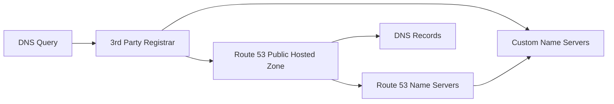

# 105. 3rd Party Domains & Route 53

## 🎯 Giới thiệu

Bài học phân biệt **domain registrar** và **DNS service**, đồng thời giải thích cách dùng domain mua từ bên thứ ba với **Amazon Route 53**.

## 1. Domain Registrar vs DNS Service

### Domain Registrar

Là nơi bạn mua/register domain name và trả phí hàng năm.

Ví dụ:

- Amazon Registrar qua Route 53 console
- GoDaddy
- Google Domains

### DNS Service

Là nơi quản lý DNS records cho domain.

Ví dụ:

- Amazon Route 53 Hosted Zone
- DNS service đi kèm registrar

📌 Registrar và DNS service có thể cùng một nhà cung cấp hoặc khác nhau.

## 2. Các kết hợp có thể có

Transcript nêu 2 chiều đều hợp lệ:

### Domain mua bằng Amazon Registrar

Bạn có thể:

- Register domain bằng Route 53.
- Nhưng không nhất thiết dùng Route 53 để quản lý DNS records.

### Domain mua bằng GoDaddy

Bạn có thể:

- Register `example.com` bằng GoDaddy.
- Dùng Amazon Route 53 để quản lý DNS records.

## 3. Cách dùng third-party domain với Route 53

Các bước:

1. Mua domain ở third-party registrar như GoDaddy.
2. Trong Route 53, tạo **public hosted zone** cho domain.
3. Lấy 4 **name servers** trong hosted zone details.
4. Vào website của third-party registrar.
5. Cập nhật **custom name servers** thành Route 53 name servers.

## 4. Kết quả sau khi đổi Name Servers

Khi người dùng query domain:

- Registrar biết domain dùng Route 53 name servers.
- DNS queries được chuyển tới Route 53.
- Route 53 trở thành nơi quản lý DNS records.

## 5. Tóm tắt quy trình

Nếu mua domain ở third-party registrar nhưng muốn dùng Route 53:

- Tạo public hosted zone trong Route 53.
- Update **NS records / name servers** trên website nơi mua domain.
- Trỏ chúng tới Route 53 name servers.

## 📊 Bảng tóm tắt

| Tiêu chí | Domain Registrar | DNS Service |
|----------|------------------|-------------|
| Vai trò | Mua/register domain | Quản lý DNS records |
| Ví dụ | GoDaddy, Amazon Registrar | Route 53 |
| Phí | Annual charges | Hosted zone/query charges |
| Có thể khác nhà cung cấp? | ✅ Có | ✅ Có |
| Cầu nối | Name servers / NS records | Hosted zone |

## 💡 Mẹo ghi nhớ cho kỳ thi AWS

- Bạn không bắt buộc mua domain ở AWS để dùng Route 53 DNS.
- Muốn Route 53 quản lý DNS cho third-party domain → update NS/name servers ở registrar.
- Registrar ≠ DNS service.

## ✅ Kết luận

Domain registrar là nơi mua domain, còn DNS service là nơi quản lý DNS records. Bạn hoàn toàn có thể mua domain ở bên thứ ba và dùng Route 53 làm DNS service bằng cách cập nhật name servers sang Route 53.
