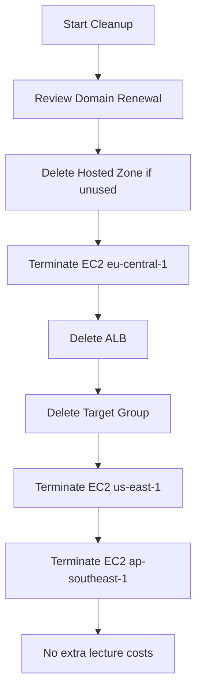

# 106. Route 53 - Section Cleanup

## 🎯 Giới thiệu

Bài này hướng dẫn cleanup các resources đã tạo trong section Route 53 để tránh phát sinh chi phí không cần thiết.

## 1. Domain name

Domain name đã mua sẽ vẫn nằm trong account.

Chi phí:

- Khoảng **$12/year** hoặc hơn, tùy domain.
- Nếu renew domain, bạn tiếp tục bị tính phí.

⚠️ Domain name không thể cleanup giống EC2 instance; nó còn tồn tại theo thời hạn đăng ký.

## 2. Hosted Zone

Nếu không dùng hosted zone, có thể xóa để tránh phí.

Transcript nhắc hosted zone có thể tốn:

- **$0.50/month**

Để delete hosted zone:

1. Empty tất cả records trong hosted zone.
2. Delete hosted zone.

📌 Nếu vẫn còn dùng domain/records thì có thể giữ lại.

## 3. EC2 Instances

Trong section đã tạo EC2 instances ở nhiều regions:

- Frankfurt / `eu-central-1`
- Northern Virginia / `us-east-1`
- Singapore / `ap-southeast-1`

Cần terminate từng instance ở từng region.

## 4. Application Load Balancer và Target Group

Ở Frankfurt đã tạo:

- **Application Load Balancer**
- **Target Group** liên quan

Cleanup:

- Delete Load Balancer.
- Delete associated Target Group.

## 5. Quy trình cleanup tổng thể

## 📊 Bảng tóm tắt

| Resource | Cleanup action | Lý do |
|----------|----------------|------|
| Domain name | Kiểm tra renewal | Có phí yearly |
| Hosted zone | Delete nếu không dùng | Tránh $0.50/month |
| EC2 instances | Terminate ở mọi region | Tránh compute cost |
| ALB | Delete | Tránh load balancer cost |
| Target group | Delete | Cleanup resource liên quan |

## 💡 Mẹo ghi nhớ cho kỳ thi AWS

- Route 53 hosted zone có phí duy trì theo tháng.
- EC2/ALB phải cleanup theo từng region.
- Domain registration có vòng đời riêng và không biến mất khi xóa hosted zone.

## ✅ Kết luận

Sau section Route 53, cần kiểm tra domain renewal, xóa hosted zone nếu không dùng, terminate EC2 instances ở mọi region, và xóa ALB/Target Group để tránh phát sinh chi phí.
