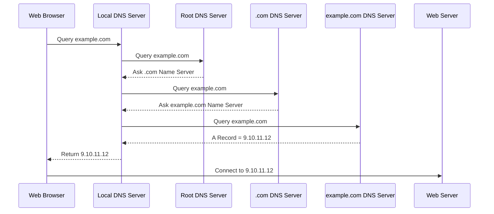

# 88. What is a DNS?

## 🎯 Giới thiệu

Bài học giới thiệu **DNS (Domain Name System)** — hệ thống giúp chuyển đổi các **human friendly hostnames** như `www.google.com` thành **IP addresses** mà trình duyệt có thể kết nối tới.

📌 DNS được xem là **backbone of the internet**, vì hầu hết mọi website đều cần DNS để người dùng truy cập bằng tên miền thay vì IP.

## 1. DNS là gì?

DNS có nhiệm vụ:

- Dịch **hostname** thành **target server IP address**.
- Giúp trình duyệt biết cần kết nối tới server nào.
- Hỗ trợ cấu trúc tên miền phân cấp như:
  - `.com`
  - `example.com`
  - `www.example.com`
  - `api.www.example.com`

Ví dụ:

- Người dùng nhập `www.google.com`.
- DNS trả về một IP address.
- Trình duyệt dùng IP đó để truy cập server của Google.

## 2. Các thuật ngữ DNS quan trọng 📌

### Domain Registrar

**Domain Registrar** là nơi đăng ký domain name.

Ví dụ:

- Amazon Route 53
- GoDaddy
- các domain registrar khác

### DNS Records

**DNS Records** là các bản ghi định nghĩa cách ánh xạ hostname tới IP hoặc hostname khác.

Các loại record được nhắc tới:

- **A**
- **AAAA**
- **CNAME**
- **NS**

### Zone File

**Zone file** chứa toàn bộ DNS records, dùng để ánh xạ hostname sang IP hoặc địa chỉ đích.

### Name Servers

**Name servers** là các server thực sự resolve DNS queries.

### Top Level Domain (TLD)

Ví dụ:

- `.com`
- `.us`
- `.in`
- `.gov`
- `.org`

### Second Level Domain

Ví dụ:

- `amazon.com`
- `google.com`

## 3. Cấu trúc của một URL / FQDN

Ví dụ: `http://api.www.example.com.`

| Thành phần | Ý nghĩa |
|----------|------|
| `.` cuối cùng | Root của toàn bộ domain names |
| `.com` | TLD - Top Level Domain |
| `example.com` | Second Level Domain |
| `www.example.com` | Subdomain |
| `api.www.example.com` | FQDN - Fully Qualified Domain Name |
| `http` | Protocol |
| Toàn bộ chuỗi | URL |

## 4. DNS hoạt động như thế nào?

Ví dụ có một web server với public IP `9.10.11.12`, và muốn truy cập bằng `example.com`.

## 5. Caching trong DNS

Khi **Local DNS Server** nhận được câu trả lời, nó sẽ **cache** kết quả.

Mục đích:

- Giảm số lần phải hỏi lại các DNS servers.
- Tăng tốc độ trả lời cho các truy vấn sau.

## 📊 Bảng tóm tắt

| Tiêu chí | Mô tả |
|----------|------|
| DNS | Domain Name System |
| Chức năng chính | Dịch hostname thành IP address |
| Domain Registrar | Nơi đăng ký domain name |
| DNS Record | Bản ghi ánh xạ hostname |
| Name Server | Server resolve DNS query |
| FQDN | Fully Qualified Domain Name |
| TLD | `.com`, `.org`, `.gov`, ... |

## 💡 Mẹo ghi nhớ cho kỳ thi AWS

- DNS không trực tiếp truyền HTTP traffic.
- DNS chỉ trả lời: hostname này tương ứng với IP hoặc endpoint nào.
- Route 53 ở các bài sau sẽ đóng vai trò quản lý DNS records.

## ✅ Kết luận

DNS là hệ thống nền tảng giúp chuyển đổi domain name thân thiện với con người thành IP address để trình duyệt có thể kết nối tới server. Hiểu DNS là bước bắt buộc trước khi học **Amazon Route 53**.
