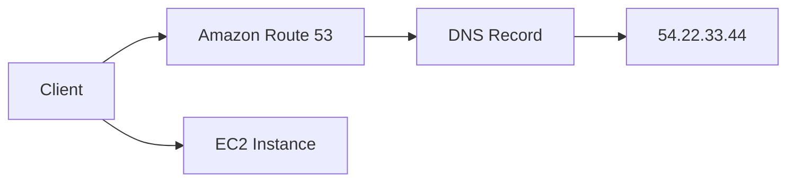
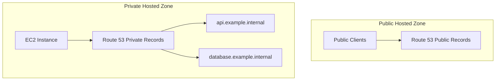

# 89. Route 53 Overview

## 🎯 Giới thiệu

**Amazon Route 53** là dịch vụ **highly available**, **scalable**, **fully managed**, và **authoritative DNS** của AWS.

📌 **Authoritative DNS** nghĩa là khách hàng có toàn quyền cập nhật **DNS records**, tức Route 53 là nguồn sự thật cho domain đó.

## 1. Route 53 dùng để làm gì?

Route 53 giúp người dùng truy cập tài nguyên AWS bằng domain name thay vì IP.

Ví dụ:

- EC2 Instance có public IP: `54.22.33.44`
- Người dùng muốn truy cập: `example.com`
- Ta tạo DNS record trong Route 53 để map `example.com` tới IP này.

## 2. Route 53 là Domain Registrar

Route 53 cũng có thể dùng để đăng ký domain names như:

- `example.com`
- domain dùng trong hands-on của khóa học

⚠️ Lưu ý: đăng ký domain name sẽ tốn phí, tối thiểu khoảng **$12/year** theo transcript.

## 3. Health Checks và SLA

Route 53 có khả năng kiểm tra **health** của resources.

Điểm đáng nhớ:

- Có thể dùng health checks để hỗ trợ routing/failover.
- Đây là dịch vụ AWS duy nhất trong transcript được nhắc là cung cấp **100% availability SLA**.
- Số **53** trong Route 53 liên quan tới DNS port truyền thống: **port 53**.

## 4. DNS Records trong Route 53

Một DNS record trong Route 53 chứa các thông tin chính:

| Thành phần | Mô tả |
|----------|------|
| Domain/Subdomain | Ví dụ `example.com`, `app.example.com` |
| Record Type | Ví dụ A, AAAA, CNAME, NS |
| Value | Ví dụ IP `12.34.56.78` |
| Routing Policy | Cách Route 53 trả lời DNS queries |
| TTL | Time To Live, thời gian record được cache |

## 5. Các Record Types cần biết 📌

### A Record

Map hostname sang **IPv4 address**.

Ví dụ:

- `example.com` → `1.2.3.4`

### AAAA Record

Map hostname sang **IPv6 address**.

### CNAME Record

Map hostname sang hostname khác.

Ví dụ:

- `www.example.com` → hostname khác

⚠️ Không thể tạo **CNAME** cho top node / **Zone Apex** như `example.com`.

### NS Record

**Name Servers** của hosted zone.

NS records kiểm soát server nào có quyền trả lời DNS queries cho domain.

## 6. Hosted Zones

**Hosted Zone** là container chứa DNS records, định nghĩa cách route traffic cho domain và subdomains.

Có 2 loại:

### Public Hosted Zone

- Dùng cho public domain name.
- Cho phép clients trên internet query records.
- Ví dụ: `mypublicdomain.com`.

### Private Hosted Zone

- Dùng cho domain names private.
- Chỉ resolve được bên trong **VPC**.
- Ví dụ: `application1.company.internal`.

## 7. Chi phí được nhắc trong bài

- Hosted zone: **$0.50/month**.
- Register domain: tối thiểu khoảng **$12/year**.

⚠️ Section này không hoàn toàn miễn phí.

## 📊 Bảng tóm tắt

| Tiêu chí | Mô tả |
|----------|------|
| Route 53 | Managed authoritative DNS |
| Registrar | Có thể đăng ký domain name |
| Health Checks | Kiểm tra health của resources |
| Port DNS | 53 |
| Public Hosted Zone | Trả lời DNS query từ internet |
| Private Hosted Zone | Chỉ resolve trong VPC |
| Record quan trọng | A, AAAA, CNAME, NS |

## 💡 Mẹo ghi nhớ cho kỳ thi AWS

- Route 53 là **authoritative DNS**.
- **A** map hostname tới IPv4.
- **AAAA** map hostname tới IPv6.
- **CNAME** map hostname tới hostname khác, nhưng không dùng cho **Zone Apex**.
- **NS** xác định name servers của hosted zone.

## ✅ Kết luận

Route 53 là dịch vụ DNS quản lý hoàn toàn của AWS, có thể dùng để đăng ký domain, quản lý records, health checks, và public/private hosted zones. Đây là nền tảng cho toàn bộ các routing policies ở các bài tiếp theo.
