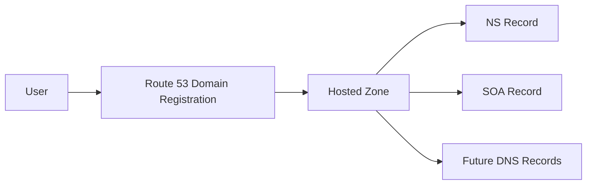

# 90. Route 53 - Registering a domain

## 🎯 Giới thiệu

Bài hands-on này hướng dẫn đăng ký một domain name trong **Route 53** để bắt đầu sử dụng DNS records trong các bài sau.

⚠️ Việc đăng ký domain name sẽ tốn tiền. Trong transcript, ví dụ domain có giá khoảng **$13/year**.

## 1. Bắt đầu trong Route 53

Trong Route 53 console:

- Vào phần **Register domains**.
- Chọn **Register domain**.
- Nhập domain name mong muốn.
- Kiểm tra domain còn khả dụng hay không.

Ví dụ trong bài dùng domain dạng `stephanetheteacher.com`.

## 2. Chọn domain và checkout

Khi domain khả dụng:

- Chọn domain.
- Thêm vào basket.
- Proceed to checkout.
- Chọn duration, ví dụ **1 year**.

### Auto renew

Bạn có thể bật hoặc tắt **autorenew**:

- Bật nếu muốn giữ domain lâu dài.
- Tắt nếu chỉ dùng domain cho khóa học.

⚠️ Nếu domain hết hạn và không renew, người khác có thể mua lại domain đó.

## 3. Contact Information và Privacy Protection

Route 53 yêu cầu thông tin liên hệ:

- Registrant contact
- Admin contact
- Tech contact

Transcript khuyến nghị bật **privacy protection** để:

- Ẩn thông tin cá nhân khỏi internet.
- Giảm khả năng nhận spam.

## 4. Submit và thanh toán

Sau khi review thông tin:

- Tick terms and conditions.
- Submit.

⚠️ Khi submit, bạn sẽ bị tính phí domain.

Việc đăng ký domain có thể mất:

- vài phút
- hoặc vài giờ

## 5. Hosted Zone sau khi đăng ký domain

Sau khi domain được đăng ký, vào **Hosted zones**.

Một hosted zone mới sẽ được tạo và thường có sẵn:

- **NS record**
- **SOA record**

### NS Record

**NS record** chỉ ra domain nên dùng AWS DNS / Route 53 name servers để trả lời DNS queries.

Từ lúc này, khi thêm DNS records vào hosted zone, Route 53 sẽ trở thành nguồn quản lý records cho domain.

## 📊 Bảng tóm tắt

| Tiêu chí | Mô tả |
|----------|------|
| Dịch vụ dùng | Route 53 |
| Mục tiêu | Register domain name |
| Chi phí ví dụ | Khoảng $13/year |
| Auto renew | Giữ domain tự động sau mỗi năm |
| Privacy protection | Ẩn thông tin cá nhân |
| Hosted zone mặc định | Có NS và SOA records |

## 💡 Mẹo ghi nhớ cho kỳ thi AWS

- Register domain và hosted zone là hai phần liên quan nhưng khác nhau.
- Sau khi register domain qua Route 53, hosted zone sẽ dùng **NS record** để Route 53 trả lời DNS queries.
- Section Route 53 có thể phát sinh chi phí.

## ✅ Kết luận

Để thực hành Route 53, bạn có thể đăng ký domain name trong Route 53. Sau khi domain được tạo, hosted zone sẽ chứa NS và SOA records, cho phép Route 53 quản lý DNS records của domain.
