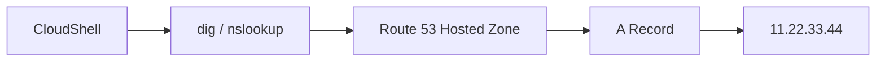

# 91. Route 53 - Creating our first records

## 🎯 Giới thiệu

Bài hands-on này tạo DNS record đầu tiên trong **Route 53 Hosted Zone**, sau đó kiểm tra bằng command line qua **CloudShell**.

## 1. Tạo record đầu tiên

Trong hosted zone:

- Chọn **Create record**.
- Nhập record name, ví dụ `test.stephanetheteacher.com`.
- Chọn record type là **A record**.
- Nhập value là IPv4 address, ví dụ `11.22.33.44`.
- TTL để mặc định `300 seconds`.
- Routing policy để **Simple routing**.

📌 **A record** dùng để route hostname tới một IPv4 address.

## 2. Vì sao browser không hiển thị gì?

Trong ví dụ, IP `11.22.33.44` chỉ là giá trị minh họa.

Vì không có server thực sự chạy ở IP đó, khi truy cập bằng browser sẽ không có kết quả hữu ích.

Điều quan trọng là DNS record đã được tạo và có thể query được.

## 3. Kiểm tra bằng CloudShell

Để mọi người dùng cùng một môi trường, transcript dùng **CloudShell** thay vì terminal cục bộ.

Cài công cụ kiểm tra DNS:

```bash
sudo yum install -y bind-utils
```

Lệnh này cài:

- `nslookup`
- `dig`

## 4. Kiểm tra bằng nslookup

Ví dụ:

```bash
nslookup test.stephanetheteacher.com
```

Kết quả trả về IP đã cấu hình trong A record.

## 5. Kiểm tra bằng dig

Ví dụ:

```bash
dig test.stephanetheteacher.com
```

`dig` hiển thị rõ hơn:

- Answer section
- Record type là **A**
- TTL
- Value của record



## 📊 Bảng tóm tắt

| Tiêu chí | Mô tả |
|----------|------|
| Record tạo | A record |
| Ví dụ hostname | `test.stephanetheteacher.com` |
| Ví dụ value | `11.22.33.44` |
| TTL | 300 seconds |
| Routing policy | Simple routing |
| Công cụ kiểm tra | `nslookup`, `dig` |
| Môi trường | AWS CloudShell |

## 💡 Mẹo ghi nhớ cho kỳ thi AWS

- **A record** trả về IPv4 address.
- Browser không chạy được không có nghĩa DNS sai; có thể IP không có web server.
- `dig` hữu ích vì hiển thị cả TTL và record type.

## ✅ Kết luận

Bài học đã tạo A record đầu tiên trong Route 53 và kiểm tra record bằng `nslookup` và `dig`. Đây là nền tảng trước khi route domain tới EC2 instances thực sự.
