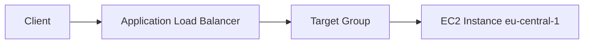
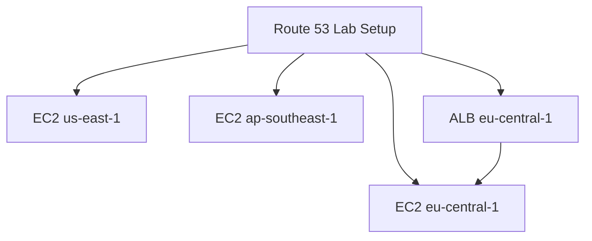

# 92. Route 53 - EC2 Setup

## 🎯 Giới thiệu

Bài này chuẩn bị môi trường cho các bài Route 53 tiếp theo bằng cách tạo:

- 3 **EC2 instances** ở 3 regions khác nhau.
- 1 **Application Load Balancer (ALB)** ở Frankfurt.
- User data script để web server trả về thông tin region/AZ.

## 1. Tạo EC2 Instance ở Frankfurt

Trong region Frankfurt:

- Launch EC2 instance.
- Chọn **Amazon Linux 2**.
- Instance type: **t2.micro**.
- Không cần key pair vì có thể dùng **EC2 Instance Connect**.
- Security group cho phép:
  - **SSH**
  - **HTTP** từ anywhere
- Thêm **EC2 user data script**.

User data script sẽ tạo web page trả về:

- `Hello World`
- Availability Zone mà instance được launch.

## 2. Tạo EC2 Instance ở các regions khác

Lặp lại quy trình tương tự ở:

- **US East 1 / Northern Virginia**
- **AP Southeast 1 / Singapore**

Kết quả có 3 instances ở 3 regions:

| Region | Mục đích |
|----------|------|
| eu-central-1 | Frankfurt |
| us-east-1 | Northern Virginia |
| ap-southeast-1 | Singapore |

## 3. Tạo Application Load Balancer

Ở Frankfurt, tạo **Application Load Balancer**:

- Name: `DemoRoute53ALB`
- Scheme: **internet-facing**
- IP address type: **IPv4**
- Chọn nhiều subnets.
- Security group có HTTP enabled.
- Listener protocol: **HTTP port 80**.
- Forward tới target group mới.

## 4. Tạo Target Group

Target group:

- Type: instances
- Name: `demo tg route 53`
- Register EC2 instance ở Frankfurt.

ALB sẽ forward HTTP traffic tới instance này.

## 5. Kiểm tra môi trường

Transcript kiểm tra từng endpoint:

- Public IP của EC2 Frankfurt trả về `Hello World` từ `eu-central-1`.
- Public IP của EC2 Northern Virginia trả về `Hello World` từ `us-east-1`.
- Public IP của EC2 Singapore trả về `Hello World` từ `ap-southeast-1`.
- ALB DNS name trỏ tới instance Frankfurt.

## 📊 Bảng tóm tắt

| Thành phần | Mô tả |
|----------|------|
| EC2 AMI | Amazon Linux 2 |
| Instance type | t2.micro |
| Key pair | Không cần, dùng EC2 Instance Connect nếu cần |
| Security group | SSH + HTTP from anywhere |
| User data | Tạo web page Hello World + AZ |
| ALB | Internet-facing, IPv4 |
| Target group | Trỏ tới EC2 ở Frankfurt |

## 💡 Mẹo ghi nhớ cho kỳ thi AWS

- Route 53 routing policies thường cần nhiều endpoints để demo.
- ALB có DNS name riêng, có thể dùng với CNAME hoặc Alias ở bài sau.
- Security group phải cho phép HTTP nếu muốn browser/health check truy cập được.

## ✅ Kết luận

Bài này chuẩn bị đầy đủ môi trường gồm nhiều EC2 instances ở nhiều regions và một ALB. Đây là nền tảng để thực hành TTL, CNAME, Alias, Health Checks và các Routing Policies.
