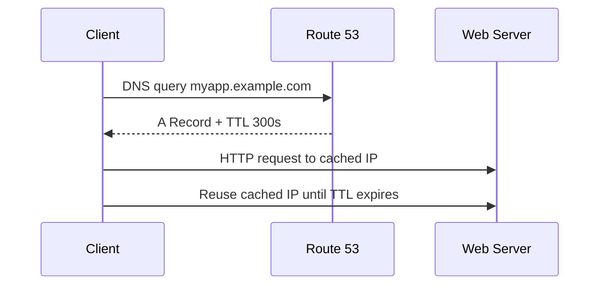
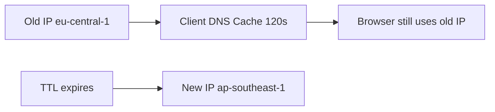

# 93. Route 53 - TTL

## 🎯 Giới thiệu

**TTL (Time To Live)** là thời gian DNS record được cache bởi client hoặc DNS resolver.

TTL quyết định client sẽ dùng lại kết quả DNS trong bao lâu trước khi hỏi lại Route 53.

## 1. TTL hoạt động như thế nào?

Ví dụ:

- Client query `myapp.example.com`.
- Route 53 trả về A record với IP và TTL = `300 seconds`.
- Client cache kết quả trong 300 giây.
- Trong thời gian cache, client không hỏi lại DNS.

## 2. TTL cao vs TTL thấp

### TTL cao

Ví dụ: **24 hours**

Ưu điểm:

- Ít DNS queries hơn tới Route 53.
- Ít traffic DNS hơn.
- Chi phí query thấp hơn.

Nhược điểm:

- Clients có thể giữ record cũ lâu.
- Nếu đổi record, phải chờ lâu để mọi client cập nhật.

### TTL thấp

Ví dụ: **60 seconds**

Ưu điểm:

- Record thay đổi nhanh hơn.
- Dễ migrate / update endpoint.

Nhược điểm:

- Nhiều DNS queries hơn.
- Có thể tốn nhiều chi phí hơn do Route 53 tính phí theo requests.

## 3. Chiến lược đổi record

Nếu chuẩn bị thay đổi DNS record:

1. Giảm TTL xuống thấp trước.
2. Chờ đủ thời gian để clients nhận TTL mới.
3. Thay đổi record value.
4. Sau khi ổn định, tăng TTL trở lại.

## 4. TTL và Alias record

TTL là bắt buộc với mọi record, **ngoại trừ Alias record**.

Với Alias record, TTL được Route 53 tự quản lý.

## 5. Hands-on TTL

Transcript tạo record:

- Name: `demo.stephanetheteacher.com`
- Type: **A record**
- Value: EC2 instance IP ở `eu-central-1`
- TTL: `120 seconds`

Sau đó:

- Dùng browser truy cập record.
- Dùng `nslookup` kiểm tra IP.
- Dùng `dig` để thấy TTL đếm ngược.

Khi đổi value sang IP ở `ap-southeast-1`, client vẫn thấy IP cũ cho tới khi TTL hết hạn.

## 📊 Bảng tóm tắt

| Tiêu chí | TTL cao | TTL thấp |
|----------|---------|----------|
| DNS queries | Ít hơn | Nhiều hơn |
| Chi phí DNS | Thấp hơn | Cao hơn |
| Tốc độ đổi record | Chậm hơn | Nhanh hơn |
| Nguy cơ stale record | Cao hơn | Thấp hơn |
| Use case | Record ít thay đổi | Chuẩn bị thay đổi record |

## 💡 Mẹo ghi nhớ cho kỳ thi AWS

- TTL = thời gian cache DNS response.
- Muốn đổi DNS nhanh, giảm TTL trước.
- Alias record không cần set TTL thủ công.

## ✅ Kết luận

TTL kiểm soát thời gian DNS response được cache. TTL cao giúp giảm DNS traffic nhưng làm record cập nhật chậm; TTL thấp giúp đổi record nhanh nhưng tăng DNS queries tới Route 53.
