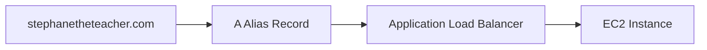

# 94. Route 53 CNAME vs Alias

## 🎯 Giới thiệu

Bài học so sánh **CNAME records** và **Alias records** trong Route 53, đặc biệt khi muốn map domain name tới AWS resources như **Load Balancer** hoặc **CloudFront**.

## 1. Bối cảnh

Một AWS Resource như:

- Load Balancer
- CloudFront

sẽ expose một hostname riêng.

Ví dụ bạn muốn:

- `myapp.mydomain.com` trỏ tới hostname của Load Balancer.

Có 2 lựa chọn:

- **CNAME record**
- **Alias record**

## 2. CNAME Record

**CNAME** cho phép point một hostname tới hostname khác.

Ví dụ:

- `app.mydomain.com` → `blabla.anything.com`

⚠️ Giới hạn quan trọng:

- CNAME chỉ hoạt động với **non-root domain**.
- Không dùng được cho **root domain / Zone Apex** như `mydomain.com`.

## 3. Alias Record

**Alias record** là tính năng riêng của Route 53.

Nó cho phép point hostname tới một **AWS Resource**.

Ví dụ:

- `app.mydomain.com` → `blabla.amazonaws.com`
- `mydomain.com` → ALB

Ưu điểm:

- Dùng được cho root domain và non-root domain.
- Free of charge khi query theo transcript.
- Có native health check capability.
- Tự nhận biết thay đổi IP của underlying AWS resource.

## 4. Alias record hoạt động với những target nào?

Alias records có thể trỏ tới AWS resources như:

- **Elastic Load Balancers**
- **CloudFront Distributions**
- **API Gateway**
- **Elastic Beanstalk environments**
- **S3 Websites**
- **VPC Interface Endpoints**
- **Global Accelerator**
- **Route 53 records in the same hosted zone**

⚠️ Lưu ý quan trọng:

- Không thể tạo Alias target tới **EC2 DNS name**.
- Alias record luôn là type **A** hoặc **AAAA**.
- Không thể set TTL cho Alias record; Route 53 tự set.

## 5. Hands-on CNAME

Tạo record:

- Name: `myapp.stephanetheteacher.com`
- Type: **CNAME**
- Value: DNS name của ALB

Kết quả:

- Truy cập `myapp...` sẽ đi tới ALB.
- ALB forward request tới EC2 instance.

## 6. Hands-on Alias

Tạo record:

- Name: `myalias.stephanetheteacher.com`
- Type: **A**
- Tick **Alias**
- Target: Application/Classic Load Balancer
- Region: region chứa ALB
- Enable evaluate target health nếu muốn

Kết quả tương tự CNAME, nhưng đây là AWS native.

## 7. Zone Apex: điểm thi quan trọng ⚠️

Khi muốn trỏ `stephanetheteacher.com` trực tiếp tới ALB:

- CNAME sẽ lỗi: CNAME không được phép tại apex của zone.
- Alias type A sẽ hoạt động.

## 📊 Bảng so sánh CNAME vs Alias

| Tiêu chí | CNAME | Alias |
|----------|-------|-------|
| Trỏ tới | Hostname bất kỳ | AWS Resource cụ thể |
| Root domain / Zone Apex | ❌ Không dùng được | ✅ Dùng được |
| Non-root domain | ✅ Dùng được | ✅ Dùng được |
| TTL | Set thủ công | Route 53 tự set |
| Chi phí query | Không nêu miễn phí | Free of charge theo transcript |
| Native health check | Không nhấn mạnh | Có |
| Target EC2 DNS name | Có thể là hostname | ❌ Không dùng làm Alias target |

## 💡 Mẹo ghi nhớ cho kỳ thi AWS

- Muốn trỏ **Zone Apex** tới ALB → dùng **Alias**, không dùng CNAME.
- Alias chỉ trỏ tới AWS resources được hỗ trợ.
- Alias record type là **A** hoặc **AAAA**.

## ✅ Kết luận

CNAME dùng để map hostname tới hostname khác nhưng không dùng được tại Zone Apex. Alias là tính năng Route 53 mạnh hơn cho AWS resources, dùng được cả root domain, miễn phí query theo transcript và tự quản lý TTL.
