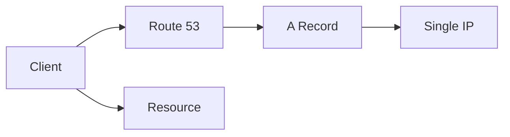
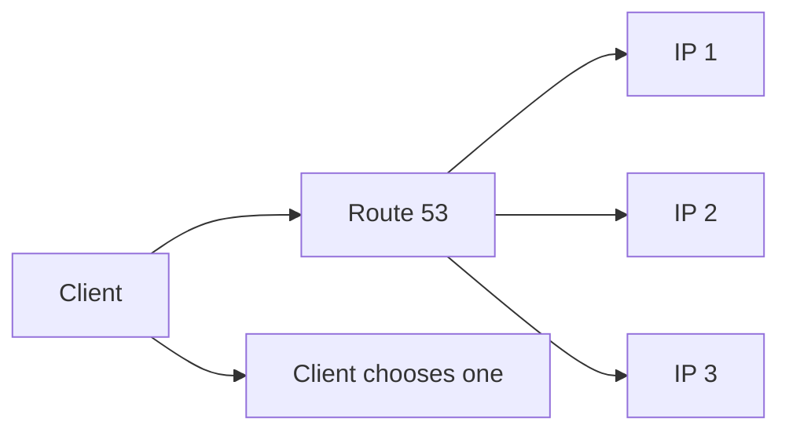

# 95. Routing Policy - Simple

## 🎯 Giới thiệu

**Routing Policy** trong Route 53 giúp Route 53 biết cách trả lời **DNS queries**.

⚠️ Không nhầm lẫn với routing của Load Balancer. DNS không route traffic trực tiếp; DNS chỉ trả lời endpoint/IP để client tự kết nối.

## 1. Route 53 Routing Policies

Các routing policies được nhắc trong section:

- Simple
- Weighted
- Failover
- Latency based
- Geolocation
- Multi-value answer
- Geoproximity

Bài này tập trung vào **Simple Routing Policy**.

## 2. Simple Routing Policy là gì?

Simple routing thường dùng để route traffic tới **một resource duy nhất**.

Ví dụ:

- Client hỏi `foo.example.com`.
- Route 53 trả lời một IP address.
- Client dùng IP đó để gửi HTTP request.

## 3. Simple record với nhiều values

Simple routing có thể trả về nhiều values trong cùng một record.

Khi DNS trả về nhiều IPs:

- Client nhận danh sách IPs.
- Client sẽ chọn một IP ở client-side.

## 4. Giới hạn của Simple Routing

Vì gọi là Simple nên có một giới hạn quan trọng:

⚠️ Không thể associate Simple Routing Policy với **Health Checks**.

Điều này nghĩa là nếu một IP trong danh sách bị unhealthy, Simple Routing vẫn có thể trả về IP đó.

## 5. Simple + Alias

Nếu dùng Simple policy cùng Alias record:

- Chỉ có thể specify **one AWS resource** làm target.

## 6. Hands-on

Tạo record:

- Name: `simple.stephanetheteacher.com`
- Type: **A record**
- Value: IP của EC2 instance ở `ap-southeast-1`
- TTL: `20 seconds`
- Routing policy: **Simple**

Khi truy cập URL, response đến từ instance ở `ap-southeast-1b`.

Sau đó edit record và thêm IP thứ hai, ví dụ `us-east-1`.

Khi dùng `dig`, DNS trả về 2 responses.

Client có thể đi tới một trong hai regions tùy lựa chọn phía client.

## 📊 Bảng tóm tắt

| Tiêu chí | Mô tả |
|----------|------|
| Policy | Simple Routing |
| Mục đích | Route tới một resource hoặc nhiều values đơn giản |
| Health Check | ❌ Không hỗ trợ |
| Nhiều values | Có thể trả về nhiều IPs |
| Cách chọn IP | Client-side |
| Alias | Chỉ một AWS resource target |

## 💡 Mẹo ghi nhớ cho kỳ thi AWS

- Simple Routing không dùng Health Checks.
- DNS chỉ trả lời; traffic không đi qua DNS.
- Nếu cần lọc unhealthy endpoint, dùng policy khác như Multi-Value hoặc Failover.

## ✅ Kết luận

Simple Routing là policy cơ bản nhất trong Route 53. Nó phù hợp khi cần trả lời một endpoint đơn giản, nhưng không phù hợp nếu cần health check hoặc logic routing phức tạp.
