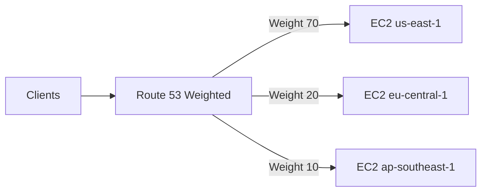

# 96. Routing Policy - Weighted

## 🎯 Giới thiệu

**Weighted Routing Policy** cho phép kiểm soát tỷ lệ DNS responses đi tới từng resource dựa trên **weights**.

Use cases được nhắc:

- Load balancing across regions.
- Test new application version bằng cách gửi một phần nhỏ traffic.
- Shift traffic theo thời gian.

## 1. Cách Weighted Routing hoạt động

Mỗi record có cùng name và type sẽ được gán một weight.

Tỷ lệ traffic tới mỗi record:

```text
record weight / sum of all record weights
```

Ví dụ weights:

- EC2 A: 70
- EC2 B: 20
- EC2 C: 10

Kết quả tương ứng:

- 70% DNS responses tới EC2 A
- 20% tới EC2 B
- 10% tới EC2 C



## 2. Weights không cần cộng lại bằng 100

Weights là giá trị tương đối.

Ví dụ:

- 7, 2, 1
- 70, 20, 10

Hai bộ trên thể hiện cùng tỷ lệ tương đối.

## 3. Điều kiện để Weighted Routing hoạt động

Các DNS records phải có:

- cùng record name
- cùng record type

Có thể associate với **Health Checks**.

## 4. Weight bằng 0

Nếu đặt weight = 0 cho một resource:

- Route 53 sẽ ngừng gửi traffic tới resource đó.

Nếu tất cả records đều có weight = 0:

- Tất cả records sẽ được trả về với equal weights.

## 5. Hands-on

Tạo 3 records cùng name:

- `weighted.stephanetheteacher.com`
- Type: **A**
- Routing policy: **Weighted**
- TTL: `3 seconds` để demo nhanh

Weights:

| Region | Weight |
|----------|------|
| ap-southeast-1 | 10 |
| us-east-1 | 70 |
| eu-central-1 | 20 |

Khi truy cập nhiều lần hoặc dùng `dig`, response thường tới `us-east-1` nhiều hơn vì weight cao nhất.

## 📊 Bảng tóm tắt

| Tiêu chí | Mô tả |
|----------|------|
| Policy | Weighted Routing |
| Cơ chế | Phân phối DNS responses theo weights |
| Weight | Giá trị tương đối |
| Cùng name/type | Bắt buộc |
| Health Check | Có thể associate |
| Weight 0 | Ngừng gửi traffic tới resource |
| Use case | Canary/testing, load balancing, traffic shifting |

## 💡 Mẹo ghi nhớ cho kỳ thi AWS

- Weighted = chia traffic theo tỷ lệ.
- Weight không bắt buộc cộng thành 100.
- Weight 0 dùng để dừng traffic tới resource cụ thể.

## ✅ Kết luận

Weighted Routing giúp kiểm soát phần trăm DNS responses tới từng endpoint. Đây là policy hữu ích khi muốn test version mới hoặc phân phối traffic giữa nhiều regions/resources.
