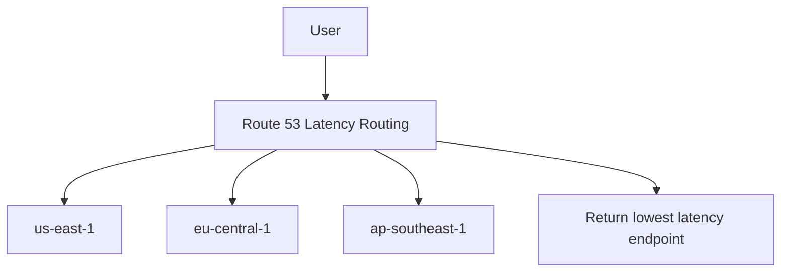

# 97. Routing Policy - Latency

## 🎯 Giới thiệu

**Latency-based Routing Policy** route user tới resource có **lowest latency**.

Policy này phù hợp khi latency là ưu tiên chính cho website hoặc application.

## 1. Cách Latency-based Routing hoạt động

Route 53 đo latency dựa trên việc user kết nối nhanh nhất tới AWS region nào tương ứng với record.

📌 Không nhất thiết là region gần nhất về địa lý; quan trọng là **lowest latency**.

Ví dụ:

- User ở Germany có latency thấp nhất tới US resource.
- User sẽ được route tới US resource.

## 2. Kiến trúc ví dụ

Ứng dụng được deploy ở nhiều regions:

- `us-east-1`
- `ap-southeast-1`
- `eu-central-1`

Route 53 trả về endpoint có latency thấp nhất cho user.

## 3. Có thể kết hợp Health Checks

Latency-based routing có thể kết hợp với **Health Checks**.

Điều này giúp không trả về resource unhealthy.

## 4. Hands-on

Tạo 3 records cùng name:

- `latency.stephanetheteacher.com`

Mỗi record:

- Type: **A**
- Routing policy: **Latency**
- Value: IP của EC2 instance
- Region: phải khai báo region tương ứng với IP

Vì record dùng IP address, Route 53 không tự biết IP đó thuộc AWS region nào, nên người dùng phải chọn region:

- `ap-southeast-1`
- `us-east-1`
- `eu-central-1`

## 5. Kiểm tra bằng browser và VPN

Transcript kiểm tra bằng cách đổi vị trí qua VPN:

- Khi ở Europe → nhận response từ `eu-central-1c`.
- Khi dùng VPN Canada → nhận response từ `us-east-1a`.
- Khi dùng VPN Hong Kong → nhận response từ `ap-southeast-1b`.

⚠️ Với CloudShell, kết quả `dig` vẫn có thể từ region nơi CloudShell đang chạy, không phụ thuộc vào VPN trên laptop.

## 📊 Bảng tóm tắt

| Tiêu chí | Mô tả |
|----------|------|
| Policy | Latency-based Routing |
| Cơ chế | Route tới lowest latency AWS region |
| Dựa trên | Latency giữa user và region |
| Health Check | Có thể kết hợp |
| Cần khai báo region | Có, khi dùng IP value |
| Use case | Application cần latency thấp |

## 💡 Mẹo ghi nhớ cho kỳ thi AWS

- Latency-based ≠ Geolocation.
- Latency-based chọn endpoint có latency thấp nhất, không chỉ dựa vào quốc gia.
- Nếu dùng IP thường, cần khai báo region của record.

## ✅ Kết luận

Latency Routing giúp user được route tới endpoint có latency thấp nhất. Đây là lựa chọn phù hợp cho applications yêu cầu phản hồi nhanh trên nhiều regions.
