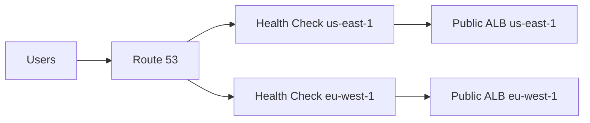
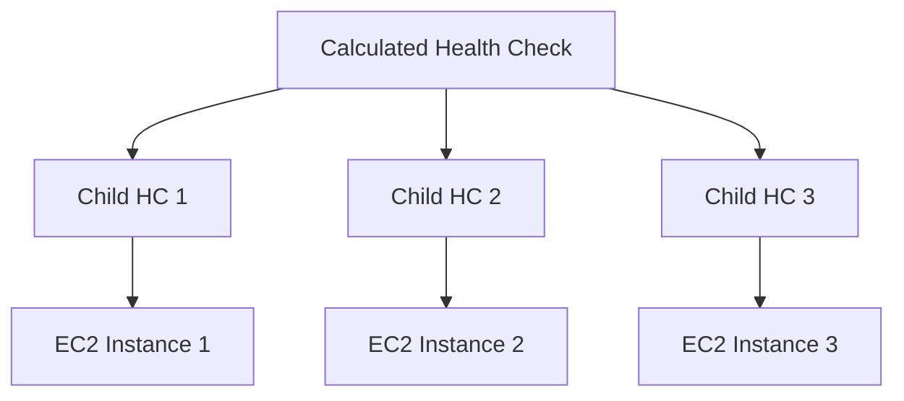
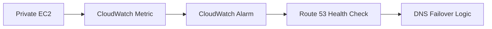

# 98. Route 53 Health Checks

## 🎯 Giới thiệu

**Route 53 Health Checks** dùng để kiểm tra health của resources, chủ yếu là **public resources**, và hỗ trợ **automated DNS failover**.

## 1. Vì sao cần Health Checks?

Trong multi-region setup, nếu một region bị lỗi, Route 53 không nên trả về endpoint của region đó.

Health Checks giúp Route 53 biết resource nào healthy để route DNS response phù hợp.

## 2. Ba loại Health Checks

### 1. Monitor an endpoint

Kiểm tra endpoint public như:

- application
- server
- AWS resource

### 2. Calculated Health Check

Theo dõi các health checks khác.

Có thể dùng logic:

- OR
- AND
- NOT

### 3. Monitor a CloudWatch Alarm

Dùng để kiểm tra private resources thông qua **CloudWatch Alarm**.

## 3. Health Check cho public endpoint

Route 53 health checkers đến từ nhiều nơi trên thế giới.

Transcript nhắc khoảng **15 global health checkers** gửi request tới endpoint.

Một endpoint được coi là healthy nếu trả về status code phù hợp, ví dụ:

- **2xx**
- **3xx**

Các protocol được hỗ trợ:

- HTTP
- HTTPS
- TCP

## 4. Health Check settings quan trọng

| Setting | Mô tả |
|----------|------|
| Interval | 30 seconds hoặc 10 seconds |
| Fast health check | 10 seconds, chi phí cao hơn |
| Threshold | Số lần fail trước khi coi unhealthy |
| Status code | 2xx hoặc 3xx |
| String matching | Kiểm tra text trong first 5,120 bytes |
| Locations | Có thể chọn health checker locations |

📌 Nếu trên **18% health checkers** báo endpoint healthy thì Route 53 coi endpoint là healthy; nếu không thì unhealthy.

## 5. Network requirement ⚠️

Health checkers phải truy cập được endpoint.

Vì vậy security group/firewall cần allow incoming requests từ Route 53 health checkers IP address ranges.

## 6. Calculated Health Checks

Calculated health check kết hợp nhiều child health checks thành một parent health check.

Có thể monitor tối đa **256 child health checks**.

Có thể định nghĩa bao nhiêu child checks cần pass để parent pass.

Use case được nhắc:

- Thực hiện maintenance website mà không làm toàn bộ health checks fail.

## 7. Health Check cho private resources

Route 53 health checkers nằm ngoài VPC nên không thể truy cập private endpoints trực tiếp.

Cách làm:

1. Tạo **CloudWatch Metric**.
2. Tạo **CloudWatch Alarm**.
3. Health check monitor CloudWatch Alarm.

## 📊 Bảng tóm tắt

| Tiêu chí | Mô tả |
|----------|------|
| Health Check endpoint | Public resource |
| Protocols | HTTP, HTTPS, TCP |
| Regular interval | 30 seconds |
| Fast interval | 10 seconds, cost higher |
| Healthy status | 2xx hoặc 3xx |
| String check | First 5,120 bytes |
| Calculated HC | Kết hợp child health checks |
| Private resource | Dùng CloudWatch Alarm |

## 💡 Mẹo ghi nhớ cho kỳ thi AWS

- Public endpoint → Route 53 Health Check trực tiếp.
- Private endpoint → CloudWatch Metric + CloudWatch Alarm + Health Check.
- Calculated health check có thể monitor tới 256 child health checks.

## ✅ Kết luận

Route 53 Health Checks là thành phần quan trọng cho DNS failover. Chúng có thể kiểm tra endpoint public, kết hợp nhiều checks, hoặc theo dõi private resources gián tiếp qua CloudWatch Alarm.
