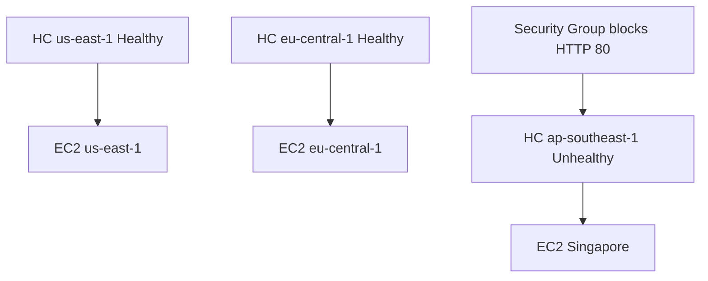
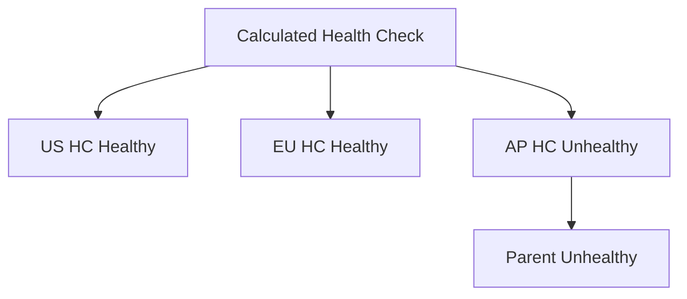

# 99. Route 53 - Health Checks Hands On

## 🎯 Giới thiệu

Bài hands-on tạo **Route 53 Health Checks** cho 3 EC2 instances ở các regions khác nhau, sau đó mô phỏng lỗi bằng cách chặn HTTP trong security group.

## 1. Tạo Health Check cho US East 1

Trong Route 53:

- Vào **Health checks**.
- Chọn **Create health check**.
- Name: `US east one`.
- Type: **Endpoint**.
- Endpoint: IP address của EC2 instance.
- Port: `80`.
- Protocol: HTTP.
- Path: `/`.

Nếu là real application, path có thể là `/health`.

## 2. Advanced Configuration

Các tùy chọn được nhắc:

- Standard health check: every **30 seconds**.
- Fast health check: every **10 seconds**, đắt hơn.
- Failure threshold.
- String matching trong first **5,120 bytes**.
- Latency graph.
- Invert health check status.
- Disable health check.
- Customize health checker regions.
- Create alarm để notify khi health check fail.

Trong bài, giữ default và không tạo alarm.

## 3. Tạo Health Checks cho các regions còn lại

Tạo thêm:

- `AP Southeast one`
- `EU central one`

Mỗi health check trỏ tới IP của EC2 instance tương ứng.

## 4. Mô phỏng unhealthy endpoint

Để làm `AP Southeast one` unhealthy:

- Vào EC2 instance ở Singapore.
- Vào security group.
- Edit inbound rules.
- Xóa rule HTTP port 80.

Kết quả:

- Health check cho AP Southeast one chuyển sang **Unhealthy**.
- Hai health checks còn lại vẫn **Healthy**.

## 5. Xem lỗi Health Check

Với health check unhealthy có thể xem:

- Last checked
- Error status
- Last failed check

Transcript cho thấy lỗi dạng **connection timeout**, do request bị chặn bởi firewall/security group.

📌 Trong AWS, timeout thường gợi ý vấn đề security group hoặc firewall.

## 6. Calculated Health Check

Tạo calculated health check:

- Monitor status của các health checks khác.
- Chọn khi nào report healthy.

Ví dụ trong bài:

- Parent health check healthy khi **all child health checks** healthy.
- Vì một child unhealthy, calculated health check cũng unhealthy.

## 7. Health Check với CloudWatch Alarm

Loại health check cuối cùng:

- Monitor state của **CloudWatch Alarm**.

Use case:

- Liên kết health của private EC2 instance vào Route 53 health check.

Trong bài không tạo được vì chưa có alarm sẵn.

## 📊 Bảng tóm tắt

| Tiêu chí | Mô tả |
|----------|------|
| Health check type | Endpoint |
| Protocol | HTTP |
| Port | 80 |
| Path | `/` |
| Standard interval | 30 seconds |
| Fast interval | 10 seconds |
| Mô phỏng lỗi | Xóa inbound HTTP rule |
| Error | Connection timeout |
| Calculated HC | Healthy khi các child HC đáp ứng điều kiện |

## 💡 Mẹo ghi nhớ cho kỳ thi AWS

- Health check endpoint public cần security group allow traffic.
- Chặn port 80 → HTTP health check timeout.
- Calculated health check dùng để tổng hợp nhiều health checks.
- Private resource → dùng CloudWatch Alarm.

## ✅ Kết luận

Bài hands-on chứng minh Route 53 Health Checks có thể xác định endpoint healthy/unhealthy, mô phỏng lỗi bằng security group, và kết hợp nhiều checks bằng calculated health check.
