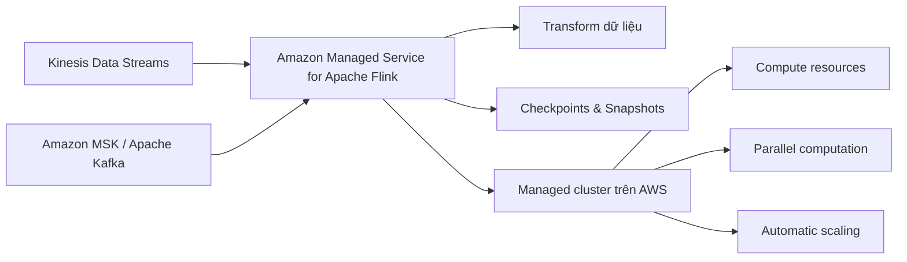

# 100. Amazon Managed Service for Apache Flink

## 🎯 Giới thiệu
- **Amazon Managed Service for Apache Flink** là dịch vụ AWS dùng để **xử lý data streams theo thời gian thực**.
- Dịch vụ này trước đây có tên là **Kinesis Data Analytics for Apache Flink**.
- Flink là một **framework**, thường dùng với các ngôn ngữ **Java, SQL, Scala**.
- Mục tiêu chính: chạy các ứng dụng **Apache Flink** trên **managed cluster** do AWS quản lý.

## 1. Apache Flink là gì?
- Là một **framework** để **process dữ liệu streaming real time**.
- Hỗ trợ nhiều cách viết ứng dụng, nổi bật là:
  - **Java**
  - **SQL**
  - **Scala**
- Trong ngữ cảnh bài giảng, Flink được nhấn mạnh như công cụ xử lý dữ liệu luồng.

## 2. Amazon Managed Service for Apache Flink hoạt động như thế nào?

- AWS sẽ **provision compute resources** cho bạn.
- Dịch vụ cung cấp:
  - **Parallel computation**
  - **Automatic scaling**
- AWS cũng quản lý **application backups** dưới dạng:
  - **Checkpoints**
  - **Snapshots**
- Bạn có thể dùng các **programming features** mà Apache Flink hỗ trợ để **transform dữ liệu** theo nhu cầu.

## 3. Điểm cần nhớ khi ôn thi AWS
- Có thể đọc dữ liệu từ:
  - **Kinesis Data Streams**
  - **Amazon MSK**
- **Không thể đọc từ Amazon Data Firehose**.
- Đây là một điểm dễ bị hỏi bẫy trong kỳ thi.
- Dịch vụ này **chỉ dùng để xử lý data streams**.

## 📊 Bảng tóm tắt
| Tiêu chí | Mô tả |
|----------|------|
| Tên dịch vụ | Amazon Managed Service for Apache Flink |
| Tên cũ | Kinesis Data Analytics for Apache Flink |
| Mục đích | Xử lý data streams theo thời gian thực |
| Ngôn ngữ thường dùng | Java, SQL, Scala |
| Nguồn dữ liệu hỗ trợ | Kinesis Data Streams, Amazon MSK |
| Nguồn dữ liệu không hỗ trợ | Amazon Data Firehose |
| AWS quản lý | Compute resources, parallel computation, automatic scaling, checkpoints, snapshots |

## 💡 Mẹo ghi nhớ cho kỳ thi AWS
- Ghi nhớ: **Flink = real-time stream processing**.
- Nhớ cụm: **Kinesis Data Streams + MSK -> Flink -> transform data**.
- Bẫy thi thường gặp:
  - **Flink đọc được Kinesis Data Streams**
  - **Flink không đọc được Amazon Data Firehose**
- Nếu thấy câu hỏi về **managed cluster**, **automatic scaling**, **checkpoints/snapshots**, hãy nghĩ đến **Amazon Managed Service for Apache Flink**.

## ✅ Kết luận
- Amazon Managed Service for Apache Flink là dịch vụ AWS để **chạy Apache Flink trên hạ tầng được quản lý**.
- Dịch vụ này tập trung vào **xử lý dữ liệu streaming thời gian thực**, với nguồn vào chính là **Kinesis Data Streams** và **Amazon MSK**.
- Điểm quan trọng nhất để ôn thi: **không hỗ trợ Amazon Data Firehose**.
