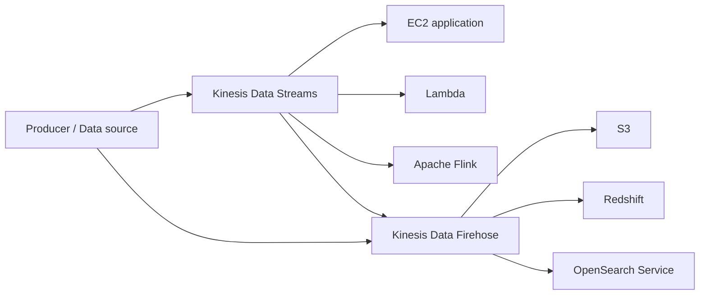

# 101. Streaming Architectures

## 🎯 Giới thiệu
Bài giảng nói về các **real-time architectures** trong AWS cho pipeline xử lý dữ liệu streaming, và cách chọn dịch vụ phù hợp dựa trên:
- **cost**
- **data retention**
- **ordering**
- **scalability**
- **latency**
- **readers / consumers**

## 1. Streaming pipeline trên AWS
- **Amazon Kinesis Data Streams** là trung tâm để nhận dữ liệu streaming.
- Từ stream này, có thể xây dựng:
  - ứng dụng trên **EC2** để đọc dữ liệu
  - ứng dụng dùng **Apache Flink** cho **streaming analytics** và transformation
  - đẩy dữ liệu sang các đích khác qua **Kinesis Data Firehose**
- **Kinesis Data Firehose** có thể gửi dữ liệu tới:
  - **S3**
  - **Redshift**
  - **OpenSearch Service**
- Có thể **produce trực tiếp vào Firehose** nếu muốn.

## 2. So sánh kiến trúc: Kinesis vs DynamoDB cho streaming
### Trường hợp giả định
- 3000 messages / giây
- mỗi message 1 KB

### Kinesis Data Streams + Lambda
- Cần khoảng **3 shards**
- Tương đương khoảng **3 MB/s**
- Chi phí được ước tính trong bài:
  - khoảng **$32 / tháng**
- Nếu cần **long-term storage**, dùng **Kinesis Data Firehose** để đẩy sang **S3**
- Vì **Kinesis Data Streams** chỉ giữ dữ liệu từ **24 giờ đến 1 năm**, sau đó dữ liệu có thể mất

### DynamoDB + DynamoDB Streams + Lambda
- Cần **3000 WCU** cho 3000 writes / giây với 1 KB mỗi write
- Tương đương **3 MB/s**
- Chi phí được ước tính:
  - khoảng **$1450 / tháng**
- Có lợi thế là **storage** nằm trong DynamoDB nên giữ được lâu
- Nhưng phần **streaming** rất đắt
- Kết luận trong bài:
  - cả hai đều chạy được
  - nhưng **Kinesis** rẻ hơn rất nhiều, khoảng **50 lần**
  - đây là ví dụ điển hình của **solution architect**: không chỉ xem “có chạy được không”, mà phải xem **có phải lựa chọn tốt nhất không**

## 3. Tóm tắt các dịch vụ data exchange
### Kinesis Data Streams
- Dữ liệu **immutable**
- **Retention**: tối đa **1 year**
- Có thể export sang **S3** bằng **Kinesis Data Firehose**
- **Ordering**: theo **shard**
- Phải **provision shards** trước
- Readers:
  - **EC2**
  - **Lambda**
  - **Kinesis Data Firehose**
  - **Kinesis Data Analytics**
  - **KCL (Kinesis Client Library)** có **checkpointing**
- **Latency**: khoảng **200 ms**

### Kinesis Data Firehose
- Dùng để chuyển dữ liệu sang target
- **Near real time**
- Thời gian flush buffer tối thiểu khoảng **1 minute**
- Thích hợp để đưa dữ liệu vào **S3** cho lưu trữ dài hạn

### SQS
- Dữ liệu **immutable**
- **Retention**: **1 - 14 days**
- **SQS standard**:
  - **no ordering**
  - scaling gần như **unlimited**
- Readers:
  - **EC2**
  - **Lambda**
- **Latency**: khoảng **10 - 100 ms**

### SQS FIFO
- Vẫn là **immutable**
- Retention giống SQS
- Có **ordering**
- Ordering theo **group id**
- Scalability thấp hơn do ràng buộc ordering:
  - khoảng **300 messages/s**
  - hoặc **3000 messages/s** nếu **batching 10 messages**
- Readers:
  - **EC2**
  - **Lambda**
- Latency vẫn khá thấp

### SNS
- Dữ liệu **immutable**
- **No retention**
- **No ordering**
- Scale rất tốt
- Consumer được gọi là **subscribers**
- Subscriber có thể là:
  - **HTTP**
  - **Lambda**
  - **email**
  - **SQS**
- Latency khá thấp

### DynamoDB
- Dữ liệu **mutable**
- Có thể **override** dữ liệu đã ghi
- Retention:
  - có thể **infinite**
  - hoặc dùng **TTL**
- **No ordering**
- Scalability:
  - dùng **WCU / RCU**
  - có thể dùng **auto scaling**
  - hoặc **on-demand scaling** khi workload spiky / unpredictable / rất thấp
- Reader:
  - dùng **SDK** để đọc dữ liệu
  - muốn đọc **stream** thì phải tạo **DynamoDB Stream**
  - stream này có thể được đọc bởi **Lambda** hoặc **EC2**
- Latency khá thấp

### S3
- Có thể dùng để “stream” dữ liệu theo cách riêng
- Dữ liệu có thể **mutable**, nhưng có **object versioning** và **S3 object logs** để hỗ trợ
- Retention:
  - **infinite**
  - có thể dùng **lifecycle policies** để chuyển tier
  - hoặc **delete** dữ liệu
- **No ordering**
- Scalability:
  - khoảng **3500 puts/s**
  - **5500 gets/s per prefix**
  - storage là **infinite**
- Readers:
  - **SDK** để lấy object cụ thể
  - **S3 events** để được notify khi object được insert
- Latency: khoảng **10 - 100 ms**

## 📊 Bảng tóm tắt
| Tiêu chí | Mô tả |
|----------|------|
| Kinesis Data Streams | Immutable, retention tới 1 year, ordering theo shard, latency ~200 ms, readers: EC2/Lambda/Firehose/Analytics/KCL |
| Kinesis Data Firehose | Near real time, flush buffer tối thiểu ~1 minute, dùng để đẩy sang S3/Redshift/OpenSearch |
| SQS | Immutable, retention 1-14 days, SQS standard không ordering, scale gần như unlimited, latency 10-100 ms |
| SQS FIFO | Immutable, ordering theo group id, khoảng 300 msg/s hoặc 3000 msg/s khi batching 10 |
| SNS | Immutable, không retention, không ordering, subscribers như HTTP/Lambda/email/SQS |
| DynamoDB | Mutable, retention infinite hoặc TTL, không ordering, dùng WCU/RCU hoặc on-demand, stream đọc qua Lambda/EC2 |
| S3 | Có thể dùng cho lưu trữ/nhận dữ liệu, retention infinite, lifecycle policy, không ordering, 3500 puts/s và 5500 gets/s per prefix |

## 💡 Mẹo ghi nhớ cho kỳ thi AWS
- **Kinesis Data Streams**: nhớ 3 ý chính là **immutable**, **ordering per shard**, **retention up to 1 year**.
- **Firehose**: nhớ là công cụ **deliver dữ liệu** sang **S3 / Redshift / OpenSearch**, phù hợp cho **long-term storage**.
- **DynamoDB vs Kinesis**:
  - cùng làm được streaming
  - nhưng trong ví dụ bài giảng, **Kinesis rẻ hơn rất nhiều**
- **SQS standard**: **no ordering**, còn **SQS FIFO**: có ordering theo **group id**.
- **SNS**: **no retention**, **no ordering**, fan-out qua **subscribers**.
- **DynamoDB Streams**: không đọc stream trực tiếp bằng SDK thường; phải đi qua **DynamoDB Stream**.
- **S3**: nhớ có thể dùng **S3 events** và **lifecycle policies**.
- Khi làm architecting, không chỉ hỏi “chạy được không” mà phải hỏi “**có cost-effective không**”.

## ✅ Kết luận
Bài này tập trung vào cách AWS xử lý **streaming architectures** và cách chọn đúng dịch vụ theo yêu cầu thực tế. Điểm quan trọng nhất là:
- hiểu luồng dữ liệu từ **producer** tới **consumer**
- phân biệt **retention / ordering / latency / scalability**
- nhận ra khi nào **Kinesis** là lựa chọn kinh tế hơn **DynamoDB** cho streaming
- nhớ đặc điểm nổi bật của **Kinesis, Firehose, SQS, SNS, DynamoDB, S3** để làm bài thi AWS hiệu quả
