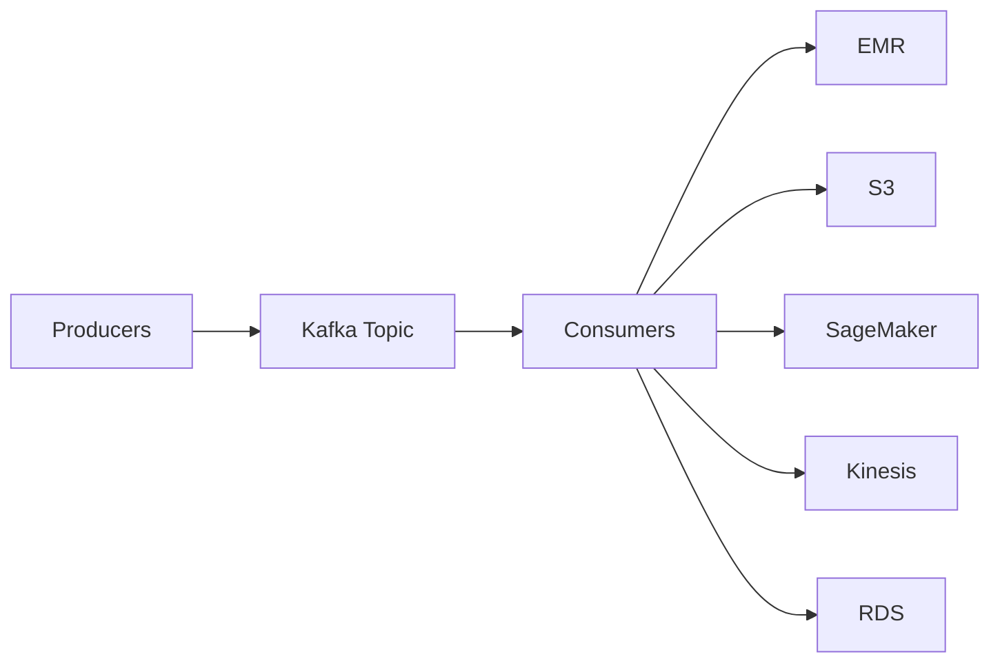

# 102. Amazon MSK

## 🎯 Giới thiệu
- **Amazon MSK (Amazon Managed Streaming for Apache Kafka)** là service **fully-managed Kafka cluster** trên AWS.
- **Kafka** là một lựa chọn thay thế cho **Amazon Kinesis** trong bài toán **stream data**.
- MSK cho phép bạn:
  - **create, update, delete** cluster linh hoạt.
  - AWS tự quản lý **Kafka broker nodes** và **Zookeeper broker nodes**.
  - Deploy trong **VPC**, trải rộng tối đa **3 AZ** để tăng **high availability**.
  - Có **automatic recovery** với các lỗi Kafka phổ biến.
  - Lưu dữ liệu trên **EBS volumes** trong thời gian bạn muốn, miễn là trả phí storage.

## 1. Kiến trúc và luồng dữ liệu

- Một **Kafka cluster** gồm nhiều **brokers**.
- **Producers** gửi dữ liệu từ nhiều nguồn như **Kinesis, IoT, RDS, et cetera** vào **Kafka Topic**.
- Topic được **replicate** sang các broker khác.
- **Consumers** pull dữ liệu từ topic để xử lý hoặc gửi sang các đích khác như:
  - **EMR**
  - **S3**
  - **SageMaker**
  - **Kinesis**
  - **RDS**

## 2. MSK Serverless và đặc điểm vận hành
- **MSK Serverless** cho phép chạy **Apache Kafka** trên MSK mà:
  - không cần provision servers
  - không cần quản lý capacity
- MSK tự động **provision resources** và **scale compute + storage**.
- Về lưu trữ, dữ liệu có thể giữ **rất lâu**, kể cả **hơn 1 năm**, nếu bạn tiếp tục trả phí cho **underlying EBS storage**.

## 3. So sánh với Kinesis Data Streams và cách tích hợp
### So sánh MSK vs Kinesis Data Streams

| Tiêu chí | Kinesis Data Streams | Amazon MSK |
|----------|----------------------|------------|
| Khái niệm phân mảnh | **Shards** | **Kafka Topics** với **Partitions** |
| Scale lên | **Shard Splitting** | Chỉ **add partitions** |
| Scale xuống | **Merging** | Không thể remove partitions |
| In-flight encryption | Có | **Plain text** hoặc **TLS** |
| At-rest encryption | Có | Có |
| Giới hạn/message retention | Transcript nêu **1 MB message limit** và có thể cấu hình retention cao hơn | Default theo transcript là tương tự, và có thể giữ dữ liệu lâu nếu trả phí storage |

### Cách produce/consume với MSK
- Để **produce** vào MSK, cần tạo **Kafka Producer**.
- Để **consume** từ MSK, có các cách:
  - **Kinesis Data Analytics for Apache Flink**
  - **Glue** cho streaming ETL jobs
  - **Lambda** làm **event source**
  - Tự viết **Kafka consumer** và chạy trên:
    - **EC2**
    - **ECS**
    - **EKS**

## 📊 Bảng tóm tắt
| Tiêu chí | Mô tả |
|----------|------|
| Tên dịch vụ | **Amazon MSK** |
| Bản chất | **Fully-managed Kafka cluster** trên AWS |
| Mục đích | **Stream data** |
| Quản lý bởi AWS | **Kafka broker nodes**, **Zookeeper broker nodes** |
| Triển khai | Trong **VPC**, tối đa **3 AZ** |
| Tính sẵn sàng | Có **automatic recovery** |
| Lưu trữ | **EBS volumes** |
| Serverless | Có **MSK Serverless** |
| Produce/Consume | **Kafka Producer**, **Kafka consumer**, **Lambda**, **Glue**, **Flink** |

## 💡 Mẹo ghi nhớ cho kỳ thi AWS
- Nhớ rằng **MSK = managed Apache Kafka**.
- **Kafka = alternative to Kinesis**.
- **MSK Serverless**: không cần quản lý server hay capacity.
- **Topic / Partition** là cặp khái niệm tương ứng với **Shard** trong Kinesis.
- MSK:
  - chỉ **add partitions**
  - không **remove partitions**
- Dữ liệu lưu trên **EBS** nên có thể giữ lâu nếu vẫn trả phí storage.
- Consumer options thường gặp trong transcript:
  - **Flink**
  - **Glue**
  - **Lambda**
  - custom consumer trên **EC2/ECS/EKS**

## ✅ Kết luận
- **Amazon MSK** là dịch vụ để chạy **Apache Kafka** trên AWS theo kiểu **fully-managed**.
- Điểm cần nhớ nhất là kiến trúc **Producers -> Kafka Topic -> Consumers**, cùng với các khác biệt chính giữa **MSK** và **Kinesis Data Streams**.
- Với bài thi AWS, chỉ cần nắm chắc các ý: **managed cluster**, **VPC**, **3 AZ**, **EBS storage**, **MSK Serverless**, và các lựa chọn **produce/consume**.
