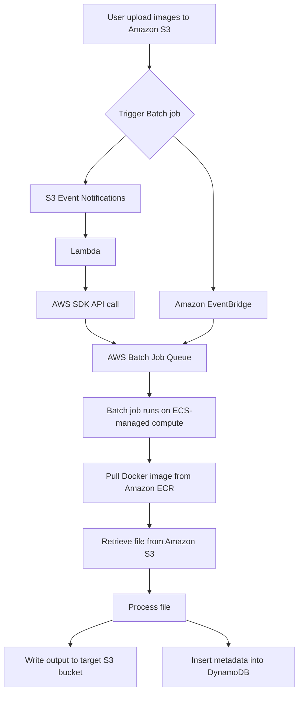

# 103. AWS Batch

## 🎯 Giới thiệu
- **AWS Batch** cho phép chạy **Batch jobs** dưới dạng **Docker images**.
- Bạn có thể:
  - Dùng **managed compute environment**
  - Dùng **unmanaged compute environment**
- Bạn chỉ trả tiền cho **underlying resources** đã sử dụng, còn **Batch itself** thì không tính phí.
- Batch phù hợp cho:
  - **Image processing**
  - Chạy **thousands of concurrent jobs**
- Job có thể được:
  - **Schedule** bằng **Amazon EventBridge**
  - **Orchestrate** bằng **AWS Step Functions**

## 1. Compute Environment trong AWS Batch
### 🏗️ Managed compute environment
- **AWS Batch** sẽ quản lý:
  - **capacity**
  - **instance types**
- Có thể chọn:
  - **On-Demand Instances**
  - **Spot Instances**
- Với Spot, có thể đặt **maximum price**.
- Batch sẽ tự **scale capacity** theo nhu cầu.
- Tất cả instances được launch trong **your own VPC**.
- Nếu chạy trong **private subnets**, cần có:
  - **NAT gateway** hoặc **NAT instance**
  - hoặc **VPC endpoint** để truy cập **ECS service** privately

### 🧩 Unmanaged compute environment
- Bạn tự quản lý:
  - **compute resources**
  - **provisioning**
  - **scaling**
- Áp dụng cho:
  - **EC2**
  - **ECS**
  - **EKS**

### 🔐 IAM và storage
- Batch job có thể:
  - Pull **Docker image** từ **Amazon ECR**
  - Retrieve file từ **Amazon S3**
  - Ghi dữ liệu sang **Amazon S3**
  - Insert metadata vào **Amazon DynamoDB**
- Vì vậy job cần **correct IAM role**.
- Batch có thể dùng:
  - **EBS**
  - **instance store**
  - hoặc **Fargate** nếu muốn serverless

## 2. Luồng xử lý Job và Kiến trúc
### 📥 Trigger job từ S3
- User upload file vào **Amazon S3**.
- Có 2 cách để trigger **AWS Batch job**:

1. **S3 event notifications -> Lambda -> AWS SDK -> start Batch job**
2. **S3 event notifications -> Amazon EventBridge -> AWS Batch**

- Lợi ích của **EventBridge**:
  - Có thêm **filtering capability**
  - **Serverless**
  - Không cần tự quản lý code
  - **EventBridge** biết cách invoke **AWS Batch**

### 🔁 Flow kiến trúc

### ⚙️ Job Queue và Autoscaling
- **Batch Job Queue** là nơi phân phối jobs tới các EC2 instances chạy Docker containers.
- Để gửi job vào AWS Batch, dùng **SDK** để **add a job to the job queue**.
- Việc này có thể được thực hiện bởi:
  - **Lambda**
  - **CloudWatch events**
  - **Step Functions**
- Khi job queue tăng nhiều, có thể bật **autoscaling** trong managed compute environment để:
  - tạo thêm **Spot Instances**
  - hoặc **On-Demand Instances**
- Mục tiêu là có môi trường “fit” đúng với kích thước job queue.

## 3. Batch vs Lambda và Multi-node Mode
### ⚖️ Batch vs Lambda
| Tiêu chí | Lambda | AWS Batch |
|----------|--------|-----------|
| Thời gian chạy | Có **time limit** | **No time limits** |
| Runtime | Built-in runtimes hoặc special container images cho Lambda | **Any runtime** nếu có Docker image |
| Disk space | **Temporary disk space** giới hạn | Dựa vào **EBS** hoặc **instance store** |
| Kiểu triển khai | Serverless | Có thể managed, unmanaged, hoặc **Fargate** |
| Độ linh hoạt | Thấp hơn | Cao hơn |

### 🚀 Multi-node mode
- Một **Batch job** thông thường tương ứng với **one EC2 instance**.
- Nhưng với **multi-node mode**:
  - Một job có thể dùng **multiple EC2 or ECS instances** cùng lúc
  - Phù hợp cho **large scale HPC**
  - Rất tốt cho **tightly coupled workloads**
- Cấu trúc:
  - Có **one main node**
  - Các node còn lại là **child nodes**
- Lưu ý:
  - **Multi-node does not work with Spot Instances**
  - Nên dùng **placement group cluster mode**
  - Mục đích là có **enhanced networking**
- Khi job hoàn thành:
  - các instances được launch
  - main node quản lý child nodes
  - rồi mọi thứ sẽ bị shutdown

## 📊 Bảng tóm tắt
| Tiêu chí | Mô tả |
|----------|------|
| Dạng chạy | Batch jobs chạy dưới dạng **Docker images** |
| Compute options | **Managed** hoặc **Unmanaged compute environment** |
| Managed mode | AWS Batch quản lý **capacity** và **instance types** |
| Cách trả tiền | Chỉ trả cho **underlying resources** |
| Job trigger | **EventBridge**, **Lambda**, **Step Functions**, **CloudWatch events** |
| Storage | Có thể dùng **EBS**, **instance store**, **S3**, **ECR** |
| IAM | Job cần **correct IAM role** |
| Khác Lambda | Không có **time limits**, linh hoạt hơn |
| Multi-node | Dùng nhiều instances cho **HPC**, không hỗ trợ **Spot Instances** |

## 💡 Mẹo ghi nhớ cho kỳ thi AWS
- **Batch = Docker jobs + compute environments + job queue**.
- Nhớ 2 đường trigger từ **S3**:
  - **S3 -> Lambda -> Batch**
  - **S3 -> EventBridge -> Batch**
- **Managed compute environment** = AWS lo **capacity**.
- **Unmanaged compute environment** = bạn tự lo **provisioning/scaling**.
- **Batch không tính phí**, chỉ tính tài nguyên bên dưới.
- **Multi-node mode**:
  - dành cho **HPC**
  - có **main node** và **child nodes**
  - **không dùng Spot**
  - nên dùng **placement group cluster mode**
- Khi job cần truy cập **S3 / ECR / DynamoDB**, phải kiểm tra **IAM role**.

## ✅ Kết luận
- **AWS Batch** là dịch vụ chạy batch workloads dạng **Docker images** với khả năng mở rộng tốt.
- Bạn cần nhớ trọng tâm thi:
  - **managed vs unmanaged compute environment**
  - **job queue**
  - **trigger bằng EventBridge/Lambda**
  - **IAM role**
  - **multi-node mode** cho **HPC**
- Đây là dịch vụ phù hợp khi cần chạy nhiều job, thời gian dài, và cần kiểm soát compute linh hoạt hơn **Lambda**.
