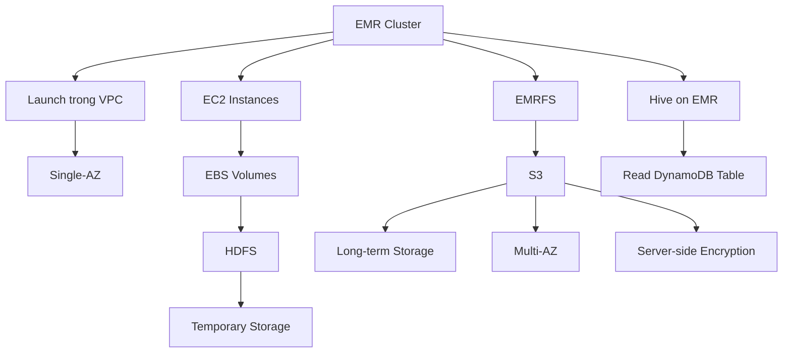

# 104. Amazon EMR

## 🎯 Giới thiệu
- **EMR** = **Elastic MapReduce**.
- Dùng để tạo **Hadoop clusters** trên AWS để xử lý **Big Data**.
- Rất phù hợp khi **migrate từ on-premise** sang AWS, đặc biệt với các công việc Hadoop sẵn có.
- EMR cho phép tận dụng **elasticity**:
  - Cluster có thể gồm **hàng trăm EC2 instances**.
  - Xong việc thì có thể **shut down cluster** để giảm cost.
- EMR nằm trong hệ sinh thái Big Data, có thể dùng với:
  - **Apache Spark**
  - **HBase**
  - **Presto**
  - **Flink**
  - **Hive**
- EMR tự xử lý phần **provisioning** và **configuration** của EC2 instances.
- Có thể kết hợp **auto-scaling với CloudWatch**.
- Use case thường gặp:
  - **Data processing**
  - **Machine learning**
  - **Web indexing**
  - **Big data processing** nói chung

## 1. Kiến trúc và lưu trữ trong EMR
- EMR được launch **trong VPC** và nằm trong **single Availability Zone (single-AZ)**.
- Cluster gồm các **EC2 instances** gắn với **EBS volumes**.
- **EBS + HDFS** được dùng cho **temporary storage**.
- Nếu cần **long-term retention**, dùng **EMRFS** để tích hợp trực tiếp với **S3**.
- **S3** là lựa chọn tốt hơn cho dữ liệu cần lưu lâu:
  - **Durable**
  - **Multi-AZ**
  - Có thể dùng **server-side encryption**
- Vì EMR chạy trong **single-AZ** nên:
  - Có lợi về **networking performance**
  - Có **lower cost**
  - Nhưng nếu mất AZ thì có thể **mất dữ liệu**
- Có thể chạy **Apache Hive** trên EMR.
- Hive trên EMR có module cho phép đọc trực tiếp dữ liệu từ **DynamoDB table**.

## 2. Node và tối ưu chi phí
- EMR cluster gồm các loại node sau:

| Loại node | Vai trò | Đặc điểm |
|---|---|---|
| **Master node** | Quản lý cluster, điều phối và theo dõi health của các node khác | **Must be long running** |
| **Core node** | Chạy tasks và lưu dữ liệu | **Must be long running** |
| **Task node** | Chỉ chạy tasks | **Optional**, thường dùng **Spot Instances** |

- **On-demand EC2 instances**
  - Phù hợp với workload **reliable**, **predictable**
  - Không bị termination
- **Reserved Instances**
  - Áp dụng với **minimum 1 year**
  - Giúp **giảm cost**
  - EMR sẽ tự dùng RI nếu có thể
  - Phù hợp cho **master node** và **core node**
- **Spot Instances**
  - **Rẻ hơn** nhưng **kém reliable**
  - Phù hợp nhất cho **task node**

## 3. Cách triển khai và cấu hình instance
- EMR có 2 kiểu triển khai chính:
  - **Long-running clusters**
    - Phù hợp khi muốn chạy lâu dài
    - Hợp với **Reserved Instances**
  - **Transient temporary clusters**
    - Dùng để làm một việc cụ thể
    - Xong thì **tear down** ngay để tiết kiệm chi phí
- EMR có 2 kiểu cấu hình instance:

| Kiểu cấu hình | Ý nghĩa |
|---|---|
| **Uniform instance groups** | Chọn trước **một instance type** và **một purchasing option** cho từng node |
| **Instance fleet** | Chỉ định **target capacity**, rồi trộn nhiều **instance types** và nhiều **purchasing options** |

- **Uniform instance groups**
  - Mỗi node group chọn sẵn instance type
  - Chọn luôn purchasing option như **on-demand** hoặc **spot**
- **Instance fleet**
  - Giống như **spot fleet** cho EMR
  - Cho phép mix nhiều instance types
  - Cho phép mix **on-demand** và **spot**
  - EMR sẽ tự provision cluster theo target capacity

## 📊 Bảng tóm tắt
| Tiêu chí | Mô tả |
|----------|------|
| Mục đích | Chạy **Hadoop clusters** trên AWS cho **Big Data** |
| Điểm mạnh | **Elasticity**, dễ scale, dễ tắt cluster để giảm cost |
| Hệ sinh thái | **Spark, HBase, Presto, Flink, Hive** |
| Vị trí triển khai | Trong **VPC**, **single-AZ** |
| Storage tạm thời | **EBS + HDFS** |
| Storage lâu dài | **EMRFS + S3** |
| Hive integration | Có thể đọc trực tiếp **DynamoDB table** |
| Node types | **Master**, **Core**, **Task** |
| Tối ưu chi phí | **RI** cho master/core, **Spot** cho task |
| Instance config | **Uniform instance groups** hoặc **Instance fleet** |

## 💡 Mẹo ghi nhớ cho kỳ thi AWS
- **EMR = Elastic MapReduce**: nhớ ngay đây là dịch vụ cho **Hadoop/Big Data**.
- **EBS + HDFS = temporary storage**, còn **EMRFS + S3 = long-term storage**.
- **Master** và **Core** phải **long running**; **Task** là nơi dễ dùng **Spot Instances** nhất.
- EMR chạy trong **single-AZ**: nhanh và rẻ hơn, nhưng không phải nơi lưu dữ liệu lâu dài.
- **Uniform instance groups** = chọn trước loại instance.
- **Instance fleet** = chọn **target capacity** rồi mix instance types và purchasing options.
- Nếu đề bài nhắc **migrate on-prem Hadoop lên AWS**, EMR là lựa chọn rất tự nhiên.

## ✅ Kết luận
- EMR là dịch vụ dùng để chạy **Hadoop cluster** trên AWS cho các bài toán **Big Data**.
- Điểm cần nhớ nhất khi ôn thi:
  - **Kiến trúc single-AZ trong VPC**
  - **EBS/HDFS cho tạm thời**
  - **S3 qua EMRFS cho lưu lâu dài**
  - **Master/Core/Task node**
  - **Uniform instance groups vs Instance fleet**
- EMR đặc biệt hữu ích khi cần **scale lớn**, **giảm chi phí**, và **migrate Hadoop workloads** từ on-premise lên AWS.
