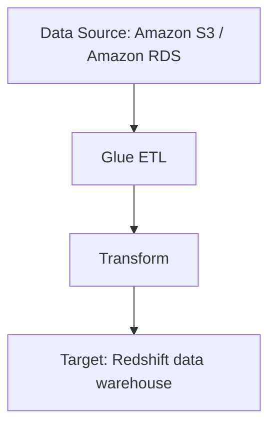
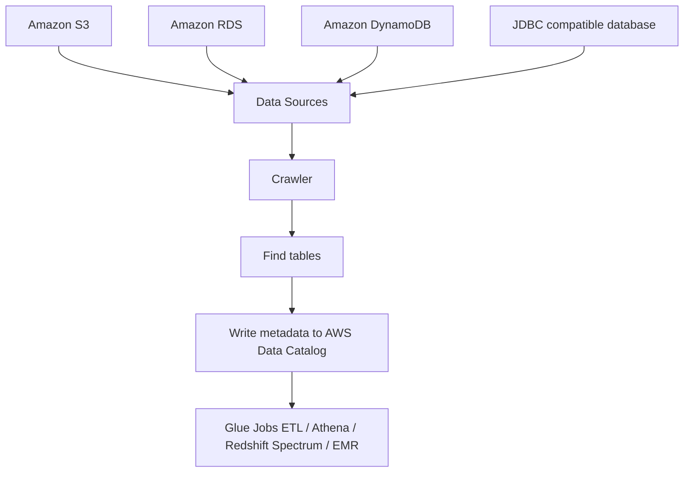

# 106. AWS Glue

## 🎯 Giới thiệu
- **AWS Glue** là một **managed ETL service** dùng cho **extract, transform, load**.
- Rất hữu ích khi cần **chuẩn bị và chuyển đổi dữ liệu trước khi analytics**.
- Đây là một **fully serverless service**.

## 1. AWS Glue ETL
- Glue ETL nhận dữ liệu từ nhiều nguồn như:
  - **Amazon S3**
  - **Amazon RDS**
- Sau đó:
  - **Extract** dữ liệu từ nguồn
  - **Transform** dữ liệu trong Glue ETL
  - **Load** sang đích cuối, ví dụ **Redshift data warehouse**

## 2. Glue Data Catalog
- **Glue Data Catalog** là **catalog of data sets**.
- Nó lưu **metadata** của bảng để các service khác và Glue Jobs có thể sử dụng.
- Khi Data Catalog đã có sẵn, **Glue Jobs ETL** có thể:
  - tìm các table
  - biết cách kết nối
  - nhận diện columns
  - đọc rows
- Điều này giúp ETL làm việc với dữ liệu dễ hơn.

## 3. Crawler và nguồn dữ liệu
- Glue có **crawler** để quét các data sources có thể có.
- Nguồn mà crawler có thể nhìn vào:
  - **Amazon S3**
  - **Amazon RDS**
  - **Amazon DynamoDB**
  - bất kỳ **JDBC compatible database**
- Crawler sẽ:
  - tìm các tables
  - ghi metadata trở lại **AWS Data Catalog** trên **AWS Glue**

## 📊 Bảng tóm tắt
| Tiêu chí | Mô tả |
|----------|------|
| Loại dịch vụ | **Managed ETL service** |
| Tính chất | **Fully serverless** |
| Mục đích chính | **Extract, transform, load** dữ liệu trước analytics |
| Nguồn dữ liệu | **S3, RDS, DynamoDB, JDBC compatible database** |
| Thành phần quan trọng | **Glue ETL**, **Glue Data Catalog**, **Crawler** |
| Vai trò của Data Catalog | Lưu **metadata** để Glue Jobs và các service khác dùng |
| Service phụ thuộc vào Data Catalog | **Athena**, **Redshift Spectrum**, **EMR** |

## 💡 Mẹo ghi nhớ cho kỳ thi AWS
- Nhớ 3 từ khóa chính của **AWS Glue**: **ETL + serverless + Data Catalog**.
- Nếu đề bài nói về:
  - chuẩn bị dữ liệu trước analytics
  - quét metadata từ nhiều nguồn
  - lưu table metadata cho service khác dùng  
  thì nghĩ ngay đến **AWS Glue**.
- **Crawler** = thành phần đi quét data sources và ghi metadata vào **Glue Data Catalog**.
- **Athena**, **Redshift Spectrum**, **EMR** có thể dùng **Glue Data Catalog**.

## ✅ Kết luận
- **AWS Glue** là dịch vụ **ETL serverless** để xử lý dữ liệu trước phân tích.
- Thành phần cốt lõi cần nhớ là **Glue ETL** và **Glue Data Catalog**.
- **Crawler** giúp tự động phát hiện table metadata từ nhiều nguồn dữ liệu và đưa vào catalog.
