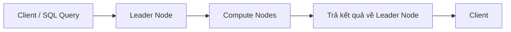
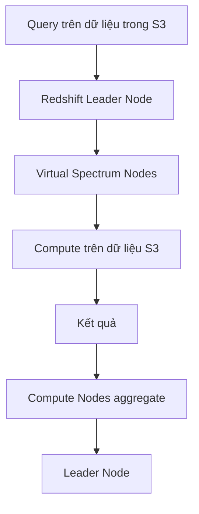

# 107. Redshift

## 🎯 Giới thiệu
- **Amazon Redshift** là dịch vụ **data warehousing** của AWS, dùng cho **OLAP** (*online analytical processing*), không dùng cho **OLTP**.
- Redshift được nói là dựa trên **PostgreSQL**, nhưng mục tiêu chính là:
  - **analytics**
  - **data warehousing**
- Điểm mạnh chính:
  - hiệu năng tốt hơn các data warehouse khác
  - scale đến **petabytes** dữ liệu
- Redshift dùng **columnar storage**:
  - dữ liệu lưu theo **cột** thay vì theo hàng
  - rất hiệu quả khi cần `sum`, `average`, hoặc đọc toàn bộ giá trị của một cột

## 1. Kiến trúc và chế độ triển khai
- Redshift dùng **MPP** (*Massively Parallel Query Execution*):
  - query được phân tán qua nhiều **Redshift nodes**
  - tối ưu hiệu năng xử lý
- Có 2 chế độ chạy cluster:
  - **Provisioned cluster**: tự provision trước
  - **Serverless cluster**: không cần quản lý hạ tầng
- Redshift có **SQL interface** và tích hợp với các công cụ như:
  - **AWS QuickSight**
  - **Tableau**
- Mục tiêu là phục vụ dashboard nhanh và phản hồi tốt.
- Cluster có thể rất lớn:
  - hơn **100 nodes**
  - mỗi node có thể tới **16 TB** dung lượng
- Redshift chủ yếu là **single-AZ** cho phần lớn cluster
  - một số loại cluster có **multi-AZ option** để có **failover** khi một AZ gặp sự cố
- Hai loại node chính:
  - **Leader node**: query planning và aggregate kết quả
  - **Compute nodes**: thực thi query và trả kết quả về leader

## 2. Nạp dữ liệu, bảo mật và truy vấn
- Các cách load dữ liệu vào Redshift:
  - từ **S3** bằng `COPY`
  - dùng **Kinesis Data Firehose**
  - tích hợp với **DynamoDB**
  - dùng **DMS** (*Database Migration Service*)
- Redshift là **managed service**, nên có:
  - **backup** và **restore**
  - triển khai trong **VPC**
  - **IAM security** để truy cập cluster
  - **KMS security** để mã hóa dữ liệu
  - monitoring qua **CloudWatch**
- **Enhanced VPC routing**:
  - đảm bảo `COPY` và `UNLOAD` đi trực tiếp qua VPC
  - giúp **tốt hơn về performance** và **giảm cost**
- Redshift chỉ “đáng dùng” khi workload **ổn định, sustained usage**
  - nếu query **sporadic**, **Athena** là lựa chọn tốt hơn

## 3. Snapshot, DR, Spectrum, WLM và Concurrency Scaling
- **Snapshot** là **point-in-time backup** của cluster:
  - lưu nội bộ trong **Amazon S3**
  - snapshot tiếp theo là **incremental**
- Có thể **restore snapshot sang new cluster**
  - không restore vào cluster cũ
  - phải tạo **cluster mới** từ snapshot
- Hai loại snapshot:
  - **Automated snapshot**
    - mỗi **8 giờ**
    - hoặc mỗi **5 GB** dữ liệu thay đổi
    - hoặc theo schedule đã cấu hình
    - có **retention** ví dụ 30 ngày
  - **Manual snapshot**
    - giữ cho đến khi bạn xóa
- Redshift có thể **copy snapshot sang region khác**
  - dùng cho **disaster recovery**
- Với snapshot **KMS encrypted**:
  - cần **snapshot copy grant**
  - để Redshift service thực hiện encryption operation ở destination region
  - sau đó snapshot được copy sang region đích với KMS key đúng

- **Redshift Spectrum**:
  - cho phép query dữ liệu trong **Amazon S3** mà **không cần load vào Redshift trước**
  - cần có **Redshift cluster** để start query
  - query được xử lý bởi nhiều **Spectrum nodes**
  - kết quả quay về compute nodes để aggregate rồi trả lên leader node

- **Redshift Workload Management (WLM)**:
  - quản lý **query priorities**
  - tránh query ngắn bị kẹt sau query dài
  - có thể tạo nhiều queue:
    - **super user queue**
    - **user-defined queues**
    - **short running queue**
    - **long running queue**
  - query được route vào queue phù hợp lúc runtime
- Hai kiểu WLM:
  - **Automatic WLM**: Redshift quản lý queue và resources
  - **Manual WLM**: bạn tự quản lý queue và resources
- **Redshift Concurrency Scaling**:
  - thêm capacity “on the fly”
  - giúp performance nhanh ổn định khi số user/query tăng
  - phần capacity bổ sung gọi là **concurrency scaling cluster**
  - quyết định query nào được gửi sang cluster này dựa trên **WLM**
  - tính phí **per second**

## 📊 Bảng tóm tắt
| Tiêu chí | Mô tả |
|----------|------|
| Mục đích | **Data warehousing**, **OLAP**, analytics |
| Không phù hợp | **OLTP** |
| Storage | **Columnar storage** |
| Cơ chế xử lý | **MPP** phân tán query qua nhiều nodes |
| Chế độ chạy | **Provisioned cluster** hoặc **Serverless cluster** |
| Nạp dữ liệu | **S3 COPY**, **Kinesis Data Firehose**, **DynamoDB**, **DMS** |
| Node chính | **Leader node** và **Compute nodes** |
| Bảo mật | **VPC**, **IAM**, **KMS** |
| Monitoring | **CloudWatch** |
| Backup/DR | **Snapshot**, incremental, copy cross-region |
| Truy vấn dữ liệu trên S3 | **Redshift Spectrum** |
| Quản lý workload | **WLM** |
| Mở rộng tải | **Concurrency Scaling** |

## 💡 Mẹo ghi nhớ cho kỳ thi AWS
- **Redshift = OLAP, không phải OLTP**.
- **Columnar storage** rất hợp cho phân tích theo cột, nên đọc `sum`/`average` nhanh.
- **Leader node** lo planning và aggregate, **Compute nodes** lo xử lý query.
- **Snapshot** của Redshift:
  - lưu trong **S3**
  - **incremental**
  - restore sang **new cluster**
- **Snapshot copy grant** là từ khóa quan trọng khi copy snapshot **KMS encrypted** sang region khác.
- **Spectrum** = query dữ liệu trong **S3** mà không cần load trước vào Redshift.
- **WLM** dùng để ưu tiên query ngắn, tránh bị query dài chặn.
- Nếu workload **sporadic**, transcript nhắc **Athena** có thể phù hợp hơn.

## ✅ Kết luận
- Redshift là dịch vụ **data warehouse** cho **OLAP**, tối ưu cho analytics và dashboard.
- Các điểm thi cần nhớ nhất:
  - **columnar storage**
  - **MPP**
  - **Leader node / Compute nodes**
  - **Snapshot + cross-region copy**
  - **Spectrum**
  - **WLM**
  - **Concurrency Scaling**
- Redshift mạnh khi cần hiệu năng cao và dữ liệu lớn, đặc biệt với workload phân tích ổn định.
