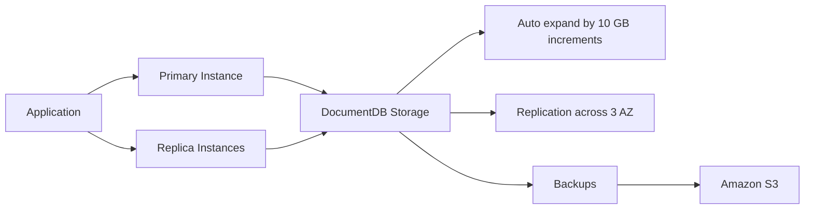

# 108. Amazon DocumentDB

## 🎯 Giới thiệu
- **Amazon DocumentDB** là dịch vụ tương tự như **Aurora**, nhưng dành cho **MongoDB**.
- **MongoDB** là một **NoSQL database**, dùng để lưu trữ, truy vấn và index dữ liệu **JSON**.
- Mục tiêu của DocumentDB là cung cấp một lựa chọn **cloud native** thay thế cho MongoDB trên AWS.

## 1. Tổng quan kiến trúc
- DocumentDB có mô hình triển khai giống **Aurora**:
  - **Fully managed**
  - **Highly available**
  - **Replication across 3 AZ**
- **Storage layer** tự động mở rộng theo từng bước **10 GB**.
- Có khả năng scale lên hoặc gần tới **millions of requests per second**.

## 2. Mô hình sử dụng và thành phần tính phí
- DocumentDB theo mô hình **pay for what you use** và **no upfront costs**.
- Cần hiểu kiến trúc của DocumentDB vì nó giống Aurora và liên quan trực tiếp đến pricing.
- Các thành phần chính:
  - **Database storage**
  - **On-demand instances**
    - **Primary instances**
    - **Replica instances**
  - **Database IO**
  - **Backups**

## 3. Pricing và điểm cần nhớ
- Bạn trả tiền cho:
  - **Instances**: tính theo **second**, với **minimum of 10 minutes**
  - **Database IO**: tính theo **million IOs**
  - **Storage**: tính theo **GB per month**
  - **Backups**: lưu nội bộ vào **Amazon S3**, tính theo **GB per month**
- **DocumentDB là provisioned**.
  - **Không có on-demand tier** cho DocumentDB.
  - Đây là một điểm dễ nhầm lẫn cần nhớ khi ôn thi.

## 📊 Bảng tóm tắt
| Tiêu chí | Mô tả |
|----------|------|
| Dạng dịch vụ | **DocumentDB** giống **Aurora** nhưng dành cho **MongoDB** |
| Loại dữ liệu | **NoSQL**, lưu trữ và truy vấn dữ liệu **JSON** |
| Quản trị | **Fully managed** |
| High availability | **Replication across 3 AZ** |
| Storage | Tự động tăng theo bước **10 GB** |
| Khả năng scale | Gần hoặc tới **millions of requests per second** |
| Billing | **Pay for what you use**, không có **upfront costs** |
| Thành phần tính phí | **Instances**, **IO**, **Storage**, **Backups** |
| Backup | Backup nội bộ vào **Amazon S3** |
| Lưu ý thi | **DocumentDB is provisioned**, không có **on-demand tier** |

## 💡 Mẹo ghi nhớ cho kỳ thi AWS
- Nhớ công thức: **Aurora : PostgreSQL/MySQL = DocumentDB : MongoDB**
- DocumentDB = **NoSQL + JSON + MongoDB-compatible concept**.
- Khi gặp câu hỏi về pricing, nhớ 4 phần:
  - **Instances**
  - **IO**
  - **Storage**
  - **Backups**
- Điểm bẫy quan trọng:
  - **Không có on-demand tier**
  - **Provisioned only**
- Nếu thấy nhắc đến backup, hãy nhớ **Amazon S3**.

## ✅ Kết luận
- **Amazon DocumentDB** là dịch vụ **fully managed** cho **MongoDB** trên AWS.
- Dịch vụ này có kiến trúc và cách triển khai rất giống **Aurora**, với **3 AZ replication**, **auto storage growth**, và khả năng scale lớn.
- Về chi phí, cần nhớ rõ: **instances + IO + storage + backups**, và **không có on-demand tier**.
