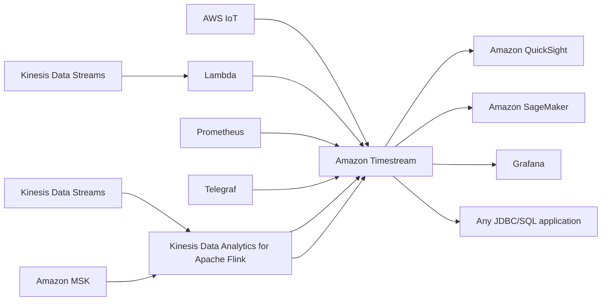

# 109. Amazon Timestream

## 🎯 Giới thiệu
- Amazon Timestream là **time series database** được AWS quản lý hoàn toàn.
- Đặc điểm chính:
  - **fast**
  - **scalable**
  - **serverless**
- **Time series** là tập dữ liệu có gắn **time** theo từng điểm dữ liệu, ví dụ dữ liệu theo năm.

## 1. Đặc điểm cốt lõi của Amazon Timestream
- Có thể **automatically adjust** database up và down để scale capacity.
- Có thể lưu và phân tích **trillions of events per day**.
- Được thiết kế riêng cho **time series data**, nên:
  - nhanh hơn
  - rẻ hơn
  - phù hợp hơn so với dùng **relational databases** cho loại dữ liệu này
- Hỗ trợ:
  - **scheduled queries**
  - records với **multiple measures**
  - **full SQL compatibility**
- Dữ liệu được chia theo lớp lưu trữ:
  - **recent data** lưu trong **memory**
  - **historical data** lưu trong **cost-optimized storage tier**
- Có **time series analytics functions** để phân tích dữ liệu và tìm pattern gần **real time**.
- Hỗ trợ **encryption in transit** và **encryption at rest**.

## 2. Use cases và luồng tích hợp
- Use cases phù hợp:
  - **IoT application**
  - **operational applications**
  - **real-time analytics**
  - mọi bài toán liên quan đến **time series database**
- Nguồn dữ liệu có thể đưa vào Timestream:
  - **AWS IoT**
  - **Kinesis Data Streams** qua **Lambda**
  - **Prometheus**
  - **Telegraf**
  - **Kinesis Data Analytics for Apache Flink**
  - **Amazon MSK** qua cùng luồng xử lý
- Ứng dụng kết nối và khai thác dữ liệu từ Timestream:
  - **Amazon QuickSight** để build dashboards
  - **Amazon SageMaker** để làm machine learning
  - **Grafana**
  - bất kỳ application nào hỗ trợ **JDBC** và **SQL**

## 3. Ý nghĩa khi ôn thi AWS
- Chỉ cần nhớ ở mức high level rằng **Timestream** là **time series database**.
- Điểm dễ ra đề:
  - **serverless**
  - tối ưu cho **time series data**
  - dữ liệu gần đây ở **memory**, dữ liệu lịch sử ở **cost-optimized storage tier**
  - hỗ trợ **SQL**, **scheduled queries**, **multiple measures**
  - phù hợp cho **IoT** và **real-time analytics**

## 📊 Bảng tóm tắt
| Tiêu chí | Mô tả |
|----------|------|
| Loại dịch vụ | **Time series database** |
| Tính chất | **Fully managed**, **fast**, **scalable**, **serverless** |
| Mục tiêu sử dụng | Lưu và phân tích dữ liệu có gắn **time** |
| Khả năng mở rộng | Tự động scale up/down capacity |
| Quy mô xử lý | Có thể lưu và phân tích **trillions of events per day** |
| Truy vấn | **Scheduled queries**, **full SQL compatibility** |
| Lưu trữ | **Recent data** trong memory, **historical data** trong storage tier tối ưu chi phí |
| Bảo mật | **Encryption in transit** và **at rest** |
| Use cases | **IoT**, **operational applications**, **real-time analytics** |
| Tích hợp đầu ra | **QuickSight**, **SageMaker**, **Grafana**, ứng dụng **JDBC/SQL** |

## 💡 Mẹo ghi nhớ cho kỳ thi AWS
- Nhớ công thức: **Timestream = time series + serverless + SQL + real-time analytics**.
- Nếu đề bài nhắc đến:
  - dữ liệu theo thời gian
  - IoT
  - nhiều sự kiện mỗi ngày
  - cần lưu trữ recent vs historical data khác nhau  
  thì nghĩ ngay đến **Amazon Timestream**.
- Ghi nhớ 3 điểm rất hay được hỏi:
  - **recent data in memory**
  - **historical data in cost-optimized storage**
  - **supports SQL compatibility**

## ✅ Kết luận
- Amazon Timestream là dịch vụ **time series database** được quản lý hoàn toàn trên AWS.
- Dịch vụ này phù hợp khi cần lưu, truy vấn và phân tích dữ liệu theo thời gian với yêu cầu **scale lớn**, **real-time**, và **cost optimization**.
- Với kỳ thi AWS, chỉ cần nắm chắc bản chất, kiến trúc lưu trữ theo thời gian, và các tích hợp chính là đủ.
