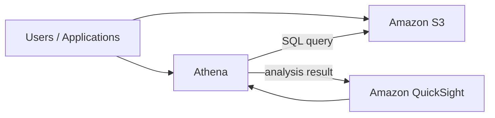
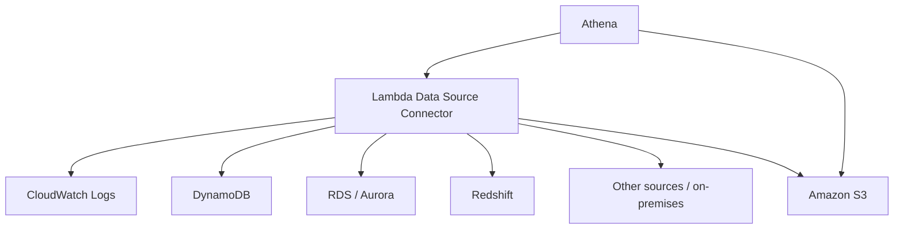

# 110. Amazon Athena

## 🎯 Giới thiệu
Amazon Athena là một **serverless query service** dùng để phân tích dữ liệu lưu trong **Amazon S3 buckets** bằng **standard SQL**.

- Athena đọc và phân tích dữ liệu **trực tiếp trên S3**, không cần di chuyển dữ liệu ra ngoài.
- Bên trong, Athena được xây dựng trên **Presto engine** và dùng SQL để truy vấn.
- Dịch vụ này **không cần provision database** vì hoàn toàn serverless.
- Athena thường được dùng cùng **Amazon QuickSight** để tạo **reports** và **dashboards**.

## 1. Cách hoạt động chính của Athena
Athena cho phép bạn:

- Load dữ liệu vào **S3 bucket**
- Dùng **Athena** để query và phân tích dữ liệu đó ngay tại S3
- Làm việc với nhiều định dạng file như:
  - CSV
  - JSON
  - ORC
  - Avro
  - Parquet

Điểm cần nhớ cho kỳ thi:

- Khi cần **analyze data in Amazon S3 using a serverless SQL engine**, nghĩ ngay đến **Athena**.
- Athena rất phù hợp cho:
  - **Ad hoc queries**
  - **Business intelligence**
  - **Analytics**
  - **Reporting**
  - Phân tích log từ AWS services như:
    - **VPC Flow Logs**
    - **Load Balancer logs**
    - **CloudTrail trails**

## 2. Tối ưu hiệu năng và chi phí
Athena tính phí theo **amount of data scanned per terabyte**, nên mục tiêu là **scan ít dữ liệu hơn**.

Các cách tối ưu được nhắc trong transcript:

- Dùng **columnar data format** để chỉ scan các cột cần thiết
  - Recommended formats:
    - **Apache Parquet**
    - **ORC**
- Dùng service như **Glue** để chuyển dữ liệu từ format như CSV sang **Parquet** hoặc **ORC**
- **Compress data** để giảm lượng dữ liệu truy xuất
- **Partition datasets** trong S3 để Athena biết chính xác folder nào cần scan
  - Ví dụ partition theo:
    - `year`
    - `month`
    - `day`
- Dùng **bigger files** thay vì quá nhiều small files
  - Files lớn hơn, ví dụ từ **128 MB trở lên**, giúp scan và retrieve hiệu quả hơn

### Ví dụ partition
Nếu dữ liệu được tổ chức theo đường dẫn:

- `/year=1991/month=1/day=1`

thì khi query có điều kiện theo `year`, `month`, `day`, Athena chỉ cần scan đúng phần dữ liệu trong folder tương ứng.

## 3. Federated Query
Một tính năng quan trọng của Athena là **Federated Query**.

- Không chỉ query dữ liệu trong S3, Athena còn có thể query dữ liệu ở:
  - **Relational databases**
  - **Non-relational databases**
  - **Custom data sources**
  - Nguồn dữ liệu trên AWS hoặc **on-premises**
- Cơ chế này dùng **Data Source Connector**
- **Data Source Connector** thực chất là một **Lambda function**
- Mỗi connector sẽ có **one Lambda function per Data Source Connector**
- Athena có thể query qua nhiều nguồn như:
  - **CloudWatch Logs**
  - **DynamoDB**
  - **RDS**
  - **ElastiCache**
  - **DocumentDB**
  - **Redshift**
  - **Aurora**
  - **SQL Server**
  - **MySQL**
  - **HBase on EMR**
  - **on-premises database**

Kết quả của query có thể được lưu vào **Amazon S3 buckets** để phân tích sau.

## 📊 Bảng tóm tắt
| Tiêu chí | Mô tả |
|----------|------|
| Tính chất | **Serverless query service** |
| Ngôn ngữ | **Standard SQL** |
| Dữ liệu nguồn | Dữ liệu trong **Amazon S3** và qua **Federated Query** |
| Engine | **Presto engine** |
| Định dạng hỗ trợ | CSV, JSON, ORC, Avro, Parquet |
| Cách tính phí | Theo lượng **data scanned** per terabyte |
| Tối ưu hiệu năng | **Parquet / ORC**, compression, partitioning, bigger files |
| Tích hợp | **Amazon QuickSight**, **Glue**, **Lambda** |
| Use cases | Ad hoc queries, BI, analytics, reporting, log analysis |

## 💡 Mẹo ghi nhớ cho kỳ thi AWS
- **Athena = serverless SQL trên S3**.
- Nhớ kỹ cụm từ: **“analyze data in Amazon S3 without moving it”**.
- Muốn tối ưu Athena:
  - **Parquet / ORC**
  - **Compression**
  - **Partitioning**
  - **Big files**
- Khi thấy câu hỏi về truy vấn dữ liệu từ nguồn ngoài S3, hãy nghĩ đến:
  - **Federated Query**
  - **Lambda Data Source Connector**
- Athena hay đi cùng **QuickSight** để làm **reports** và **dashboards**.
- Athena phù hợp cho **logs analysis** như **VPC Flow Logs**, **CloudTrail**, **Load Balancer logs**.

## ✅ Kết luận
Amazon Athena là dịch vụ **serverless**, dùng **SQL** để truy vấn dữ liệu ngay trong **S3**. Điểm mạnh của Athena là đơn giản, linh hoạt, và rất phù hợp cho phân tích dữ liệu, báo cáo, và truy vấn log. Khi ôn thi, hãy nhớ các ý chính: **serverless**, **S3**, **SQL**, **Parquet/ORC**, **partitioning**, và **Federated Query**.
