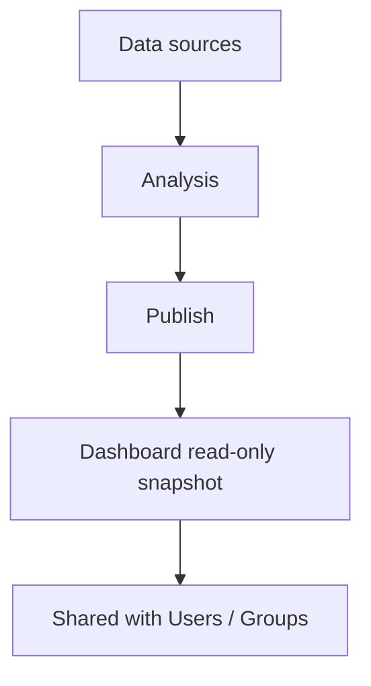

# 111. Amazon QuickSight

## 🎯 Giới thiệu
Amazon QuickSight là một **serverless, machine-powered business intelligence service** dùng để tạo **interactive dashboards**.

- Dùng để trực quan hóa dữ liệu và tạo business insights
- **Fast** và **automatically scalable**
- Có thể **embed in website**
- Dùng mô hình **per-session pricing**

## 1. Use case và khả năng chính
QuickSight thường được dùng cho:

- **Business analytics**
- **Building visualization**
- **Ad-hoc analysis** theo kiểu trực quan
- Tìm **business insights** từ dữ liệu

Các kiểu nội dung làm việc trong QuickSight:

- **Analysis**: nơi tạo và chỉnh sửa phân tích
- **Dashboard**: bản **read-only snapshot** của analysis để chia sẻ

## 2. Nguồn dữ liệu và tích hợp
QuickSight có thể kết nối với nhiều nguồn dữ liệu:

- AWS sources:
  - **RDS**
  - **Aurora**
  - **Redshift**
  - **Athena**
  - **S3**
  - **OpenSearch**
  - **Timestream**
- Third-party SaaS:
  - **Salesforce**
  - **Jira**
- Third-party databases:
  - **Teradata**
  - Database on-premises dùng **JDBC**

QuickSight cũng có thể import trực tiếp các file/dữ liệu:

- **Excel**
- **CSV**
- **JSON**
- **TSV**
- **EFS CLF format** cho log

## 3. SPICE, users, groups và sharing
### SPICE engine
- **SPICE** là một **in-memory computation engine**
- Chỉ hoạt động khi dữ liệu được **import trực tiếp vào QuickSight**
- Không dùng theo cách QuickSight chỉ **connected to another database**

### Users và groups
- QuickSight có **users** trong **Standard version**
- Có **groups** trong **Enterprise version**
- **Users/groups chỉ tồn tại trong QuickSight service**
- Chúng **không tương đương IAM users**
- **IAM users** chỉ dùng cho **administration**

### Sharing
- Bạn tạo **analysis** hoặc **dashboard**
- Sau đó **share** với các **specific users or groups**
- Cần **publish** dashboard trước khi chia sẻ
- Dashboard là **read-only snapshot** của analysis và giữ lại:
  - filters
  - parameters
  - controls
  - sorting options

## 📊 Bảng tóm tắt
| Tiêu chí | Mô tả |
|----------|------|
| Loại service | **Serverless business intelligence service** |
| Mục đích chính | Tạo **interactive dashboards** và phân tích dữ liệu |
| Tính chất | **Fast**, **automatically scalable**, **per-session pricing** |
| Use cases | **Business analytics**, **visualization**, **ad-hoc analysis** |
| Nguồn dữ liệu | **RDS, Aurora, Athena, Redshift, S3, OpenSearch, Timestream**, SaaS, JDBC databases, file import |
| SPICE | **In-memory computation engine**, chỉ hoạt động khi import dữ liệu trực tiếp vào QuickSight |
| User model | **Users** (Standard), **Groups** (Enterprise), chỉ tồn tại trong QuickSight |
| IAM | **IAM users** không phải QuickSight users, chỉ dùng cho administration |
| Sharing | Dashboard là **read-only snapshot** của analysis và phải **publish** trước khi share |

## 💡 Mẹo ghi nhớ cho kỳ thi AWS
- Nhớ QuickSight là **BI service** để tạo **interactive dashboards**
- Hay gặp nhất trên exam là:
  - **QuickSight + Athena**
  - **QuickSight + Redshift**
- **SPICE** = engine **in-memory**
- **SPICE chỉ dùng khi import data vào QuickSight**
- **Dashboard** là bản **read-only snapshot** của **analysis**
- **Users/groups trong QuickSight không phải IAM users**
- **Enterprise edition** có **column-level security (CLS)**

## ✅ Kết luận
Amazon QuickSight là dịch vụ **business intelligence** trên AWS để tạo dashboard và phân tích trực quan.

- Kết nối được nhiều nguồn dữ liệu AWS và bên thứ ba
- Hỗ trợ **SPICE** để xử lý in-memory rất nhanh
- Có mô hình **users/groups** riêng trong QuickSight
- **Dashboard** là bản chia sẻ read-only từ **analysis**

Nếu đi thi, hãy nhớ 3 ý cốt lõi: **BI dashboards**, **SPICE in-memory**, và **QuickSight users/groups khác IAM users**.
