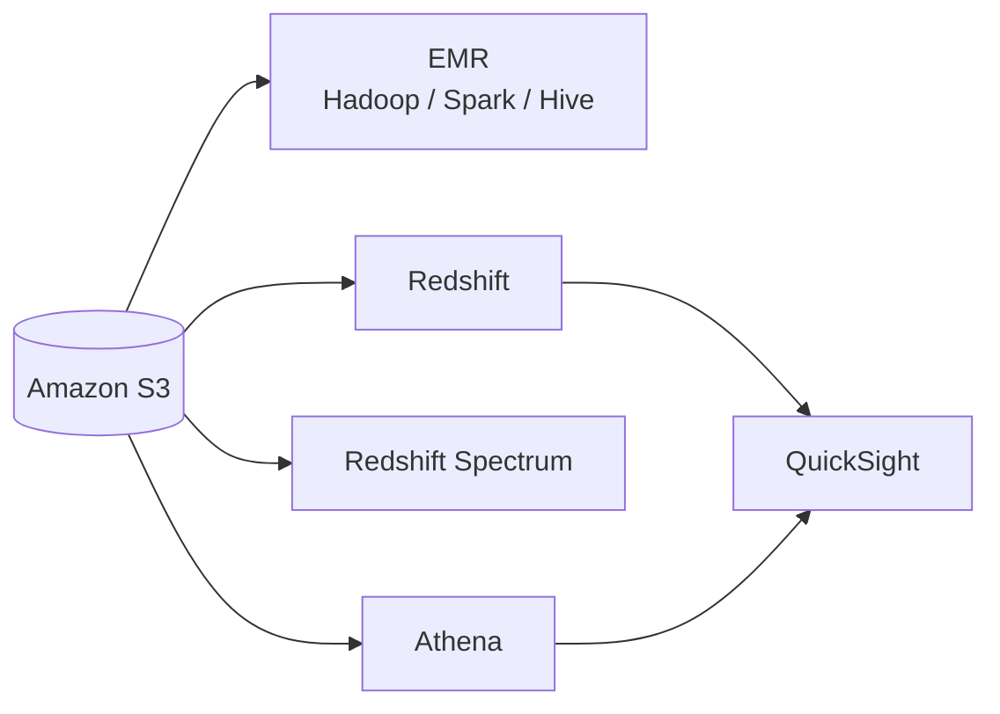
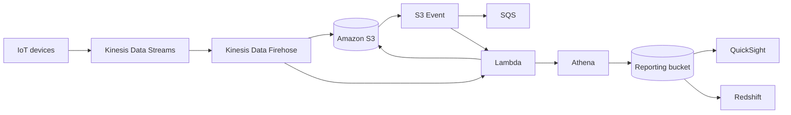

# 112. Big Data Architecture

## 🎯 Giới thiệu
Bài này tóm tắt cách xây dựng **Big Data architecture trên AWS** theo 2 phần chính:
- **Analytics layer**: lưu trữ, truy vấn, trực quan hóa dữ liệu
- **Big Data ingestion**: đưa dữ liệu từ nguồn vào hệ thống xử lý và báo cáo

Các dịch vụ xuất hiện trong transcript gồm: **S3, EMR, Redshift, Redshift Spectrum, Athena, QuickSight, Kinesis Data Streams, Kinesis Data Firehose, Lambda, SQS, DynamoDB, CloudTrail, EBS, EMR FS**.

## 1. Analytics layer trên AWS 📊
Transcript mô tả nhiều cách dùng dịch vụ AWS cho tầng phân tích:

- **Amazon S3** có thể làm nơi chứa dữ liệu cho analytics layer.
- **EMR** có thể đọc dữ liệu từ S3 và chạy các tool open source như:
  - **Hadoop**
  - **Spark**
  - **Hive**
- Cách này phù hợp khi migrate từ **on-premise** sang AWS và muốn tận dụng Big Data tool quen thuộc.

- Với hướng **AWS native**, có thể dùng:
  - **Redshift** để data warehousing và query bằng **SQL**
  - **Redshift Spectrum** để query dữ liệu trực tiếp trên **S3**
- **Athena** là lựa chọn **serverless**, phù hợp cho các truy vấn không liên tục và query trực tiếp trên **S3**.
- **QuickSight** dùng cho **visualization**:
  - tích hợp dễ với **Redshift** hoặc **Athena**
  - tạo dashboard từ dữ liệu đã được query/xử lý

## 2. Big Data ingestion flow 🔄
Transcript mô tả luồng ingest dữ liệu real-time và gần real-time như sau:

- **IoT devices** tạo dữ liệu real-time vào **Kinesis Data Streams**
- **Kinesis Data Firehose** dùng để ingest và chuyển dữ liệu gần real-time vào **Amazon S3**
- Có thể dùng **Lambda** để transform dữ liệu trước khi vào S3 nếu cần
- Khi có file mới trong **S3**, có thể:
  - kích hoạt **S3 event**
  - đẩy qua **SQS** như một service tùy chọn
  - hoặc gọi trực tiếp **Lambda**
- **Lambda** có thể trigger một **Amazon Athena job** để query dữ liệu trong S3
- Kết quả có thể được đưa vào **reporting bucket**
- Từ reporting bucket, có thể:
  - tạo **QuickSight dashboard**
  - hoặc ingest vào **Amazon Redshift** để query tiếp

### Ý chính của flow
- AWS hỗ trợ đi từ **real-time layer** đến **reporting layer**
- Kiến trúc mang tính **mix and match**, tùy job và yêu cầu hệ thống
- Có thể dùng nhiều service khác nhau trong cùng một pipeline

## 3. So sánh EMR, Athena, Redshift ⚖️

### EMR
- Dùng khi cần Big Data tools như **Apache Hive**, **Spark**
- Phù hợp cho migration sang AWS
- Có 2 kiểu kiến trúc:
  - **one long-running cluster** rồi submit nhiều jobs
  - **one cluster per job** để size độc lập
- Có thể enable **Hadoop scaling**
- Hỗ trợ các lựa chọn mua:
  - **Spot Instances**
  - **On Demand Instances**
  - **Reserved Instances**
- Có thể access:
  - **DynamoDB** qua **Hive**
  - **S3** qua **EMR FS**
- Có thể dùng:
  - **EBS** cho scratch data / **HDFS**
  - **S3** cho long-term storage qua **EMR FS**

### Athena
- Dùng cho **simple queries** và **aggregations**
- Dữ liệu phải nằm trong **Amazon S3**
- Là **serverless**
- Có out-of-the-box queries cho nhiều service, bao gồm **custom billing reports**
- Tích hợp tốt với AWS và có thể audit query qua **CloudTrail**

### Redshift
- Dùng cho **advanced SQL queries**
- Cần **provision servers**
- Có thể dùng **Redshift Spectrum** cho serverless queries trên **S3**
- Là một **full data warehouse**
- Phù hợp khi có **sustained usage** để đạt **return on investment**

## 📊 Bảng tóm tắt
| Tiêu chí | Mô tả |
|----------|------|
| Analytics storage | **S3** là nơi chứa dữ liệu phổ biến cho analytics |
| Open source processing | **EMR** chạy **Hadoop, Spark, Hive** trên AWS |
| Data warehousing | **Redshift** cho SQL analytics và warehouse |
| Serverless query | **Athena** query trực tiếp trên **S3** |
| Visualization | **QuickSight** dùng để làm dashboard |
| Real-time ingestion | **Kinesis Data Streams** + **Firehose** + **S3** |
| Transform dữ liệu | **Lambda** có thể transform trước khi vào **S3** |
| Event-driven flow | **S3 event**, **SQS**, **Lambda** có thể kích hoạt xử lý tiếp |
| Audit | **CloudTrail** có thể audit các query của Athena |
| Storage choices | **EBS** cho scratch/HDFS, **S3** cho long-term storage qua EMR FS |

## 💡 Mẹo ghi nhớ cho kỳ thi AWS
- **EMR** = khi cần **open source Big Data tools** như **Hive/Spark** và có thể dùng nhiều kiểu cluster.
- **Athena** = **serverless**, dữ liệu phải ở **S3**, hợp với **simple queries**.
- **Redshift** = **data warehouse**, cần provision, mạnh cho **advanced SQL**.
- **QuickSight** = lớp **visualization**, thường nối với **Athena** hoặc **Redshift**.
- **Kinesis Data Streams + Firehose** = luồng ingest từ real-time đến **S3**.
- **Lambda** thường xuất hiện ở bước **transform** hoặc **trigger** theo event.
- **CloudTrail** được nhắc như công cụ để audit query của **Athena**.
- Nhớ rằng kiến trúc trong transcript là kiểu **mix and match**, không có một công thức cố định.

## ✅ Kết luận
Big Data architecture trên AWS trong transcript xoay quanh việc:
- đưa dữ liệu vào hệ thống qua **Kinesis, Firehose, Lambda, S3**
- xử lý bằng **EMR**, truy vấn bằng **Athena** hoặc **Redshift**
- trực quan hóa bằng **QuickSight**

Điểm quan trọng là chọn đúng công cụ theo nhu cầu:
- **EMR** cho Big Data tool và migration
- **Athena** cho serverless query trên S3
- **Redshift** cho data warehousing và SQL nâng cao
