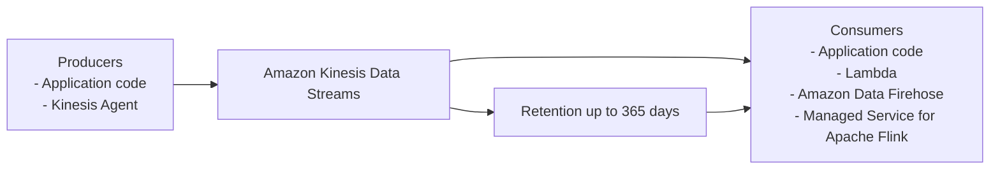

# 98. Amazon Kinesis Data Streams

## 🎯 Giới thiệu
- **Amazon Kinesis Data Streams** là service dùng để **collect** và **store streaming data in real-time**.
- Từ khóa quan trọng khi làm bài thi: **real-time**.
- Dữ liệu real-time là dữ liệu được tạo ra và sử dụng ngay lập tức, ví dụ:
  - **click stream** từ website
  - dữ liệu từ **connected devices**
  - **metrics** và **logs** từ server
- Dữ liệu được đưa vào Kinesis Data Streams thông qua **producers**.
- Dữ liệu sau đó được đọc bởi **consumers** để xử lý trong thời gian thực.

## 1. Luồng dữ liệu trong Kinesis Data Streams 🚀
- **Producers** có thể là:
  - **applications**: bạn phải tự viết code để đẩy dữ liệu từ website hoặc devices vào stream
  - **Kinesis Agent**: cài trên server để gửi **metrics** và **logs** vào stream
- **Consumers** có thể là:
  - application code để đọc stream
  - **Lambda functions**
  - **Amazon Data Firehose**
  - **Managed Service for Apache Flink**
- Mục tiêu của kiến trúc này là cho phép xử lý và khai thác dữ liệu **as it happens**.

## 2. Tính năng chính và bảo mật 🔐
- Dữ liệu có thể được **retained up to 365 days**.
- Vì dữ liệu được **persisted**, consumers có thể **reprocess** hoặc **replay** dữ liệu.
- Sau khi gửi vào stream, bạn **không thể delete ngay**; dữ liệu chỉ bị xóa khi **expire theo thời gian**.
- Có thể gửi dữ liệu **up to 10 megabytes** vào Kinesis Data Streams.
- Trường hợp dùng phổ biến là **nhiều dữ liệu nhỏ, real-time**.
- Dữ liệu sẽ có **thứ tự** nếu bạn gửi 2 data points có cùng **partition ID**.
- Security features:
  - **KMS encryption at rest**
  - **HTTPS encryption in flight**
- Tối ưu hiệu năng:
  - Producer tối ưu throughput: **Kinesis Producer Library (KPL)**
  - Consumer tối ưu: **Kinesis Client Library (KCL)**

## 3. Capacity modes 📈
### Provisioned mode
- Bạn **chọn số lượng shards** cho stream.
- **Shard** là đơn vị thể hiện kích thước/khả năng của stream.
- Shards càng nhiều thì **inbound throughput** càng cao.
- Mỗi shard cung cấp:
  - **1 MB/s** hoặc **1,000 records/s** cho inbound
  - **2 MB/s** cho read capacity / out-traffic
- Nếu cần ví dụ như **10,000 records/s** hoặc **10 MB/s**, bạn sẽ cần scale lên **10 shards**.
- Có thể **scale manual** để tăng hoặc giảm số shards.
- Cần monitor throughput để biết số shards phù hợp.
- Chi phí: **pay for each shard provisioned per hour**.

### On-demand mode
- Bạn **không cần provision** hay quản lý capacity.
- Có một mức capacity mặc định khoảng:
  - **4,000 records/s**
  - hoặc **4 MB in**
- Kinesis Data Streams sẽ **tự scale** theo throughput quan sát được trong **30 ngày gần nhất**.
- Chi phí:
  - **pay per stream per hour**
  - và tính theo lượng data **in and out**

## 📊 Bảng tóm tắt
| Tiêu chí | Mô tả |
|----------|------|
| Mục đích | Collect và store streaming data in real-time |
| Dữ liệu đầu vào | Click stream, connected devices, metrics, logs |
| Producer | Application code hoặc Kinesis Agent |
| Consumer | Application code, Lambda, Amazon Data Firehose, Managed Service for Apache Flink |
| Retention | Tối đa 365 days |
| Replay | Có thể reprocess / replay dữ liệu đã persist |
| Xóa dữ liệu | Không xóa ngay, chỉ mất khi expire theo thời gian |
| Kích thước dữ liệu | Up to 10 MB |
| Ordering | Có thứ tự nếu cùng partition ID |
| Security | KMS at rest, HTTPS in flight |
| Tối ưu hóa | KPL cho producer, KCL cho consumer |
| Provisioned mode | Chọn shards, scale manual, trả theo shard/hour |
| On-demand mode | Không quản lý capacity, auto scale theo 30 ngày gần nhất, trả theo stream/hour và data in/out |

## 💡 Mẹo ghi nhớ cho kỳ thi AWS
- Nhớ từ khóa **real-time** là dấu hiệu mạnh nhất của **Kinesis Data Streams**.
- **Producers** đưa dữ liệu vào, **consumers** lấy dữ liệu ra để xử lý.
- **365 days retention** nghĩa là có thể **replay** dữ liệu.
- **Shard** là đơn vị capacity cốt lõi trong **provisioned mode**.
- Khi thấy:
  - **KPL** = producer tối ưu
  - **KCL** = consumer tối ưu
- Phân biệt nhanh:
  - **Provisioned**: tự chọn số shard
  - **On-demand**: không cần quản lý capacity

## ✅ Kết luận
- **Amazon Kinesis Data Streams** được dùng để xử lý **streaming data in real-time**.
- Nó hỗ trợ **producers**, **consumers**, **data retention**, **replay**, và **bảo mật** bằng **KMS** và **HTTPS**.
- Hai chế độ capacity cần nhớ là **Provisioned mode** và **On-demand mode**, với cách tính throughput và chi phí khác nhau.
