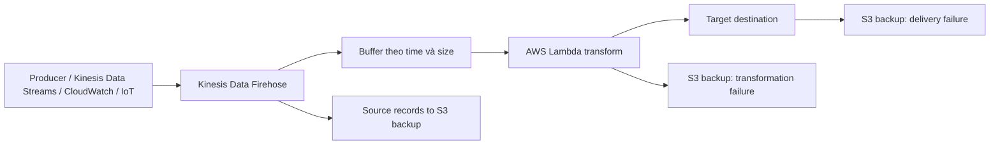

# 99. Amazon Data Firehose

## 🎯 Giới thiệu
Amazon Data Firehose là dịch vụ **fully managed** dùng để **đưa dữ liệu vào target destinations** một cách **near real time**.  
Điểm chính cần nhớ:

- Firehose nhận dữ liệu từ **producers** hoặc từ **Kinesis Data Streams**
- Firehose xử lý theo kiểu **batch writes**, không ghi tức thì
- Firehose có **automatic scaling**
- Bạn chỉ trả tiền cho **amount of data đi qua Firehose**, không phải provision capacity trước

## 1. Cách Firehose hoạt động 🔄

Firehose hoạt động theo flow sau:

Các ý cần nhớ:

- Source có thể là:
  - ứng dụng gửi trực tiếp
  - **Kinesis Data Streams**
  - **Amazon CloudWatch**
  - **AWS IoT**
- Firehose đọc record lần lượt, tối đa **1 MB mỗi lần**
- Có thể dùng **AWS Lambda** để transform record trước khi deliver
- Firehose dùng **buffer** theo:
  - **buffer size**
  - **buffer time**
- Khi buffer đầy hoặc hết thời gian buffer, dữ liệu sẽ được flush ra destination
- Đây là lý do Firehose là dịch vụ **near real time**, không phải real time tuyệt đối

## 2. Destinations, transformation và backup 🎯

Các destination quan trọng cần học thuộc:

- **Amazon S3**
- **Amazon Redshift**
- **Amazon OpenSearch**
- **Splunk**

Chi tiết quan trọng:

- Với **Redshift**, Firehose sẽ:
  - ghi dữ liệu vào **S3** trước
  - sau đó chạy **COPY command** vào Redshift
- Firehose cũng có thể gửi tới **third-party destinations** như:
  - Datadog
  - Splunk
  - New Relic
  - MongoDB
- Có thể cấu hình **custom destination** nếu có **valid HTTP endpoint as an API**
- Có thể lưu:
  - **source records**
  - **transformation failures**
  - **delivery failures**
  vào một **backup S3 bucket**
- Ý nghĩa thi cử:
  - Firehose **không làm mất dữ liệu**
  - Nếu không vào target chính thì vẫn có thể được archive ở S3

Firehose còn hỗ trợ:

- **data conversion**
  - ví dụ: **JSON to Parquet**
  - **ORC** nếu dùng **S3**
- **AWS Lambda transformation**
  - ví dụ: **CSV to JSON**
- **compression** khi target là **S3**
  - **GZIP**
  - **ZIP**
  - **SNAPPY**
- Nếu nạp vào **Redshift** thì chỉ **GZIP** là supported conversion mechanism theo transcript

## 3. Firehose vs Kinesis Data Streams ⚖️

| Tiêu chí | Kinesis Data Streams | Kinesis Data Firehose |
|----------|----------------------|------------------------|
| Mô hình | Cần custom code cho producer/consumer | Fully managed |
| Mức thời gian | Real time | Near real time |
| Latency | ~200 ms cho classic consumers, ~70 ms cho enhanced fan-out | Có buffer, không ghi tức thì |
| Capacity | On-demand hoặc Provisioned | Automatic scaling |
| Storage | Có storage 1 đến 365 ngày | Không có data storage |
| Replay | Có replay capability | Không replay data |
| Consumers | Multiple consumers | Không theo mô hình consumer như Streams |
| Transform | Có thể dùng Lambda trong pipeline | Serverless transformation qua **AWS Lambda** |
| Destination | Có thể dùng để đẩy vào OpenSearch, v.v. | S3, Splunk, Redshift, OpenSearch |
| Use case | Khi application cần đọc stream data | Khi mục tiêu là đẩy dữ liệu vào storage/analytics destinations |

Điểm thi rất dễ nhầm:

- **Spark streaming** và **Kinesis Client Library (KCL)**:
  - **không đọc từ Firehose**
  - chỉ đọc từ **Kinesis Data Streams**
- **Producer / KPL** có thể produce vào:
  - **Kinesis Data Streams**
  - **Kinesis Data Firehose**

## 📊 Bảng tóm tắt

| Tiêu chí | Mô tả |
|----------|------|
| Bản chất | Fully managed service để deliver data tới destination |
| Mô hình xử lý | Batch writes, near real time |
| Source | Direct producers, Kinesis Data Streams, CloudWatch, AWS IoT |
| Transform | Có thể dùng **AWS Lambda** |
| Destinations quan trọng | **S3, Redshift, OpenSearch, Splunk** |
| Backup | Có thể lưu source records, transformation failures, delivery failures vào **S3** |
| Scaling | Automatic scaling |
| Billing | Tính theo lượng data đi qua Firehose |
| Không hỗ trợ | Không phải nơi để Spark streaming / KCL đọc dữ liệu |

## 💡 Mẹo ghi nhớ cho kỳ thi AWS

- Nhớ câu: **Firehose = deliver data into destination**
- Nhớ 4 destination chính:
  - **S3**
  - **Redshift**
  - **OpenSearch**
  - **Splunk**
- Nhớ đặc điểm:
  - **near real time**
  - **batch writes**
  - **automatic scaling**
  - **no replay**
- Nhớ flow quan trọng:
  - source -> Firehose -> buffer -> optional Lambda transform -> destination
- Nhớ bẫy đề thi:
  - **KCL** và **Spark streaming** không đọc từ Firehose
  - Firehose là để **load data**, không phải để làm stream processing kiểu Kinesis Data Streams
- Nhớ với **Redshift**:
  - Firehose ghi qua **S3** trước rồi mới **COPY** vào Redshift
- Nhớ Firehose có thể:
  - lưu **source records**
  - lưu **failed records**
  - tránh mất dữ liệu

## ✅ Kết luận
Amazon Data Firehose là lựa chọn phù hợp khi bạn muốn **đẩy dữ liệu nhanh, đơn giản, fully managed** vào các đích như **S3, Redshift, OpenSearch, Splunk**.  
Điểm cốt lõi cần nhớ để ôn thi là: **Firehose dùng buffer, near real time, autoscaling, có thể transform bằng Lambda, và không có replay như Kinesis Data Streams**.
