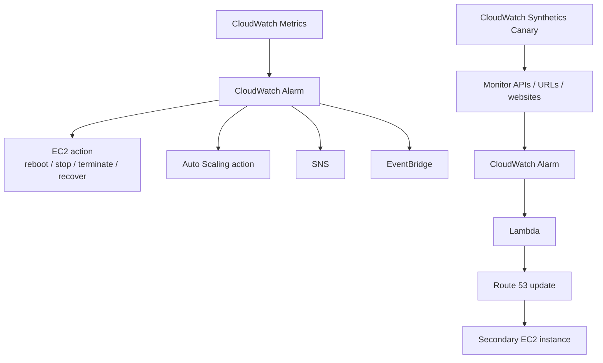

# 113. CloudWatch

## 🎯 Giới thiệu
CloudWatch là dịch vụ giám sát trung tâm của AWS, xuất hiện xuyên suốt trong nhiều service. Trong lecture này, trọng tâm là:
- `CloudWatch Metrics`
- `CloudWatch Alarms`
- `CloudWatch Dashboards`
- `CloudWatch Synthetics Canary`

## 1. CloudWatch Metrics 📈
- Nhiều AWS services cung cấp `CloudWatch Metrics` mặc định.
- Với `EC2`, metrics có sẵn theo mặc định.
- `EC2 standard monitoring` có resolution là `5 minutes`.
- Có thể bật `detailed monitoring` để có metrics mỗi `1 minute`.
- Các metrics EC2 nhắc tới trong transcript:
  - `CPU`
  - `network`
  - `disk`
- `RAM` không phải built-in metric.
  - Muốn theo dõi memory usage của EC2 thì phải tạo `custom metric`.
  - Có thể dùng `CloudWatch unified agent` để gửi metric này về CloudWatch.
- `Custom metric`:
  - Standard resolution: `1 minute`
  - `High resolution mode`: xuống tới `1 second`

## 2. CloudWatch Alarms và Integrations 🚨
CloudWatch alarm có thể trigger 3 nhóm hành động chính:

- `EC2 action`
  - `reboot`
  - `stop`
  - `terminate`
  - `recover`
- `Auto Scaling action`
- `SNS`

Ngoài ra:
- Alarm event có thể được `Amazon EventBridge` intercept.
- Điều này mở ra nhiều integration khác nhau.

### Ví dụ use case trong transcript
- Monitor một `critical EC2 instance`.
- Nếu `status check` fail, alarm sẽ trigger `recover`.
- Mục tiêu là khôi phục EC2 instance và giữ nguyên thông tin như:
  - `private IP`
  - `public IP`

### Các integration nhắc tới
- `SNS` để gửi email / alerting
- Từ `SNS` có thể fan out sang:
  - `SQS queues`
  - `Lambda`
- Từ `EventBridge` có thể:
  - đẩy dữ liệu vào `Kinesis`
  - trigger `Step Functions`
  - trigger `Lambda`

### Dashboards
- `CloudWatch dashboards` có thể hiển thị:
  - metrics
  - alarms
- Có thể hiển thị metrics từ `multiple regions`

## 3. CloudWatch Synthetics Canary 🧪
`CloudWatch Synthetics Canary` là cách chạy script để:
- monitor `APIs`
- monitor `URLs`
- monitor `websites`

Mục tiêu:
- thực hiện `health checks` giống hành vi thật của customer
- phát hiện vấn đề trước khi customer bị ảnh hưởng

### Canary có thể theo dõi
- `availability`
- `latency`
- `load time`
- `screenshots` của UI

### Cách hoạt động
- Canary chạy script theo lịch hoặc chạy một lần.
- Script có thể viết bằng:
  - `Node.js`
  - `Python`
- Có thể dùng `headless Chrome`
- Có dashboard và summary trong CloudWatch

### Use case trong transcript
- API chạy trên `EC2` ở `US-East-1`
- User truy cập qua `Route 53`
- Canary gửi API calls định kỳ, ví dụ mỗi `1 minute`
- Nếu response bất thường:
  - có thể trigger `CloudWatch alarm`
  - alarm gọi `Lambda`
  - `Lambda` cập nhật DNS record trong `Route 53`
  - traffic được chuyển sang `second EC2 instance`

### Blueprints được nhắc tới
- `heartbeat monitor`
  - load URL
  - store screenshot
  - tạo `HTTP archive file`
- `API Canary`
  - test `read` và `write` cho `REST APIs`
- `broken link checker`
- `visual monitoring`
  - so sánh screenshot với `baseline screenshots`
- `Canary recorder`
  - record thao tác trên website để generate script
- `GUI Workflow Builder`
  - verify các action trên webpage, ví dụ login form

## 📊 Bảng tóm tắt
| Tiêu chí | Mô tả |
|----------|------|
| `CloudWatch Metrics` | Theo dõi metric của AWS services; EC2 có sẵn metrics mặc định |
| `EC2 monitoring` | `standard monitoring` = `5 minutes`, `detailed monitoring` = `1 minute` |
| `Custom metric` | Dùng khi cần metric không built-in, ví dụ `RAM usage` |
| `High resolution metric` | Có thể xuống tới `1 second` |
| `CloudWatch Alarms` | Có thể trigger `EC2 action`, `Auto Scaling`, `SNS` |
| `EventBridge` | Intercept alarm events để mở rộng integration |
| `Dashboards` | Hiển thị metrics và alarms, hỗ trợ multiple regions |
| `Synthetics Canary` | Chạy script để monitor APIs, URLs, websites bằng health checks |
| `Canary outputs` | Có thể lưu `load time` và `screenshots` |
| `Blueprints` | Heartbeat, API Canary, broken link checker, visual monitoring, recorder, GUI Workflow Builder |

## 💡 Mẹo ghi nhớ cho kỳ thi AWS
- `EC2 standard monitoring` = `5 minutes`; `detailed monitoring` = `1 minute`.
- `RAM` không phải metric built-in của EC2, nên nhớ phải dùng `custom metric`.
- `CloudWatch alarm` có 3 nhóm tích hợp chính: `EC2 action`, `Auto Scaling`, `SNS`.
- `EventBridge` là điểm mở rộng quan trọng cho alarm events.
- `Synthetics Canary` không chỉ kiểm tra “down/up”, mà còn phát hiện ứng dụng trả về kết quả sai.
- Nhớ các blueprint phổ biến: `heartbeat`, `API Canary`, `broken link checker`, `visual monitoring`.

## ✅ Kết luận
CloudWatch trong lecture này tập trung vào 4 mảng chính:
- `Metrics` để thu thập số liệu giám sát
- `Alarms` để kích hoạt hành động hoặc integration
- `Dashboards` để quan sát tập trung
- `Synthetics Canary` để kiểm tra hành vi thực tế của ứng dụng, API, và website

Nếu nắm chắc các resolution, các action của alarm, và flow của Canary, bạn sẽ có nền tảng tốt cho phần exam liên quan đến monitoring trên AWS.
