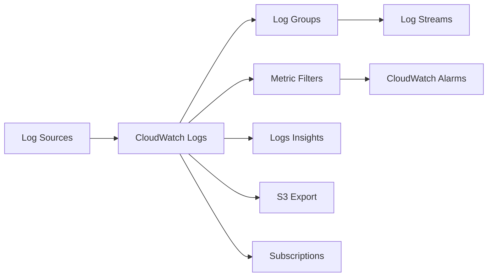
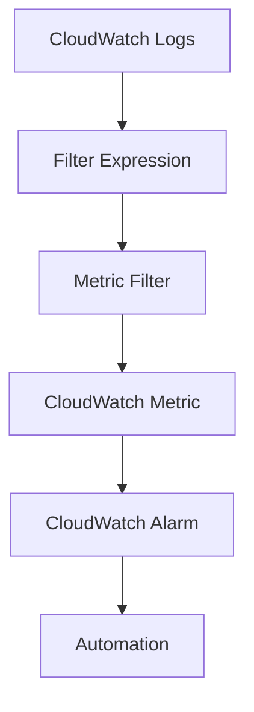
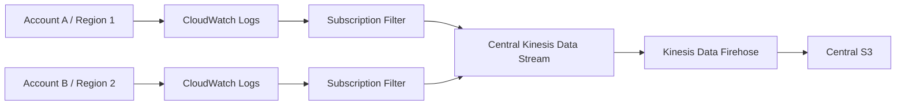

# 114. CloudWatch Logs

## 🎯 Giới thiệu
CloudWatch Logs là chủ đề rất quan trọng cho kỳ thi SA Pro. Nội dung trọng tâm trong transcript là:
- Cách đưa dữ liệu vào CloudWatch Logs
- Cấu trúc và cách quản lý log
- Các hướng export, subscription, và tích hợp với CloudWatch Agent

## 1. Nguồn dữ liệu đẩy vào CloudWatch Logs
CloudWatch Logs có thể nhận log từ nhiều nguồn khác nhau:

- Qua `SDK`
- Qua `CloudWatch Logs Agent`
- Qua `CloudWatch Unified Agent`
- Qua tích hợp trực tiếp từ một số AWS services

Các nguồn tích hợp được nhắc đến:
- `Elastic Beanstalk`: gom log ứng dụng và gửi trực tiếp vào CloudWatch Logs
- `ECS`: dùng log driver để lấy log từ containers
- `Lambda`: tích hợp trực tiếp, cung cấp function logs
- `VPC Flow Logs`
- `API Gateway Access Logs`
- `CloudTrail` theo filter
- `Route 53 DNS queries`

Điểm cần nhớ:
- `CloudWatch Logs Agent` có thể cài trên `EC2`
- Cũng có thể cài trên `on-premise VMs` hoặc bất kỳ server nào có log cần gửi đi

## 2. Cấu trúc và quản lý log
CloudWatch Logs được tổ chức theo 2 lớp chính:

- `Log group`: thường đại diện cho một application
- `Log stream`: đại diện cho các instance, container, hoặc luồng log cụ thể bên trong application

Điểm quan trọng:
- Việc tổ chức `log group` và `log stream` khá linh hoạt, tùy cách bạn thiết kế
- Phần quan trọng nhất là nội dung log bên trong `log stream`

Quản lý log:
- Có thể đặt `log expiration policy`
- Log có thể:
  - `never expire`
  - hoặc expire sau một thời gian như `30 days`
- Nếu cho log expire, cần đảm bảo dữ liệu quan trọng đã được lưu ở nơi khác để phân tích sau này
- CloudWatch Logs có thể được mã hóa bằng `KMS`

## 3. Metric Filters, Insights, Export và Subscriptions
### CloudWatch Logs Metric Filters
CloudWatch Logs có thể dùng `filter expression` để tạo metric, gọi là `Logs Metric Filter`.

Ví dụ use case:
- Tìm một `IP` cụ thể trong log và đếm số lần xuất hiện
- Đếm số lần xuất hiện của từ `error`
- Dùng để tạo metric và trigger `CloudWatch Alarms`

### CloudWatch Logs Insights
`CloudWatch Logs Insights` dùng để:
- Query log trực tiếp trong CloudWatch
- Lưu query và đưa lên `CloudWatch Dashboard`

Ví dụ query logic được nhắc đến:
- Đếm số exceptions mỗi 5 phút
- Liệt kê log events không phải exceptions
- Phân tích log từ `Lambda`, `Route 53`, `VPC Flow Logs`

### Export sang S3
CloudWatch Logs có thể export sang `Amazon S3`:
- Phải mã hóa dữ liệu
- Hỗ trợ:
  - `SSE-S3`
  - `SSE-KMS`
- Log data có thể mất tới `12 hours` mới sẵn sàng để export
- Không phải real time
- Phải dùng API `CreateExportTask`

### CloudWatch Logs Subscriptions
Nếu cần gần real time hơn, dùng `subscription filter`.

Output có thể là:
- `Lambda` managed function để gửi dữ liệu vào `Amazon ElasticSearch` theo thời gian thực
- `Your own Lambda function` để xử lý real time
- `Kinesis Data Firehose` để đưa gần real time vào:
  - `Amazon S3`
  - `Amazon ElasticSearch`
- `Kinesis Data Streams` để tiếp tục xử lý bằng:
  - `Kinesis Data Firehose`
  - `Kinesis Data Analytics`
  - `EC2` chạy `KCL`
  - `Lambda`

So sánh nhanh:
| Tiêu chí | Lambda | Kinesis Data Firehose |
|----------|--------|------------------------|
| Độ trễ | Real time | Near-real time |
| Phù hợp | Cần phản hồi ngay | Chấp nhận khoảng 1 phút lag |
| Chi phí / scale | Thường không tối ưu bằng Firehose cho luồng lớn | Có xu hướng rẻ hơn và scalable hơn |

### Multi-account, multi-region log aggregation
Một kiến trúc rất phổ biến:
- Ở nhiều account và region khác nhau
- CloudWatch Logs dùng `subscription filter`
- Gửi về `Kinesis Data Stream` trong một `central logging account`
- Sau đó dùng `Kinesis Data Firehose` sync gần real time vào `Amazon S3`

### CloudWatch Agent và Systems Manager
CloudWatch Agent có thể được cài và quản lý theo 2 cách chính:

- Dùng `SSM Run Command`
  - Lệnh `ConfigureAWSPackage`
  - Package: `AmazonCloudWatchAgent`
- Dùng `Systems Manager State Manager`
  - Đảm bảo `CloudWatch Agent` luôn được cài trên `EC2`

Ngoài ra:
- Nếu `SSM agent` không có sẵn nhưng vẫn muốn dùng SSM
- Có thể cài `CloudWatch Agent` trực tiếp trên instance
- Khi cấu hình và khởi động agent, có thể cho nó tải cấu hình từ `SSM Parameter Store`

## 📊 Bảng tóm tắt
| Tiêu chí | Mô tả |
|----------|------|
| Nguồn dữ liệu | SDK, CloudWatch Logs Agent, Unified Agent, và tích hợp từ AWS services |
| Tổ chức | `Log group` chứa nhiều `log stream` |
| Quản lý vòng đời | Có thể đặt `log expiration policy` |
| Bảo mật | Hỗ trợ mã hóa bằng `KMS`, export hỗ trợ `SSE-S3` và `SSE-KMS` |
| Phân tích | `Logs Metric Filters` và `CloudWatch Logs Insights` |
| Export | `CreateExportTask` sang `S3`, nhưng không real time |
| Gần real time | Dùng `Subscription filters` với `Lambda`, `Kinesis Data Firehose`, hoặc `Kinesis Data Streams` |
| Kiến trúc phổ biến | Multi-account, multi-region aggregation về central logging account |
| Agent quản lý | Có thể cài qua `SSM Run Command` hoặc `State Manager` |

## 💡 Mẹo ghi nhớ cho kỳ thi AWS
- `Logs Metric Filters` dùng khi bạn muốn biến pattern trong log thành metric và alarm.
- `CloudWatch Logs Insights` dùng để query log ngay trong CloudWatch.
- Export sang `S3` qua `CreateExportTask` là `not real time`.
- Nếu đề bài yêu cầu `real time`, nghĩ đến `Lambda`.
- Nếu chấp nhận `near-real time` và muốn scalable hơn, nghĩ đến `Kinesis Data Firehose`.
- `CloudWatch Logs Agent` có thể chạy trên `EC2`, `on-premise VMs`, hoặc server bất kỳ.
- `Log group` là container lớn hơn, `log stream` là luồng log bên trong nó.

## ✅ Kết luận
CloudWatch Logs trong transcript tập trung vào 4 ý chính: ingest log từ nhiều nguồn, tổ chức bằng `log group` và `log stream`, phân tích bằng `Metric Filters` và `Logs Insights`, và export/stream log sang `S3`, `Lambda`, `Kinesis Data Firehose`, hoặc `Kinesis Data Streams`. Đây là phần rất quan trọng để ôn thi SA Pro, đặc biệt ở các câu hỏi về `real time` vs `near-real time`, và cách build kiến trúc logging tập trung.
