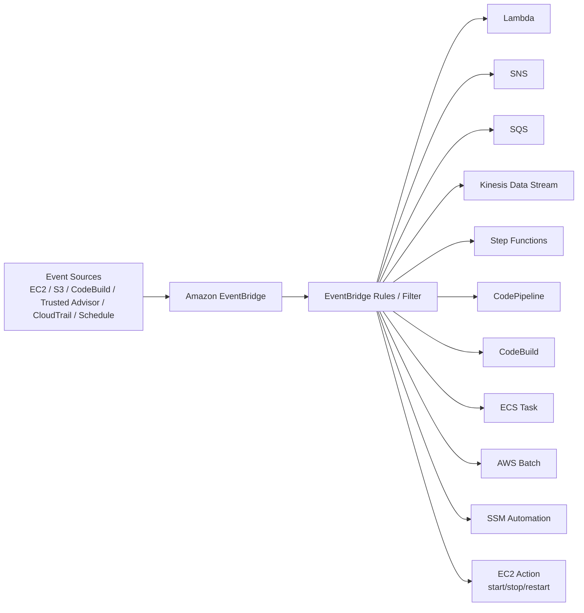

# 115. Amazon EventBridge

## 🎯 Giới thiệu
- **Amazon EventBridge** là dịch vụ dùng để nhận và xử lý **events** từ nhiều nguồn khác nhau.
- Tên cũ của nó là **CloudWatch Events**.
- Dùng để:
  - **Schedule** tác vụ theo thời gian, ví dụ `cron`, mỗi giờ, mỗi thứ Hai lúc 8:00.
  - **React to events** khi một dịch vụ AWS hoặc partner có thay đổi.
  - Gửi event tới nhiều đích khác nhau như **Lambda**, **SNS**, **SQS**, **Kinesis Data Stream**, **Step Functions**, **CodePipeline**, **CodeBuild**, **ECS**, **AWS Batch**, **SSM Automation**, hoặc thực hiện một số thao tác trên **EC2**.

## 1. Event flow trong EventBridge
- EventBridge đứng ở giữa, nhận event từ nhiều nguồn:
  - **EC2**: start, stop, terminate.
  - **CodeBuild**: build failed.
  - **S3**: object uploaded.
  - **Trusted Advisor**: có finding mới về security.
  - **CloudTrail** kết hợp với EventBridge: có thể intercept API calls trong AWS account.
  - **Schedule / cron**: chạy theo thời gian định sẵn.
- Sau khi nhận event, **EventBridge rules** có thể lọc theo điều kiện cụ thể.
- Event được chuyển thành một **JSON document** chứa chi tiết như:
  - instance nào bị start
  - ID
  - thời gian
  - IP
  - và các metadata khác

## 2. Các loại Event Bus
- **Default event bus**
  - Nhận event từ các service AWS gửi vào EventBridge.
  - Đây là luồng mặc định mà transcript mô tả.
- **Partner event bus**
  - Dành cho các partner tích hợp với AWS.
  - Ví dụ được nhắc đến: **Zendesk**, **Datadog**, **Auth0**.
  - Partner có thể gửi event trực tiếp vào partner event bus của bạn.
- **Custom event bus**
  - Bạn tự tạo event bus riêng.
  - Ứng dụng của bạn có thể gửi event vào đó.
  - Sau đó vẫn dùng **EventBridge rules** để route event tới các destination khác nhau.

## 3. Tính năng quan trọng cho quản trị và debugging
- **Archive events**
  - Có thể archive toàn bộ event hoặc một phần theo filter.
  - Retention có thể là:
    - **indefinite**
    - hoặc một khoảng thời gian xác định
- **Replay archived events**
  - Dùng để phát lại event đã archive.
  - Hữu ích cho:
    - debugging
    - troubleshooting
    - retest sau khi sửa lỗi, ví dụ sửa bug trong **Lambda**
- **Schema Registry**
  - EventBridge có thể phân tích event trong bus để **infer schema**.
  - Schema giúp application biết trước cấu trúc dữ liệu của event.
  - Có thể **generate code** từ schema.
  - Schema cũng có thể được **versioned** theo thời gian.
- **Resource-based policies**
  - Dùng để quản lý permissions cho một event bus cụ thể.
  - Cho phép hoặc từ chối event từ account khác hoặc region khác.
  - Hỗ trợ mô hình **central event bus** trong nhiều account:
    - một account trung tâm nhận event từ các account khác
    - các account khác dùng **PutEvents** để gửi event vào central bus

## 📊 Bảng tóm tắt
| Tiêu chí | Mô tả |
|----------|------|
| Tên dịch vụ | **Amazon EventBridge**, trước đây là **CloudWatch Events** |
| Mục đích chính | Schedule job và phản ứng với event từ AWS services hoặc partner |
| Nguồn event | **EC2**, **S3**, **CodeBuild**, **Trusted Advisor**, **CloudTrail**, schedule, partner, custom app |
| Destination | **Lambda**, **SNS**, **SQS**, **Kinesis Data Stream**, **Step Functions**, **CodePipeline**, **CodeBuild**, **ECS**, **AWS Batch**, **SSM Automation**, **EC2 actions** |
| Event bus | **Default event bus**, **Partner event bus**, **Custom event bus** |
| Filter | Dùng **EventBridge rules** để lọc event theo điều kiện |
| Archive / Replay | Lưu event để replay lại khi debug hoặc troubleshooting |
| Schema Registry | Infer schema, generate code, support versioning |
| Cross-account | Dùng **resource-based policies** để nhận event từ account khác |

## 💡 Mẹo ghi nhớ cho kỳ thi AWS
- **EventBridge = events + scheduling + routing**.
- Nhớ 3 loại event bus:
  - **Default**
  - **Partner**
  - **Custom**
- Nếu đề bài nói về:
  - chạy theo lịch `cron`
  - trigger Lambda định kỳ
  - phản ứng với event từ service AWS
  - nhận event từ SaaS partner
  - replay event đã lưu
  - schema của event
  - cross-account event bus
  thì nghĩ ngay tới **EventBridge**.
- **CloudWatch Events** là tên cũ, còn đề thi sẽ dùng **EventBridge**.
- **Archive + Replay** rất hợp cho debugging production.
- **Schema Registry** giúp hiểu cấu trúc JSON event và generate code.

## ✅ Kết luận
- **Amazon EventBridge** là dịch vụ trung tâm để nhận, lọc, lưu, replay và route events.
- Nó hỗ trợ cả **schedule-based** và **event-driven** workflows.
- Ba khả năng quan trọng nhất cần nhớ là:
  - **Default / Partner / Custom event bus**
  - **Archive / Replay**
  - **Schema Registry + resource-based policies**
