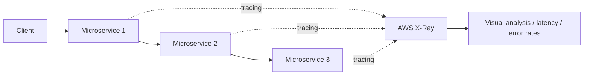

# 116. X-Ray

## 🎯 Giới thiệu
AWS X-Ray là dịch vụ dùng để:
- **Visual analysis** ứng dụng
- **Tracing** request đi qua các **microservices**
- Theo dõi các chỉ số như:
  - **latency**
  - **error rates**
- Xác định nhanh vấn đề nằm ở đâu trong **distributed system**

X-Ray được nhắc là đặc biệt hữu ích khi ôn thi theo hướng **developer exam**, nhưng vẫn cần biết ở mức cơ bản cho kỳ thi.

## 1. X-Ray dùng để làm gì?
- Tracing request across **microservices**
- Xem client gửi data vào nhiều service khác nhau như thế nào
- Theo dõi các **network calls** đi qua infrastructure
- Hữu ích khi cần troubleshooting ở **request level**

## 2. Khi nào nên nghĩ đến X-Ray?
- Khi hệ thống là **distributed system**
- Khi có **many microservices**
- Khi cần tìm nguyên nhân lỗi ở đâu trong luồng request
- Khi cần debug các vấn đề trong quá trình request đi qua nhiều service

## 3. Tích hợp và yêu cầu
### Tích hợp được nhắc trong transcript
- **EC2 instances**
  - Cần cài **X-Ray agent**
- **ECS**
  - Cần cài **X-Ray agent** hoặc dùng **Docker container** cho X-Ray
- **Lambda function**
  - Chỉ cần “tick box” để bật
- **Beanstalk**
  - Agent sẽ được cài tự động nếu bật X-Ray integration
- **API Gateway**
  - Hữu ích để debug lỗi như **504 timeout**

### Yêu cầu quyền
- Các **X-Ray agents** hoặc service dùng X-Ray cần đúng **IAM permissions** để nói chuyện với **Amazon X-Ray**

## 📊 Bảng tóm tắt
| Tiêu chí | Mô tả |
|----------|------|
| Mục đích | Tracing request across microservices |
| Giá trị chính | Visual analysis, latency, error rates |
| Use case | Troubleshooting ở request level trong distributed system |
| EC2 | Cần cài X-Ray agent |
| ECS | Cần X-Ray agent hoặc Docker container |
| Lambda | Chỉ cần bật integration |
| Beanstalk | Agent được cài tự động khi bật integration |
| API Gateway | Hữu ích để debug lỗi 504 timeout |
| Yêu cầu quyền | Cần đúng IAM permissions để giao tiếp với Amazon X-Ray |

## 💡 Mẹo ghi nhớ cho kỳ thi AWS
- Gặp **distributed tracing** hoặc **request-level troubleshooting** thì nghĩ ngay đến **X-Ray**
- **EC2 / ECS** thường gắn với **X-Ray agent**
- **Lambda** là dạng “tick box” để bật
- **Beanstalk** có thể tự cài agent khi bật integration
- **API Gateway + 504 timeout** là tình huống debug rất đáng nhớ
- Nhớ rằng X-Ray cần **IAM permissions**

## ✅ Kết luận
AWS X-Ray là dịch vụ để **trace requests across microservices**, giúp nhìn rõ luồng request, theo dõi **latency** và **error rates**, đồng thời hỗ trợ troubleshooting trong **distributed system**. Đây là service nên nhớ khi ôn thi AWS, đặc biệt ở các câu hỏi về **distributed tracing** và **request-level debugging**.
