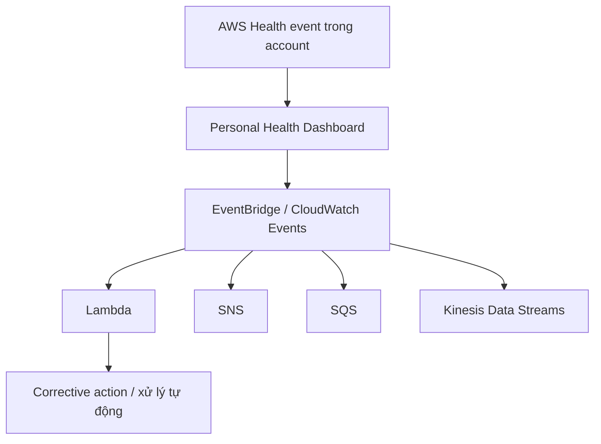

# 117. AWS Personal Health Dashboard

## 🎯 Giới thiệu
- **AWS Personal Health Dashboard (PHD)** giúp bạn biết các sự kiện trong AWS đang ảnh hưởng như thế nào đến **services** và **resources** của bạn.
- Đây là biểu tượng **cái chuông** ở góc phải trên của AWS Console.
- Là một **global service** và hiển thị các **outages**, **maintenance events**, và tác động trực tiếp lên tài nguyên của bạn như:
  - **EC2 instances**
  - **EBS volumes**
- Dashboard còn cho biết:
  - các vấn đề đang mở
  - các hành động có thể làm để **remediate**
  - trạng thái đã đóng hay chưa
- Có thể truy cập thông tin này bằng API là **AWS Health API**.
- Nếu đã bật **AWS Organizations**, có thể **aggregate** thông tin của tất cả accounts trong organization vào một nơi.

## 1. AWS Personal Health Dashboard là gì
- Dùng để xem các sự kiện từ AWS ảnh hưởng đến môi trường của bạn.
- Hiển thị:
  - **open issues**
  - **scheduled changes**
  - các **notifications** khác
- Trong transcript, đây là keyword quan trọng cho kỳ thi: **maintenance events from AWS**.
- Ví dụ có thể thấy:
  - **EC2 operational issue**
  - **EC2 instance recovery**
  - **Athena engine version auto upgrade notification**
- Thông tin issue có thể gồm:
  - **region**
  - **category**
  - số lượng **affected resources**
  - **description**

## 2. Health event notifications với EventBridge / CloudWatch Events
- Có thể dùng **EventBridge** hoặc **CloudWatch Events** để phản ứng với thay đổi của **health events** trong account.
- PHD có thể trigger event vào **CloudWatch Events / EventBridge**.
- Use case:
  - nhận notification khi **EC2 instances** được lên lịch cập nhật
  - gửi thông báo
  - lấy event information
  - thực hiện corrective action tự động qua automation
- **Không dùng được** để bắt **public service health dashboard events**.
  - Các public events đó phải theo dõi bằng **RSS**.
- **CloudWatch Events / EventBridge** có thể invoke:
  - **Lambda**
  - **SNS**
  - **SQS**
  - **Kinesis Data Streams**

## 3. Quan sát trên dashboard và organization-wide view
- Khi mở biểu tượng chuông, bạn có thể xem:
  - số **open issues**
  - **scheduled changes**
  - các thông báo khác
- Tab **Event Log** cho phép xem lịch sử các sự kiện trong account.
- Dashboard có phần tổng quan:
  - số vấn đề trong **past seven days**
  - **scheduled changes**
  - **other notifications**
- Có thể tạo **Event rule** để nhận notification cho các event có thể ảnh hưởng đến infrastructure.
- Trong **EventBridge**, có thể:
  - tạo rule
  - chọn event pattern theo service
  - chọn service provider là **AWS**
  - chọn service name là **Health**
  - chọn **All Events** hoặc **specific health events**
  - chọn target như **Lambda** hoặc **SNS topic**
- Nếu bật **AWS Organizations** và **organizational view**, có thể xem health information của toàn organization ở một nơi.

## 📊 Bảng tóm tắt
| Tiêu chí | Mô tả |
|----------|------|
| Mục đích | Theo dõi tác động của AWS events lên services và resources của bạn |
| Giao diện | Biểu tượng chuông ở AWS Console |
| Phạm vi | Global service |
| Dữ liệu hiển thị | Outages, maintenance events, open issues, scheduled changes, notifications |
| Tài nguyên ví dụ | EC2 instances, EBS volumes |
| API | AWS Health API |
| Tự động hóa | EventBridge / CloudWatch Events có thể invoke Lambda, SNS, SQS, Kinesis Data Streams |
| Hạn chế | Public service health dashboard events không bắt qua EventBridge, phải dùng RSS |
| Tổ chức | Có thể aggregate dữ liệu toàn organization khi bật AWS Organizations |

## 💡 Mẹo ghi nhớ cho kỳ thi AWS
- Nhớ cụm từ khóa: **maintenance events from AWS**.
- **PHD** là để xem ảnh hưởng lên **your resources**, không phải chỉ xem trạng thái chung.
- **AWS Health API** là cách truy cập dữ liệu programmatically.
- **EventBridge / CloudWatch Events** dùng cho notification và automation trong **account của bạn**.
- **Public service health dashboard events** không được intercept bằng EventBridge, phải dùng **RSS**.
- Nếu đề bài nói đến xem health của toàn bộ nhiều account, nghĩ đến **AWS Organizations + organizational view**.

## ✅ Kết luận
- **AWS Personal Health Dashboard** là công cụ theo dõi các sự kiện sức khỏe từ AWS ảnh hưởng đến tài nguyên của bạn.
- Bạn có thể xem trực tiếp trên Console, truy cập qua **AWS Health API**, hoặc tạo automation bằng **EventBridge / CloudWatch Events**.
- Nếu dùng **AWS Organizations**, có thể gom toàn bộ thông tin health từ nhiều account về một nơi để theo dõi tập trung.
